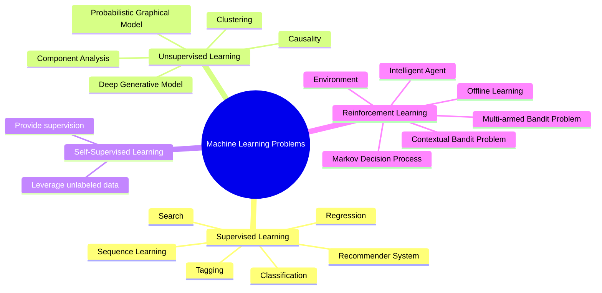

---
tags:
  - 读书笔记
  - 正在做
---

# 📖 Dive into Deep Learning

!!! abstract "书籍信息"

    - **书名**：Dive into Deep Learning/动手学深度学习
    - **年份**：2023
    - **书籍网站**：[d2l.ai](https://d2l.ai/)

## Introduction

理解并能够阐述下列概念：

- Machine Learning
    - Deep Learning
- parameter, model
- learning:
    - learning algorithm
        - loss function
            - squared error
        - overfitting
    - supervised learning
    - optimization algorithm
        - gradient descent
- dataset:
    - feature, label, dimensionality
- 设计模型 -> 获取数据 -> 更新模型 -> 检查准确性
- attention, transformer, language model, GAN, diffusion model



需要明白以下概念的含义：

- 监督、无监督、自监督、强化学习
- 监督学习所解决的：回归、分类、标注、搜索、推荐、序列学习问题

本章还介绍了最新的人工智能发展趋势，如深度学习、自然语言处理、计算机视觉、强化学习、生成对抗网络等。


!!! note "交叉：计算机体系结构"

    本章也对人工智能和计算机计算能力的发展进行了比较。要点是：**RAM 的增长速度落后于数据集和计算能力的增长速度，因此现在的统计模型应当更加内存高效，也就是在访存期间做更多计算。**
    
    作者通过下面的事实来证明观点：
    
    - 多层感知机、CNN 等模型在上个世纪就已经被提出，但近来才得以广泛应用
    - 曾经流行的广义线性模型、逻辑回归、核方法、支持向量机被取代

## 2. Preliminaries

### Data Manipulation

!!! note "`tensor`"

    创建

    ```python
    torch.arange(12, dtype=torch.float32)
    torch.zeros((2, 3, 4))
    torch.ones((2, 3, 4))
    torch.randn(3, 4)
    torch.tensor([[2, 1, 4, 3], [1, 2, 3, 4], [4, 3, 2, 1]])
    ```

    属性：

    ```python
    x.shape
    ```

    方法：

    ```python
    x.reshape(3, 4)
    x.reshape(-1, 4) # auto infer
    ```

    操作：

    ```python
    # 一元、二元运算都是 element-wise 的。
    torch.exp(x)
    x + y, x - y, x * y, x / y, x ** y
    x == y, x < y, x > y
    # 其他
    torch.cat((x, y), dim=0)
    x.sum()
    ```

    广播：

    - 对于长度为 1 的维度，拷贝使得两个张量的维度相同。
    - 执行 element-wise 运算。


!!! note "其他"

    ```python
    id()
    ```

## 3. Linear Neural Networks

### Data Preprocessing

### Linear Algebra

### Calculus

### Automatic Differentiation

### Probability and Statistics
