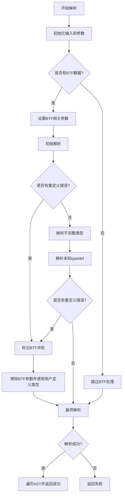

# bpftrace

bpftrace 仍处于开发阶段，有不少问题需要解决，也有不少功能等待实现。

《BPF Performance Tools》一书详细介绍了 bpftrace 的工作原理，本篇笔记在此基础上完成。

## 环境

!!! quote

    感谢 @YooLc 提供的指导。

bpftrace 仓库可以使用 Dev Container 方便地管理环境。打开 VSCode 面板，选择 DevContainer: Reopen in Container 即可自动开始配置。配置过程比较漫长，需要下载足足 5 GB 多的文件，这是 Nix 环境的通病。

容器构建完成后，在项目目录 `nix develop` 就能进入有环境的 shell 了。在 DevContainer 的配置文件中，执行了这样一行命令：

```bash
nix develop -c true && direnv allow
```

这就是使用 direnv 的效果。项目使用 Nix Flake 来管理开发环境，配置文件为 `flake.nix`。

Nix 通过 `pkgs.mkShell` 创建开发环境，其中 `buildInputs` 包含了所需的依赖项。项目封装了 `mkBpftraceDevShell` 函数，接受 `llvmVersion` 参数，可以创建基于不同 LLVM 版本的环境。

可以使用以下命令切换不同的 LLVM 版本：

```bash
nix develop .#bpftrace-llvm20
nix develop .#bpftrace-llvm19
```

这样就能在不同 LLVM 版本的环境中进行开发和测试。

在 DevContainer 中，默认用户为 `vscode`，而部分测试要求以 `root` 身份运行。因此最好所有测试都在虚拟机内进行：

```bash
vmtest -k $(nix build --print-out-paths .#kernel-6_14)/bzImage -- make -C build-vscode test
cd build-vscode/tests/
vmtest -k $(nix build --print-out-paths .#kernel-6_14)/bzImage -- BPFTRACE_RUNTIME_TEST_EXECUTABLE=../src/bpftrace python3 -u runtime/engine/main.py --filter=btf.user_supplied_c_def_using_btf
```

## 程序入口与核心数据结构

1. `main.cpp` 初始化 `BPFtrace` 和 `PassManager`。
2. `PassManager` 添加 `CreateClangParsePass` 步骤。
3. `CreateClangParsePass` 调用 `ClangParser::parse` 执行 Clang 解析逻辑。
4. `ClangParser::parse` 完成实际的 C 代码解析工作。

### `class BPFtrace`

1. **动态跟踪功能**：
   - 支持动态添加和移除探针（`add_probe`、`attach_probe`）。
   - 提供符号解析功能（如 `resolve_ksym`、`resolve_usym`），用于将地址转换为可读的函数名。
   - 支持堆栈跟踪（`get_stack`）和时间戳解析（`resolve_timestamp`）。

2. **输出与控制**：
   - 管理输出内容（如 `print_map`、`print_benchmark_results`）。
   - 支持多种输出格式（如 PCAP 文件写入 `write_pcaps`）。

3. **资源管理**：
   - 管理 BPF 程序和映射（`BpfBytecode`、`BpfMap`）。
   - 支持多核 CPU 环境（`ncpus_`、`max_cpu_id_`）。

4. **调试与配置**：
   - 提供调试模式（`DebugStage`）和日志输出控制（`bt_verbose`、`bt_quiet`）。
   - 支持安全模式（`safe_mode_`）和自定义配置（`Config`）。

## bpftrace 语言编译

研究 clang 解析器是如何工作的，这也将对我们编写 bpftrace 程序有用。

### Pass 的执行方式

看看编译相关的数据结构：

```cpp
class Program : public Node {
// 存储和操作程序的各个组成部分，包括配置、导入、宏、函数和探针等
  std::string c_definitions;
  Config *config = nullptr;
  ImportList imports;
  MapDeclList map_decls;
  MacroList macros;
  SubprogList functions;
  ProbeList probes;
}
class ASTContext : public ast::State<"ast"> {
    Program *root = nullptr;
}
```

调用链如下：

```c
main()
    auto flags = extra_flags(bpftrace, args.include_dirs, args.include_files);
    ast = ast::ASTContext(args.filename, buf.str());
    ast::PassManager pm;
    pm.put(ast);
    pm.put(bpftrace);
    pm.add(printPass(name));
    //... 添加各个 Pass
    ast::AllParsePasses(std::move(flags));
        passes.emplace_back(CreateClangParsePass(std::move(extra_flags))); 
    auto pmresult = pm.run();
        foreach([&](auto &pass) { return pass.run(ctx); })
            return fn_(ctx);
```

于是我们回头去找 `fn_` 是什么。以 `ClangParsePass` 为例：

```cpp
ast::Pass CreateClangParsePass(std::vector<std::string> &&extra_flags)
{
    return ast::Pass::create("ClangParser",
        [extra_flags = std::move(extra_flags)](
                ast::ASTContext &ast,
                BPFtrace &b) -> Result<CDefinitions> {
            ClangParser parser;
            if (!parser.parse(ast.root, b, extra_flags)) {
                return make_error<ClangParseError>();
            }
            return std::move(parser.definitions);
        });
}
static Pass create(const std::string &name, Func func)
{
    std::function fn(func);
    return createFn(name, fn);
}
```

请记住这个 lambda 函数被存放在 `std::function fn` 中，接下来我们看看它是如何存放的：

```cpp
static Pass createFn(const std::string &name,
                std::function<Result<Return>(Inputs &...)> fn)
{
    return createImpl(name, fn);
}
static Pass createImpl(const std::string &name,
                        std::function<Result<Return>(Inputs &...)> fn)
{
    return Pass(
        name,
        std::move(inputs),
        std::move(outputs),
        [fn](PassContext &ctx) -> Result<> {
            auto args = std::make_tuple(std::ref(ctx.get<Inputs>())...);
            auto result = std::apply(fn, args);
        });
}
using Fn = std::function<Result<>(PassContext &ctx)>;
Pass(std::string name,
    std::vector<int> &&inputs,
    std::vector<int> &&outputs,
    Fn fn)
    : name_(std::move(name)),
        inputs_(std::move(inputs)),
        outputs_(std::move(outputs)),
        fn_(std::move(fn)) {}
```

至此，我们终于明白究竟什么东西被存放在 `class Pass` 的 `fn_` 字段：`createImpl` 中那个接受 `PassContext` 的 lambda 函数，它捕获了传入的 `fn`，将其 `std::apply` 到 `args` 上。这个被调用的 `fn`，又是最开头创建的 lambda 函数，它将 `ClangParser.parse()` 作用到 `ast.root` 和 `BPFtrace b` 上。

### `src/ast/passes/clang_parser.cpp`

总体来说，`ClangParser` 负责处理类型定义。它获取 BTF 和系统中的头文件信息，使用 libclang 翻译为 AST，然后使用 `visit_children()` 分类存放下面的信息：

- `definitions.macros`：存储宏定义。
- `definitions.enums`和`definitions.enum_defs`：存储枚举信息。
- `bpftrace.structs`：存储结构体字段信息。

```cpp title="src/ast/passes/clang_parser.h"
// When the imported definitions are parsed with clang, relevant C definitions
// are centralized here to be consumed by later passes.
class CDefinitions : public ast::State<"C-definitions"> {
public:
  std::map<std::string, std::string> macros;
  std::map<std::string, std::tuple<uint64_t, std::string>> enums;
  std::map<std::string, std::map<uint64_t, std::string>> enum_defs;
};
class ClangParser {
public:
  bool parse(ast::Program *program,
             BPFtrace &bpftrace,
             std::vector<std::string> extra_flags = {});

  // Moved out by the pass.
  CDefinitions definitions;
};
class BPFtrace : public ast::State<"bpftrace"> {
  StructManager structs;
}
```



### `linux/type.h` 错误分析

!!! quote

    - [Error after specifying header file on debian10 · Issue #3473 · bpftrace/bpftrace](https://github.com/bpftrace/bpftrace/issues/3473)

首先还原错误路径。`__aligned_u64` 等类型定义在 `linux/type.h` 中：

```c
#define __aligned_u64 __u64 __attribute__((aligned(8)))
```

在 `clang_parser.c` 中的 `ClangParser::parse()` 中，注意到存在 BTF 时，会通过添加宏定义阻止 `linux/type.h` 中的类型定义：

```c title="src/ast/passes/clang_parser.cpp"
if (bpftrace.has_btf_data()) {
   // We set these args early because some systems may not have
   // <linux/types.h> (containers) and fully rely on BTF.

   // Prevent BTF generated header from redefining stuff found
   // in <linux/types.h>
   args.push_back("-D_LINUX_TYPES_H");
}
```

```c title="linux/type.h"
#ifndef _LINUX_TYPES_H
#define _LINUX_TYPES_H
...
```

BTF 生成的头文件 `__btf_generated_header.h` 中没有发现 `__aligned_u64` 的定义。`bpftrace/src/stdlib/include/linux/types.h` 是有定义的，并且头文件保护符用的是 `_UAPI_LINUX_TYPES_H`，应该不受上面宏参数的影响。

我想看看预处理器的结果。于是我在 `clang_parseTranslationUnit2()` 的调用前输出其参数，再用命令行 `-E` 输出预处理结果：

```bash
#!/usr/bin/env bash
clang -E definitions.h \
    -isystem \
    /bpftrace/include \
    -isystem \
    /usr/lib64/clang/17/include \
    -isystem \
    /usr/local/include \
    -isystem \
    /usr/include \
    -isystem \
    /usr/include/x86_64-linux-gnu \
    -nostdinc \
    -isystem \
    /virtual/lib/clang/include \
    -I/lib/modules/6.6.92-34.1.tl4.x86_64/source/arch/x86/include \
    -I/lib/modules/6.6.92-34.1.tl4.x86_64/build/arch/x86/include/generated \
    -I/lib/modules/6.6.92-34.1.tl4.x86_64/source/include \
    -I/lib/modules/6.6.92-34.1.tl4.x86_64/build/include \
    -I/lib/modules/6.6.92-34.1.tl4.x86_64/source/arch/x86/include/uapi \
    -I/lib/modules/6.6.92-34.1.tl4.x86_64/build/arch/x86/include/generated/uapi \
    -I/lib/modules/6.6.92-34.1.tl4.x86_64/source/include/uapi \
    -I/lib/modules/6.6.92-34.1.tl4.x86_64/build/include/generated/uapi \
    -include \
    /lib/modules/6.6.92-34.1.tl4.x86_64/source/include/linux/kconfig.h \
    -D__KERNEL__ \
    -D__BPF_TRACING__ \
    -D__HAVE_BUILTIN_BSWAP16__ \
    -D__HAVE_BUILTIN_BSWAP32__ \
    -D__HAVE_BUILTIN_BSWAP64__ \
    -DKBUILD_MODNAME="bpftrace" \
    -D_LINUX_TYPES_H \
    -DBPFTRACE_HAVE_BTF
```

我惊讶地发现，原来是 `linux/type.h` 只匹配到源码树中的，而非 `/bpftrace/include` 中的：

```bash
$ grep linux/type output.c
# 1 "/lib/modules/6.6.92-34.1.tl4.x86_64/source/include/linux/types.h" 1 3
# 1 "/lib/modules/6.6.92-34.1.tl4.x86_64/source/include/linux/types.h" 1 3
# 1 "/lib/modules/6.6.92-34.1.tl4.x86_64/source/include/linux/types.h" 1 3
```

难怪 `__aligned_u64` 没有被定义。

查阅了一段时间的资料，似乎没有明确的 Include 顺序说明。有人说 Clang 按照 GCC 的顺序，先 `-I` 再 `-isystem`，也有人驳斥这种说法。相关资料罗列如下：

- [Clang++ include path order - Developers - The Stan Forums](https://discourse.mc-stan.org/t/clang-include-path-order/2787)
- [What's going on with clang's include priorities? - Stack Overflow](https://stackoverflow.com/questions/22178946/whats-going-on-with-clangs-include-priorities)

将 `/bpftrace/includ` 的 `-isystem` 修改为 `-I` 后，`__aligned_u64` 被定义了。然而还缺少 `bool`、`u64`、`u32` 等类型的定义。索性把所有 `-isystem` 全部修改为 `-I`，问题居然全部解决了！原 Issue 提出者的命令也没有类型缺失问题了。

```bash
$ build/src/bpftrace -e 'tracepoint:sched:sched_switch { $task = (struct task_struct *)curtask; if ($task->state & 0x02) { @[kstack] = count(); }  }' --include linux/sched.h --include sys/types.h
stdin:1:76-89: ERROR: Struct/union of type 'struct task_struct' does not contain a field named 'state'
tracepoint:sched:sched_switch { $task = (struct task_struct *)curtask; if ($task->state & 0x02) { @[kstack] = count(); }  }
```

梳理一下传给 Clang 的参数：

- 源码中定义的：

    ```cpp
    -isystem /bpftrace/include
    ```

- 通过 `query_clang_include_dirs()` 查找 Clang 自带的：

    ```bash
    $ clang -Wp,-v -x c -fsyntax-only /dev/null
    #include "..." search starts here:
    #include <...> search starts here:
    /usr/lib64/clang/17/include
    /usr/local/include
    /usr/include
    ```

- Arch include 目录：

    ```bash
    -isystem "/usr/include/" + std::string(utsname.machine) + "-linux-gnu";
    ```

- 其余 `extra_flags` 又来自哪里呢？来自前面看到的 `extra_flags(bpftrace, args.include_dirs, args.include_files);`：
    - `get_kernel_dirs`：`BPFTRACE_KERNEL_SOURCE`、`BPFTRACE_KERNEL_BUILD` 或 将路径指向 `/lib/modules/$(uname -r)/build` 及 `/source`
    - `get_kernel_cflags` 弄了一堆参数：

        ```cpp
        cflags.emplace_back("-nostdinc");
        cflags.emplace_back("-isystem");
        cflags.emplace_back("/virtual/lib/clang/include");

        // see linux/Makefile for $(LINUXINCLUDE) + $(USERINCLUDE)
        cflags.push_back("-I" + ksrc + "/arch/" + arch + "/include");
        cflags.push_back("-I" + kobj + "/arch/" + arch + "/include/generated");
        cflags.push_back("-I" + ksrc + "/include");
        cflags.push_back("-I" + kobj + "/include");
        cflags.push_back("-I" + ksrc + "/arch/" + arch + "/include/uapi");
        cflags.push_back("-I" + kobj + "/arch/" + arch + "/include/generated/uapi");
        cflags.push_back("-I" + ksrc + "/include/uapi");
        cflags.push_back("-I" + kobj + "/include/generated/uapi");

        cflags.emplace_back("-include");
        cflags.push_back(ksrc + "/include/linux/kconfig.h");
        cflags.emplace_back("-D__KERNEL__");
        cflags.emplace_back("-D__BPF_TRACING__");
        cflags.emplace_back("-D__HAVE_BUILTIN_BSWAP16__");
        cflags.emplace_back("-D__HAVE_BUILTIN_BSWAP32__");
        cflags.emplace_back("-D__HAVE_BUILTIN_BSWAP64__");
        cflags.emplace_back("-DKBUILD_MODNAME=\"bpftrace\"");
        ```

- 保存为 `CXUnsavedFile` 的所有文件：未标明的都是 `bpftrace/src/stdlib/include` 下的

    ```text
    /bpftrace/include
    ├── asm
    ├── asm-generic
    ├── bpf：来自 libbpf 的头文件
    ├── __btf_generated_header.h：来自内核 BTF 生成
    ├── float.h
    ├── limits.h
    ├── linux
    ├── stdarg.h
    ├── stdbool.h
    ├── stddef.h
    ├── __stddef_max_align_t.h
    └── stdint.h
    ```

### `stdint.h` 错误分析

然而复测一下发现，Infiniband 头文件遇到了新的 `UINTMAX` 宏未定义的问题，该宏在 `stdint.h` 中。使用 `clang -H -E` 看到包含顺序如下：

```text
. /usr/include/infiniband/verbs.h
.. /bpftrace/include/stdint.h
... /usr/lib64/clang/17/include/stdint.h
```

在预处理器输出中能看到执行行数，从而推断进入位置：

```text
# 1 "/usr/include/infiniband/verbs.h" 1
# 40 "/usr/include/infiniband/verbs.h"
# 1 "/bpftrace/include/stdint.h" 1
# 63 "/bpftrace/include/stdint.h"
# 1 "/usr/lib64/clang/17/include/stdint.h" 1
# 64 "/bpftrace/include/stdint.h" 2
# 41 "/usr/include/infiniband/verbs.h" 2
```

bpftrace stdlib 通过下面的方式进入 Clang 头文件：

```c
/* If we're hosted, fall back to the system's stdint.h, which might have
 * additional definitions.
 */
#if __STDC_HOSTED__ && __has_include_next(<stdint.h>)
# include_next <stdint.h>
#else
// stdint.h 中的各类定义
#endif
```

两份头文件都使用 `__CLANG_STDINT_H` 来保护，于是产生了这样的情况：

- bpftrace stdlib 进入 `__has_include_next` 为真的分支，因此没有定义 stdint.h 中的宏
- Clang 因为 bpftrace stdlib 已经定义头文件保护符，所以被整个跳过，也没有定义 stdint.h 中的宏

头文件保护符一致，说明 bpftrace stdlib 的头文件也来自 clang。所以我不明白为什么 bpftrace 需要自己提供 stdlib。ClangParser 的注释解释了提供 Linux 头文件的原因：

```text
// We set these args early because some systems may not have
// <linux/types.h> (containers) and fully rely on BTF.
```

但是 C 标准库头文件的情况不同，它应该在任何 C 开发环境下都有。

目前，我通过将 bpftrace stdlib 的头文件保护符改为 `__STDINT_H` 来解决这个问题，但是这也有和其他 C 标准库实现冲突的风险。这里我列出 `src/stdlib/include` 中可能有风险的头文件：

| 头文件 | 含有 `#include_next` | 头文件保护符前缀为 `__CLANG` |
| - | - | - |
| `float.h` | Y | N |
| `limits.h` | Y | Y |
| `stdint.h` | Y | Y |
| `__stddef_max_align_t.h` | N | Y |

如果我们必须提供自己的 C 标准库头文件实现，也许我们需要将保护符修改为 `__BPFTRACE` 前缀。我在这方面经验不多，希望能得到大家的意见。

### `c_macro_expansion.cpp` 错误分析

在移除 `stdint.h` 和 `limits.h` 后，其中的宏仍然不能正常展开，涉及到了宏展开的 Pass，报错如下：

```text
test.bt:5:29-40: ERROR: unable to expand macro as an expression: (18446744073709551615UL)
    printf("SUCCESS %zu\n", UINTPTR_MAX); exit();
                            ~~~~~~~~~~~
```

`CMacroExpansionPass` 就接在 `ClangParsePass` 后，让我们继续研究一下。报错来源于下面这段：

```c
// Parse just the macro as an expression.
ASTContext macro(ident->ident, value);
Driver driver(macro);
auto expanded = driver.parse_expr();
```

构造了一个 AST 上下文让后直接调用 Driver 解析表达式：

```c
parse(Parser::make_START_EXPR(loc));
if (std::holds_alternative<ast::Expression>(result)) {
return std::get<ast::Expression>(result);
}
```

这里 `parse` 是 YACC 解析器：

```c
void Driver::parse(Parser::symbol_type first_token)
{
  // Reset state on every pass.
  loc.initialize();
  struct_type.clear();
  buffer.clear();

  // Push the start token, which indicates that exact context that we should
  // now be parsing.
  token.emplace(first_token);

  yyscan_t scanner;
  yylex_init(&scanner);
  Parser parser(*this, scanner);
  if (debug) {
    parser.set_debug_level(1);
  }
  set_source_string(&ctx.source_->contents);
  parser.parse();
  yylex_destroy(scanner);
}
```

