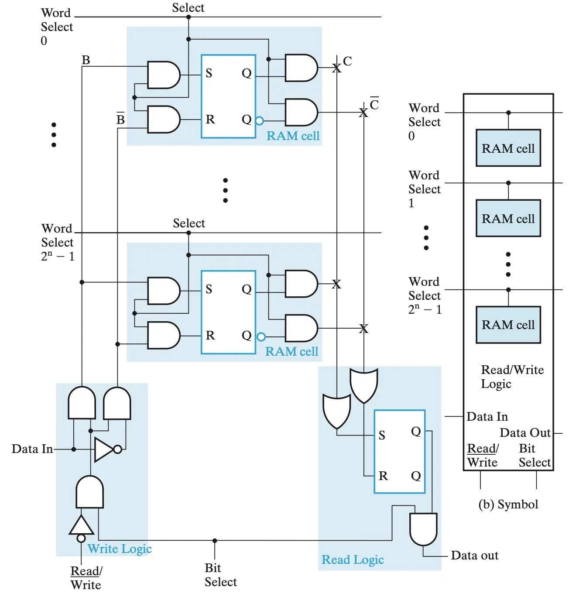
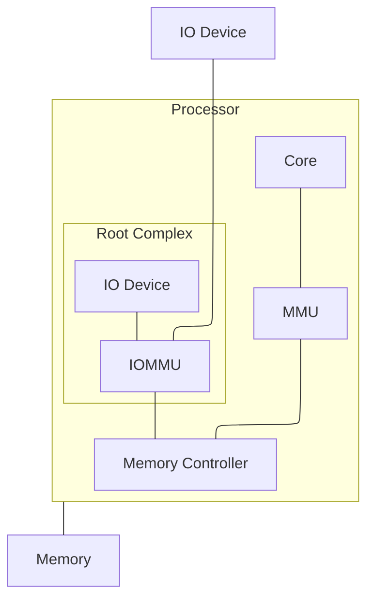

# 内存

## 内存类型

### Volatile memory

### SRAM 与 DRAM

- 规格：
    - 容量：$2^k \times n$ bit

        例：$64K \times 8$ RAM 的字长为 8 bit，有 $2^{16}$ 个字，共 64 KB 容量

- 信号：
    - $n$ 输入数据
    - $n$ 输出数据
    - $k$ 地址线
    - $m$ 控制信号（读/写 + 片选 Chip Select）
- 时钟：
    - 读写周期需要与 CPU 的时钟周期同步
- SRAM
    - SRAM Cell：
        - 构造：以 SR Latch 为核心
        - 信号：Select 控制输入 $B$ 和输出 $C$
    - Bit Slice：

        

        - 构造：组织为 Word 和 Bit Select 两个维度，包含读写逻辑
        - 写逻辑：
            - 当 Read 信号为 1 时，取反通入与门，使 Cell 输入均为 0，保持不变
            - 当 Read 信号为 0 时，Data in 一正一反进入 SR Latch，类似 D Latch 完成输入
        - 读逻辑：输出进入 SR Latch 锁存后输出

    - Chip：

        由于 $k$ 输入 Decoder 需要 $2^k$ 个与门，开销太大，因此将地址分为 Row 和 Column Select，采用两个小 Decoder 进行选择

    - Array：

        字被分划到不同 Chip 上，使 Chip 间并行组成 Array

        

        也可以将地址高位用于片选

- DRAM

    - DRAM Cell：

        - 构造：一个晶体管和一个电容
        - 信号：$Select$ 选择、$B$ 输入、$C$ 输出
        - 原理：
            - $Select$ 连接栅极，控制 $B$ 和电容导通

### DDR SDRAM

内存相关的工业标准由 [JEDEC](https://www.jedec.org/standards-documents) 制定。

内存模块形态：

- 如今最通用的是 DIMM (Dual In-line Memory Module)，其中 Dual In-line 指的是两排针脚，即金手指两面是不同的信号，提供更高速率。与之相对的是 SIMM，金手指两面信号相同互为冗余。

早期 DRAM 是异步的，后来被 SDRAM 取代，原因如下：

- 同步时钟信号使内存操作可以**流水化**以提升性能
- 使用状态机和寄存器进行控制
- SDRAM 将内存划分为多个 Bank 并行读写操作
- 更高的频率和带宽

DDR（Double Data Rate）SDRAM 在 SDRAM 基础上通过在时钟上升沿和下降沿都传输数据来提升带宽

- DDR5：
    - 每个内存通道分为 Channel A 和 Channel B
    - 每个 Channel 各自使用 32x 数据线 + 21x地址线 + 7x控制线，共享地址和指令
    - 每个 Channel 有 4 个 Chip，各自贡献数据中的 8 bit
- Chip：一个 2GB DRAM Die
    - 8 个 Bank Group
    - 4 个 Bank
    - 65536 行
    - 8192 列
- 31x 地址线
    - RAS
        - 3x Bank Group
        - 2x Bank
        - 16x Row
    - CAS
        - 10x Column

    过程：RAS 选中 Row 并激活，Column Multiplexer 选中 Column 并读写

读写、刷新过程：

- Row Closing：关闭所有 Row
- Bitline Precharge：Bitline 恢复到 $V_{DD}/2$
- Row Opening：选中 Row
- Sense Amplifier Refreshing：Bitline 的 Sense Amplifier 检测到微小电压差并放大到 $V_{DD}$ 或 0
- Column Address：
- 读/写 Read/Write：选中 Column，连接到 Read/Write Driver

刷新一行约 50ns，整个 Bank 刷新约 3ms，每个 Bank 需要在 64ms 内刷新一次

### DDR 优化技术

基本参数：

- 传输速率：4800 Mega Transfers per second (MT/s)
- CAS Latency：40
- RAS to CAS Delay（tRCD）：39
- Row Precharge Time（tRP）：39
- Active to Precharge Delay（tRAS）：79

当访问的行已经被打开时，称为 Row/Page Hit，只需要 CAS 延迟

- 操作系统、编译器都对此有优化，尽可能访问同一个 Row 的数据
- 划分为 Bank，不同 Bank 的操作独立，更有可能命中 Row

#### Burst Buffer

CAS 中 6 位用于 Multiplexer，4 位用于 Burst buffer

Column Multiplexer 中 128x 数据线连接到 burst buffer，连续发送 16 次 8 bit 数据。

#### Subarrays

1024x1024 Cell 组织为 Subarray，拥有 Sense Amplifier

- 更短的 Wordline：打开 Row 的时间变短、需要的电压降低
- 更短的 Bitline：对电容的容量要求降低

#### Folded Layout

每列实际上使用了两条 Bitline，

提升电气性能

内存带宽计算：

理论带宽/每通道 = 传输速率(MT/s) × 数据总线宽度(位) ÷ 8 (字节/位)

内存地址到 Bank 的映射是通过静态哈希进行的，无法保证 Bank 完美均衡 <https://dl.acm.org/doi/10.5555/3241094.3241139>

### Persistent Memory

## Virtual Memory - MMU

## Virtual Memory - IOMMU

!!! quote

    - [IOMMU: Virtualizing IO through IO Memory Management Unit (IOMMU)](https://pages.cs.wisc.edu/~basu/isca_iommu_tutorial/index.htm)：ASPLOS 2016 的 Tutorial，PPT 对整个 IOMMU 体系结构和功能进行了全面介绍。
    - [An Introduction to IOMMU Infrastructure in the Linux Kernel](https://lenovopress.lenovo.com/lp1467.pdf)：上文是从 CPU 厂商的角度讲硬件实现，这篇则是从操作系统的角度讲 Linux 内核中的 IOMMU 支持。

MMU 自 1970s 就已经广泛使用，而直到 2000s 后 IOMMU 才随着虚拟化技术的广泛应用出现。IOMMU 支持了下列功能：

- 让设备使用 CPU 的虚拟地址空间，例如 CUDA 的 Unified Memory
- 虚拟化场景下的设备直通，即 GPA 到 IOVA 等的地址转换
- 用户空间访问 IO

IOMMU 的四大关键能力：

- DMA 地址保护。
    - 如果没有 IOMMU，设备的 DMA 路径上没有 MMU 之类的安全措施，恶意或错误配置的设备容易引发问题。
- DMA 地址空间的转换。
    - VMM 会带来 30% 左右性能损失。
    - IOMMU 拦截设备的 DMA 请求并做地址转换
- 设备 I/O 中断的重映射和虚拟化。
    - VMM 会为每次中断带来 5-10k cycles 的开销。
    - IOMMU 能直接在硬件层面中断重定向到 Guest OS。
- IO 共享 CPU 的页表。

IOMMU 在各厂家的命名：

- [Intel® Virtualization Technology for Directed I/O Architecture Specification](https://www.intel.com/content/www/us/en/content-details/868911/intel-virtualization-technology-for-directed-i-o-architecture-specification.html)
- [AMD I/O Virtualization Technology (IOMMU) Specification](https://docs.amd.com/v/u/en-US/48882_IOMMU)
- ARM [System MMU](https://developer.arm.com/Architectures/System%20MMU%20Support)

IOMMU 的地址翻译：

- OS 运行 IOMMU Driver 去配置 IOMMU
- OS 定义一些 Domain 给设备用
- 内存里放个 Device Table
- IOMMU 根据 Device ID 和 Domain ID 在 Device Table 找到 Page Table
- IOMMU 会缓存 TLB 和 Device Table Cache
- ATS：
    - Device 也可以 cache IOMMU 的 TLB，称为 IOTLB，从而减少对 IOMMU 的访问
    - 需要 IOMMU 在 Device Table 中为设备配置 per-translation capability，允许设备自行使用转换后的 HPA
    - Device 发起 ATS，然后请求转换后的 HPA
- Device Demand Paging：
    - ATS NACK 时，发起 PPR（Page Peripheral Request）
    - IOMMU 将 PPR 放到内存，然后发起中断通知 OS/VMM，由 handler 处理 Page Fault

IOMMU 处理 Nested Address Translation：

- guest 的每级页表索引都需要经过 Host 页表，总共带来 $m \times n$ 次内存访问
- 详见
    - [Accelerating Two-Dimensional Page Walks for Virtualized Systems](https://pages.cs.wisc.edu/~remzi/Classes/838/Spring2013/Papers/p26-bhargava.pdf)
    - [Two Dimension Walk](https://pages.cs.wisc.edu/~remzi/Classes/838/Spring2013/Notes/twodimwalk.pdf)

IOMMU Driver 的命令：

- Invalidate IOMMU TLB/IOTLB, Device Table Entry
- Complete PPR/Wait...
- 这些命令放到一个环形缓冲区里，Driver 是生产者，移动 tail 指针，IOMMU 是消费者，移动 head 指针

IOMMU 与中断重映射

- Core 上有 [Advanced Programmable Interrupt Controller (APIC)](https://en.wikipedia.org/wiki/Advanced_Programmable_Interrupt_Controller)
- Device Table 里还有 Interrupt Remapping Table

