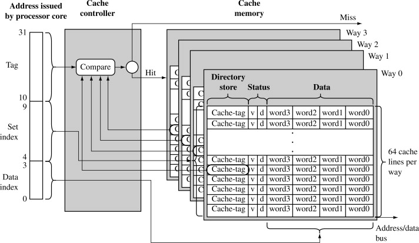

# 缓存

!!! quote

    - [CPU cache - Wikipedia](en.wikipedia.org/wiki/CPU_cache)

## 结构

cache entry = (cache line = cache block) + tag

### Associativity

<figure>
    
    <figcaption>
        Cache associativity 
        <small>来源：[ARM System Developer's Guide 12.2.4](www.sciencedirect.com/book/9781558608740/arm-system-developers-guide)</small>
    </figcaption>
</figure>

- fully associative
- N-way set associative
- direct-mapped

Trade-off:

- Drawback: check more places takes more power, chip area and time.
- Benifit: fewer misses (conflict miss)

### Address Translation

Latency, Aliasing, Granularity

- PIPT: slow, must lookup page table
- VIVT:
    - fast (no MMU)
    - aliasing problem: VAs -> PA
    - homonym problem: VAs -> PAs, page table change, ...
- VIPT:
    - parallel: cache set look up & TLB translation
    - index + offset $\leq$ page size
    - cache size limit: page size $\times$ associativity
- PIVT: useless

Morden CPU:

- L1: virtually indexed, fast
- L2: physically indexed

## 操作与策略

cache thrashing = cache evict

refill：当前 level 不存在，从更低加载到当前 level

### Replacement

Problem: predict which existing cache entry is least likely to be used in the future

LRU

### Write

Problem: the timing of data written to main memory

- write-through: every write to the cache causes a write to main memory
    - writes may be held in a store data queue: reduce **bus turnarounds**
- write-back: only when dirty cache entries are evicted from the cache
    - **read miss can cause write and load**

## 一致性

Cache Coherence

cache can be changed by: DMA, another core, ...

## 

## 相关技术

### Cache(Page) coloring

!!! quote

    - [Page coloring (Larry McVoy; Linus Torvalds)](https://yarchive.net/comp/linux/page_coloring.html)

- 问题：虚拟地址空间中连续的内存，在物理空间中并不一定连续，可能映射到同一个 Cache set 导致 conflict miss。
- 解决办法：给物理页染色。操作系统分配内存时按照颜色进行分配。

$$
\text{Number of Colors​} = \frac{\text{Total L3 Cache Size​}}{\text{Number of Ways}\times\text{Page Size}}
$$

!!! example "Linux 内核"

    Linux 内核并没有实现 Page coloring。Linus 在邮件列表中讨论了对 Page Coloring 的看法，可以简单概括为：

    > Page coloring is **a software workaround for hardware limitations** that largely disappeared as cache associativity increased. On modern high-performance CPUs, hardware cache design—not OS page coloring—is the primary solution to cache conflicts.

!!! example "Intel"

    虽然在通用场景下作用不大，但在特殊场景，比如需要对多核系统做 LLC 分区的情况下，Page Coloring 是很好的软件实现。

    

    [(HPCA'08) Gaining insights into multicore cache partitioning: Bridging the gap between simulation and real systems](https://ieeexplore.ieee.org/document/4658653)

### Cache Scrambling

