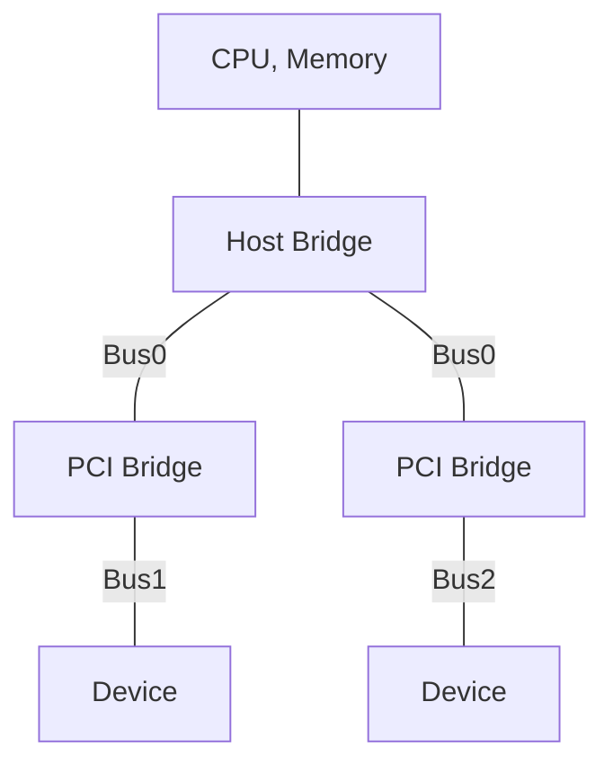

---
tags:
- 个人笔记
---

# 📖 总线

总线（Bus）是计算机系统中用于在各组件之间传输数据、地址和控制信号的公共通信通道。它负责连接 CPU、内存、存储设备、I/O 设备等，使它们能够高效协同工作。

总线发展的趋势是从并行演变为串行：

- **并行**就是用多根线同时传输数据，**串行**就是用一根线顺序传输数据。看起来串行慢，但并行占用空间大，I/O 引脚过多变得无法接受，且随着传输速率的提高出现了难以解决的串扰问题。
- 这两种总线架构不同：**串行总线只能点对点**连接两个设备，而**并行总线可以在单一总线上连接多个设备**，并且很容易增减总线上的设备。对于串行总线，我们需要使用交换机和多个总线设备连接。

!!! example

    - PCI（Peripheral Component Interconnect）是并行总线，PCIe（PCI Express）是串行总线。
    - ATA（Advanced Technology Attachment）是并行总线，SATA（Serial ATA）是串行总线。
    - SCSI（Small Computer System Interface）是并行总线，SAS（Serial Attached SCSI）是串行总线。
    - USB（Universal Serial Bus）是串行总线。

## PCIe

!!! quote

    - [Best way to learn PCIE protocol from scratch? : r/FPGA](https://www.reddit.com/r/FPGA/comments/1et3zhl/best_way_to_learn_pcie_protocol_from_scratch/)
    - [Specifications | PCI-SIG](https://pcisig.com/specifications)

<figure markdown="span">
    <center>
    { width=80% align=center }
    </center>
    <figcaption>
    PCI 与 PCIe 总线
    </figcaption>
</figure>

PCIe 的学习可以从两个方向入手：

- **硬件方向**：在 FPGA 上实现一个 SERDES（串行解串器）
- **软件方向**：学习 PCIe 协议栈

让我们从软件侧开始，从内核 PCI 驱动入手。

### PCI 驱动

!!! quote

    - Linux Device Drivers, 3rd Edition, Chapter 12: PCI Drivers

PCI 定义了三级分层架构，每个外围设备由三级架构定义：

| 层次 | 最大数量 | 解释 |
| - | - | - |
| Domain | ? | Linux 用于支持大型系统 |
| Bus | 256 | |
| Device | 32 | |
| Function | 8 | 一个设备可能有多个功能，如音频和 CD |

因此每个 Function 可以通过 16 bit 标识。

!!! example

    某个设备的地址为 `0000:00:14.0`：

    | 字段 | 数值 |
    | - | - |
    | Domain (16b) | 0000 |
    | Bus (8b) | 00 |
    | Device (5b) | 14 |
    | Function (3b) | 0 |

总线之间的连接通过 Bridge 完成，整体组成树状结构，最顶层为 Bus 0：



PCI 设备具有三种地址空间：

- 内存位置、I/O 端口
    - 在总线上广播，所有设备都能看到
    - 由固件决定映射到不冲突的地址范围，可以从配置空间直接得到，所以 PCI 不需要做设备探测
- 配置寄存器（configuration register）：
    - 每次只寻址一个 slot，永远不会冲突
    - 每个 Function 的配置空间，PCI 有 256 Byte，PCIe 有 4KB，其中有 4 Byte 包含 Function ID
    - 二进制：`/proc/bus/pci/devices` 和 `/proc/bus/pci/*/*`、`/sys/bus/pci/devices`

总结：每个设备通过 Geographical 寻址得到配置寄存器，利用其中的信息进行 I/O

PCI 设备的启动过程：

- 上电：没有任何映射，所有功能和中断都关闭，只响应配置事务（configuration transaction）
- BIOS 或操作系统执行配置，分配安全的地址空间
- 当设备驱动要访问设备时，内存和 I/O 都已经映射完成

PCI 配置寄存器的前 64 字节是标准化的。一些重要的字段：

| 字段 | 内容 |
| - | - |
| vendorID, deviceID, class | 厂商设置，只读，用于驱动程序寻找设备 |
| subsystem vendorID, subsystem deviceID | 同上 |

驱动程序使用内核提供的宏创建 `struct pci_device_id` 来表达自己支持的设备类型，并使用 `MODULE_DEVICE_TABLE` 导出到用户空间，让热插拔和模块加载系统知晓。具体来说，在构建内核的 depmod 过程，这些列表会被提取到 `/lib/modules/KERNEL_VERSION/modules.pcimap`。

!!! info "过时的信息"

    `.pcimap` 和 `.usbmap` 已经被合并到 `.alias` 中

```c
// USB driver
static const struct pci_device_id pci_ids[] = { {
    PCI_DEVICE_CLASS(((PCI_CLASS_SERIAL_USB << 8) | 0x20), ~0)
    },
    { /* end */ }
}
// I2C driver
static struct pci_device_id i810_ids[] = {
    { PCI_DEVICE(PCI_VENDOR_ID_INTEL, PCI_DEVICE_ID_INTEL_82810_IG1) },
    { 0, },
}

MODULE_DEVICE_TABLE(pci, i810_ids)
```

PCI 驱动注册流程如下：

```c
static struct pci_driver pci_driver = {
   .name = "pci_skel",
   .id_table = ids,
   .probe = probe,
   .remove = remove,
};
static int __init pci_skel_init(void)
{
   return pci_register_driver(&pci_driver);
}
```

- `int (*probe) (struct pci_dev *dev, const struct pci_device_id *id)`：当系统认为有应由该驱动程序控制的设备时调用

    在访问设备资源（I/O 区域或中断）前，需要调用 `pci_enable_device()`

- `remove()`、`suspend()`、`resume()`：其他状态变化时调用

内核提供 `pci_read/write_config_*()` 来访问配置空间：

```c
static unsigned char skel_get_revision(struct pci_dev *dev)
{
   u8 revision;
   pci_read_config_byte(dev, PCI_REVISION_ID, &revision);
   return revision;
}
```

配置寄存器标准化的字段中，定义了 6 个 Base Address，它们简称为 BAR（Base Address Register），因此设备支持 6 个 I/O 区域。大多数 PCI 设备将其实现为内存区域，涉及缓存问题，需要看配置寄存器中的 memory-is-prefetchable 位：

- 如果设置了，则 CPU 可以缓存，做任何优化

    例子：显卡的显存

- 如果未设置，则对该内存区域的访问可能存在副作用，不可以缓存

    例子：控制寄存器（control register）

内核同样提供接口访问区域位置，无需直接读取寄存器：

```c
unsigned long pci_resource_start(struct pci_dev *dev, int bar);
_end
_flags // IORESOURCE_IO, IORESOURCE_MEM, IORESOURCE_PREFETCH, IORESOURCE_READONLY
```

中断号由固件分配，驱动只需读取：

```c
result = pci_read_config_byte(dev, PCI_INTERRUPT_LINE, &myirq);
```

本章的剩余部分介绍了 ISA 和其他总线。

### PCIe 

!!! quote

    - [A Practical Tutorial on PCIe for Total Beginners on Windows (Part 1) – Reversing Engineering for the Soul](https://ctf.re/windows/kernel/pcie/tutorial/2023/02/14/pcie-part-1/)：非常优质的 PCIe 入门，通过示例演示，并且给出了精美的可视化。

PCI 到 PCIe 的最大转变就是从总线变为了**点对点**结构，可以类比以太网从集线器到交换机的演进。

- Root Complex 位于 CPU 内，其上具有
    - Root Port，可以连接其他 Endpoint 或 Switch。
    - Root Complex Integrated Endpoints：封装在 CPU 内，使用厂商特定协议连接的设备，但仍使用 PCIe 语义通信。例如：集成显卡。
- 在 PCI 规范中：
    - Endpoint 也称为 Type0，Switch 称为 Type1。
    - Bus/Device/Funtion (BDF) 也称为 RID（Requestor ID）

初学者应当正确地理解 PCIe 与 MMIO：

- 不要将操作理解为读写内存，而应该理解为与设备交互，因为实际上并不是内存读写的操作
- 当读写 PCI 设备的内存区域时，硬件实际上将从 Root Complex 发出 TLP（Transmission-Layer Packet），这对软件完全不可见

读写 Configuration Register 的过程：


使用 BAR 的过程：


### PCIe Switch

!!! quote

    - [Top 3 Uses for PCI Express Switches](https://www.arrow.com/en/-/media/e81e083f51ea49c28099182f435e1ec7.ashx)

PCIe Switch 是一种用于扩展 PCIe 总线的设备，可以将一个 PCIe 总线扩展为多个 PCIe 总线。它利用了 PCIe 串行总线点对点通信的特点。它的应用场景有：

- **扩展 PCIe 总线**：将一个 PCIe 总线扩展为多个 PCIe 总线，可以连接多个 PCIe 设备。**多见于 GPU 服务器**，一般为 4U，支持 8 卡，比如我们的宁畅 X640 G40。

    如下图所示，CPU 只需要向 PCIe Switch 提供 x4 PCIe，就能扩展出 4 个 x4 PCIe 设备和一个 x1 PCIe 设备。当然这肯定会有延迟、带宽之类的损失，比如在该 PCIe Switch 下的所有设备 Host to Device 的**总带宽**只能局限在 x4，但是 Device to Device 带宽一般可以达到满速。

    <figure markdown="span">
        <center>
        { width=60% align=center }
        </center>
        <figcaption>
        PCIe Switch 扩展 PCIe 总线
        </figcaption>
    </figure>

- **拆分 PCIe 总线**：将一个 PCIe 总线拆分为多个 PCIe 总线，可以连接多个 PCIe 设备。多见于 PCIe 转接卡。这里就不会有总带宽的问题，因为每个设备都有独立的 PCIe 总线。

    !!! example

        比如有一些 PCIe x16 转 4 U.2 的转接卡（因为 U.2 每个只占 x4 通道）。这些自带 PCIe Switch 的转接卡不需要主板支持 PCIe 拆分（PCie Bifurcation）。而比较便宜的 PCIe x16 转 4 U.2 转接卡就不带 PCIe Switch，需要主板支持 PCIe 拆分。这就是价格差异的原因。

    <figure markdown="span">
        <center>
        { width=60% align=center }
        </center>
        <figcaption>
        PCIe Switch 拆分 PCIe 总线
        </figcaption>
    </figure>

### SR-IOV
