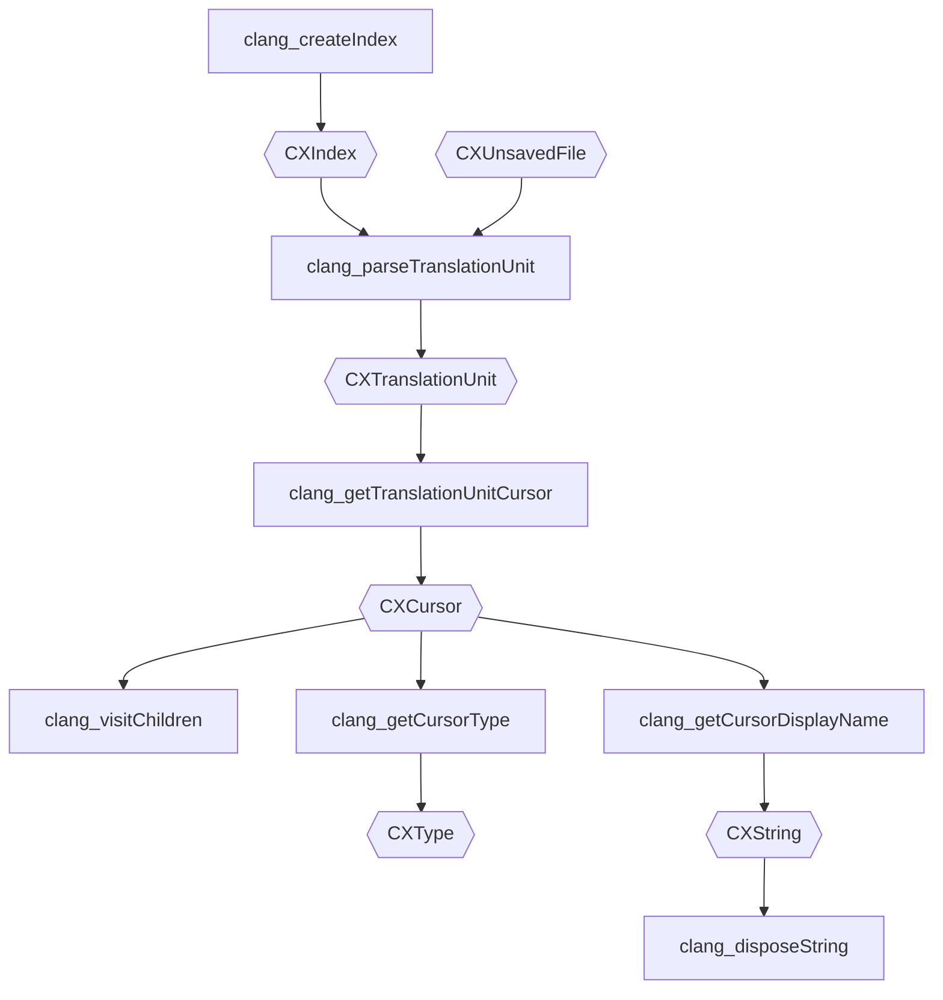

# LLVM

!!! quote

    - [About — LLVM documentation](https://llvm.org/docs/)

## clang

!!! quote

    - [Welcome to Clang's documentation! — Clang documentation](https://clang.llvm.org/docs/index.html)

### 预处理过程

!!! quote

    - [Preprocessor Output (The C Preprocessor)](https://gcc.gnu.org/onlinedocs/cpp/Preprocessor-Output.html)

### Include Priority

先看看 C 标准怎么说。

!!! info "C23 - 6.10.3 Source file inclusion:"

    `#include` 预处理器指令有三种形式。但是最后一种形式在**完成宏替换后，应当匹配前两种形式**。

    ```c
    #include <a>
    #include "b"
    #include c
    ```

    标准说明，两种形式的**搜索方式均由实现定义**。

再看看 GCC 怎么说。GCC 简单地把 include path 分为三类：当前目录，系统目录，引号目录。`-isystem`、`-iquote` 分别控制各自的目录，`-I` 同时控制两种目录。

!!! info "[The C Preprocessor](https://gcc.gnu.org/onlinedocs/cpp/Header-Files.html) - Header Files"

    GNU 简单地把 Header files 分为两类：

    - System header files：使用 `<>`，在 standard list of system directories 中搜索
    - Your own header files：使用 `""`，优先在文件所在目录中搜索，然后是 quote directories 和与 `<>` 相同的 directories
    
    再看选项：

    - `-I`：添加到 standard list of system directories 和 quote directories 的首位，多个参数将从左到右搜索
    - `-iquote`：添加到 quote directories
    - `-isystem`：添加到 standard list of system directories

    查看 default search directory list：

    ```bash
    cpp -v /dev/null -o /dev/null
    ```

    此外，GNU 扩展了一个 `#include_next` 指令，将搜索下一个同名的 header file，用于在不修改系统头文件的情况下进行调整。具体用法：自己写一个新的同名头文件，在其中做一些修改，然后用 `#include_next` 包含系统头文件。

最后看 Clang 怎么说。Clang 文档从未明确说明搜索顺序，并且搞出了一堆五花八门的 include search path 和 prefix 来。

!!! info "Clang Compiler User's Manual - Controlling Diagnostics in System Headers"

    > Warnings are suppressed when they occur in system headers. By default, an included file is treated as a system header if it is found in an include path specified by `-isystem`, but this can be overridden in several ways.

    默认情况下，include file 都认为是 system header，**忽略其中的错误**。

    > When the name in a `#include` directive is found within a header search path and starts with a system prefix, the header is treated as a system header. The last prefix on the command-line which matches the specified header name takes precedence.

    不管是 `<>` 还是 `""`，只要 `#include` 字符串的前缀与 Clang 的 system header 前缀匹配，就认为是 system header。如果有多个 system header prefix 匹配，则最后一个优先。

    可以用 `--system-header-prefix` 和 `--no-system-header-prefix` 来控制 system header 前缀。

    > A `#include` directive which finds a file relative to the current directory is treated as including a system header if the including file is treated as a system header.

    相对路径也可以被认为是 system header。

!!! info "Clang command line argument reference — Include Path Management"

    > - `-I<dir>`: Add directory to **include search path**.
    >     - **For C++ inputs**, if there are multiple `-I` options, these directories are searched in the order they are given before the standard system directories are searched.
    >     - If the same directory is in the **SYSTEM include search paths**, for example if also specified with -isystem, the -I option will be ignored
    > - `-cxx-isystem<directory>`: Add directory to the **C++ SYSTEM include search path**
    > - `-iapinotes-modules<directory>`: Add directory to the **API notes search path** referenced by module name
    > - `-idirafter<arg>`: Add directory to **AFTER include search path**
    > - `-iquote<directory>`: Add directory to **QUOTE include search path**
    > - `-isystem<directory>`: Add directory to **SYSTEM include search path**
    > - `-F<arg>`: Add directory to **framework include search path**
    > - `--embed-dir=<dir>`: Add directory to **embed search path**
    > - `-iframework<arg>`: Add directory to **SYSTEM framework search path**

    与 Prefix 有关的：

    > - `-iwithprefix<dir>`: Set directory to **SYSTEM include search path with prefix**
    > - `-iwithprefixbefore<dir>`: Set directory to **include search path with prefix**

可以看到，在 Clang 中，有多种 include search path，和 prefix 一起控制头文件的搜索。

## libclang

!!! quote

    - [Libclang tutorial — Clang documentation](https://clang.llvm.org/docs/LibClang.html)
    - [](https://clang.llvm.org/doxygen/group__CINDEX.html)

- 功能：将源代码翻译为 AST，并支持对 AST 的操作
- 头文件：`clang-c/Index.h`
- 前缀：`CX`



### `clang_parseTranslationUnit2()`
