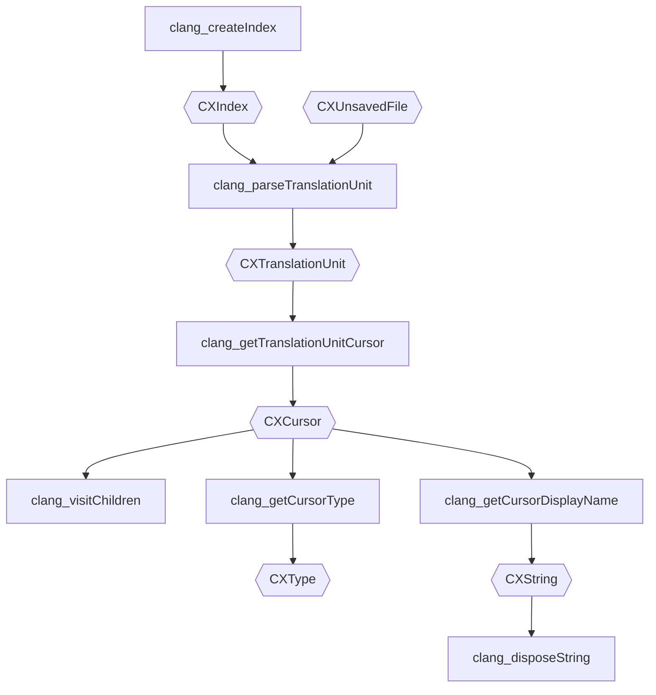

# LLVM

## libclang

!!! quote

    - [Libclang tutorial — Clang documentation](https://clang.llvm.org/docs/LibClang.html)
    - 

- 功能：将源代码翻译为 AST，并支持对 AST 的操作
- 头文件：`clang-c/Index.h`
- 前缀：`CX`

```mermaid
graph TD
    CXIndex{{CXIndex}}
    CXTranslationUnit{{CXTranslationUnit}}
    CXCursor{{CXCursor}}
    CXType{{CXType}}
    CXString{{CXString}}
    CXUnsavedFile{{CXUnsavedFile}}

    clang_createIndex[clang_createIndex]
    clang_parseTranslationUnit[clang_parseTranslationUnit]
    clang_getTranslationUnitCursor[clang_getTranslationUnitCursor]
    clang_visitChildren[clang_visitChildren]
    clang_getCursorDisplayName[clang_getCursorDisplayName]
    clang_getCursorType[clang_getCursorType]
    clang_disposeString[clang_disposeString]

    CXIndex --> clang_parseTranslationUnit
    CXTranslationUnit --> clang_getTranslationUnitCursor
    CXCursor --> clang_visitChildren
    CXCursor --> clang_getCursorDisplayName
    CXCursor --> clang_getCursorType
    CXString --> clang_disposeString
    CXUnsavedFile --> clang_parseTranslationUnit 

    clang_createIndex --> CXIndex
    clang_parseTranslationUnit --> CXTranslationUnit
    clang_getTranslationUnitCursor --> CXCursor
    clang_getCursorDisplayName --> CXString
    clang_getCursorType --> CXType
```
