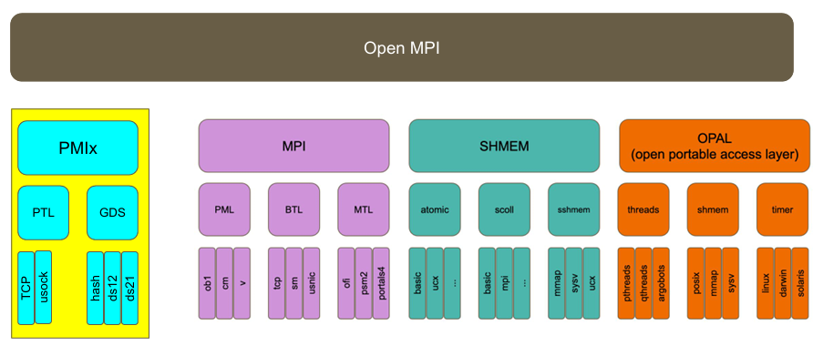
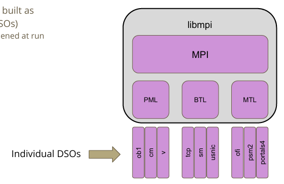

# MPI

## OpenMPI

!!! quote

    - [EasyBuild Tech Talks · easybuilders/easybuild Wiki](https://github.com/easybuilders/easybuild/wiki/EasyBuild-Tech-Talks-I:-Open-MPI)：2020 年的讲座，对 OpenMPI Z
    - [Open MPI head of development — Open MPI main documentation](https://docs.open-mpi.org/en/main/index.html)
    - [open-mpi/ompi: Open MPI main development repository](https://github.com/open-mpi/ompi)

### 基础概念

我们从 2020 年的 The ABCs of Open MPI 系列讲座开始。

OpenMPI 是一个大型项目，采用模块化组织，称为 MCA（Modular Component Architecture），从上至下分为 Project、Framework、Component：



默认情况下，所有 component 被编译为动态链接库（Dynamic Shared Objects, DSO），可以按需加载：



到 OpenMPI v5.0，共有如下 FrameWork

- MPI：
    - `coll`：MPI Collecitves，实现 `MPI_BCAST`、`MPI_BARRIER`、`MPI_REDUCE` 等集合通信。

        在 v4.1.0 后，增加了可选的组件，并且可以对默认的通信算法选择进行调优。

    - `op`：MPI Reduction Operations
    - `osc`：MPI One-sided Communications
    - `pml`：MPI Point-to-Point Communications，实现 `MPI_SEND`、`MPI_RECV` 等点对点通信。可选：

        - `ob1`：多设备多链路引擎。它可以选择多个能够到达目标的 BTL 组件，并实现负载均衡。

            

        - `cm`：用于驱动支持硬件消息标签匹配的网络接口（matching network），比如 iWARP、OminiPath

            

        - `ucx`：使用 UCX 通信库，用于 InfiniBand 或 RoCE 设备

    - `topo`：MPI Topologies

- 底层传输：

    - `btl`：Byte Transport Layer

        可选组件：

        - `ofi`：Libfabric
        - `self`：loopback
        - `sm`：共享内存
        - `tcp`

        其余不常见的略过。

    - `bml`：BTL Multipliexing Layer
    - `mtl`：Matching Transport Layer，不常用，略

- 文件：

    - `io`：MPI IO，实现 `MPI_FILE_OPEN`、`MPI_FILE_READ`、`MPI_FILE_WRITE` 等文件操作。可选：

        - `ompio`：默认
        - `romio`：来自 MPICH

    - `fbtl`：MPI File Byte Transfer Layer
    - `fcoll`：MPI File Collectives
    - `fs`：MPI File Management
    - `sharedfp`：MPI shared file pointer operations

- 其他：

    - `hook`：Generic Hooks
    - `vprotocol`：Virtual Protocol API Interposition

#### 通信库

##### Libfabric

!!! quote

    - [fi_guide(7)](https://ofiwg.github.io/libfabric/main/man/fi_guide.7.html)

Libfabric 简称 OFI，由不希望网络 API 受 InfiniBand 的抽象限制的厂商发起，如 Intel 和 Cicso。它构建在较高的抽象层次，支持 IB Verbs、Sockets、共享内存等。

##### UCX

UCX 支持 InfiniBand 和 RoCE 等 RDMA 设备。

#### PMIx

#### ORTE 与 PRRTE

ORTE 就是

`orterun`、`mpirun`、`mpiexec` 是同一个文件，见 [Ubuntu Manpage: orterun, mpirun, mpiexec - Execute serial and parallel jobs in Open MPI.](https://manpages.ubuntu.com/manpages/trusty/man1/orterun.1.html)

如果要阅读 ORTE 源码，可以在 v4.x 下找到 `orte` 文件夹，其中 `orte/tools/orterun/main.c` 就是 orterun 的入口。

在 OpenMPI v5.0 中，PRRTE 取代了 ORTE。现在，`prun` 的入口在 `prrte/src/tools/prun/main.c`。

### 构建和运行

构建：

```bash
./configure CC= CXX= FC= --with-FOO --without-FOO
```

OpenMPI 内置了某些依赖（如 hwloc 和 libevent），但是也可以用 `--with-hwloc` 等选项替换为外部版本。

要构建支持 CUDA 的 OpenMPI，需要：

- 构建支持 GDR 的 UCX
- 然后构建支持 CUDA 和 UCX 的 OpenMPI

查看当前构建的信息：

```bash
ompi_info --parsable
```

运行：

```bash
export OMPI_MCA_foo=bar
mpirun \
    --mca pml ob1/cm/ucx \
    --mca btl a,b,c \
```

!!! example

    在 OpenMPI v4.x 中：

    ```bash
    $ ompi_info --all | grep btl_openib_if_include
    MCA btl openib: parameter "btl_openib_if_include" (current value: "", data source: default, level: 9 dev/all, type: string)
        Comma-delimited list of devices/ports to be used (e.g. "mthca0,mthca1:2"; empty value means to use all ports found).  Mutually exclusive with btl_openib_if_exclude.
    ```

    可以通过下面的方式：

    ```bash
    export OMPI_MCA_btl_openib_if_include=mlx5_0:1
    mpirun \
        --mca btl_openib_if_include mlx5_0:1
    ```

### 源码阅读

#### 构建系统

从 Makefile 开始，构建时我们使用 `all` 这个目标，它进入到所有子文件夹并执行构建，见 [Where is the target all-recursive in makefile? - Stack Overflow](https://stackoverflow.com/questions/17172659/where-is-the-target-all-recursive-in-makefile)。

#### 运行时

#### MCA

#### BTL

##### openib

## MVAPICH

这可能是目前最先进的 MPI 实现，受 NVIDIA 喜爱，并且也是神威 - 太湖之光所使用的 MPI 实现。

MVAPICH 提供非常多种细分的版本，可根据需求选择。一般选用 MVAPICH2（源码分发）或 MVAPICH2-X（打包分发），提供最全面的 MPI 和 IB/RoCE 支持。
