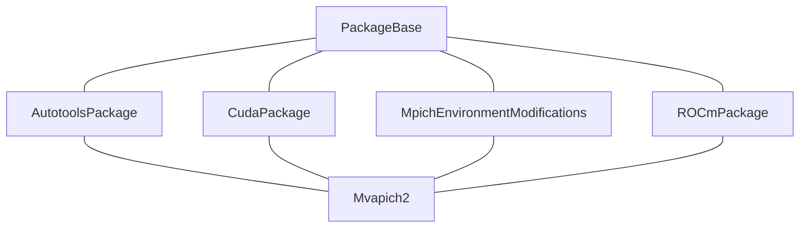

---
tags:
  - 个人笔记
---

# Spack

!!! note "概念：[spec](https://spack.readthedocs.io/en/latest/spec_syntax.html)"

    > A spec is like a name, but it has a version, compiler, architecture, and build options associated with it. In spack, you can have many installations of the same package with different specs.

    spec 是 Spack 中按特定选项构建的一个软件包，包含软件包名、版本、编译器、选项等信息。比如 `gcc@12.2.0` 就是一个 spec。对于一个软件包，我们可以用不同的编译选项选项构建多个 Spec。

    使用 `spack find -dvf` 可以查看 spec 的详细信息：

    ```bash
    $ spack find -dfv
    -- linux-debian12-icelake / gcc@12.2.0 --------------------------
    cuda@11.8.0%gcc ~allow-unsupported-compilers+dev build_system=generic
        gcc-runtime@12.2.0%gcc  build_system=generic
        glibc@2.36%gcc  build_system=autotools
        libxml2@2.10.3%gcc +pic~python+shared build_system=autotools
            gmake@4.3%gcc ~guile build_system=generic patches=599f134
            libiconv@1.17%gcc  build_system=autotools libs=shared,static
            pkgconf@1.8.1%gcc  build_system=autotools
            xz@5.4.6%gcc ~pic build_system=autotools libs=shared,static
            zlib-ng@2.1.6%gcc +compat+new_strategies+opt+pic+shared build_system=autotools
    ```

    Spec 的常用符号含义如下：

    | Symbol  | Example | Description |
    |-----|---- |-------------|
    | `@` | `@1.2:1.4` | 指定版本 |
    | `^` | `^gcc@4.7` | 依赖项 |
    | `%` | `%gcc@4.7` | 指定编译器 |
    | `+`、`-` 或 `~` | `+mpi` | 布尔类型选项<br/> `~` 与 `-` 等价，用于某些情况下阻止 shell 解析 |
    | `++`、`--` 或 `~~` | `++mpi` | 布尔类型选项，在依赖之间传递 |
    | `name=<value>` | `build_system=cmake` | 指定选项的值 |
    | `name==<value>` | `build_system==cmake` | 指定选项的值，在依赖之间传递 |
    | `<flag>=<flags>` | `cflags=-O3` | 特殊的编译器选项，如：`cflags`, `cxxflags`, `fflags`, `cppflags`, `ldflags`, and `ldlibs` |

    对于本地安装的 spec，还可以通过 `/` 哈希值来指定：

    ```bash
    $ spack location --install-dir cuda
    ==> Error: cuda matches multiple packages.
    Matching packages:
        ngtuhol cuda@11.8.0%gcc@12.2.0 arch=linux-debian12-icelake
        bthqeln cuda@12.4.0%gcc@12.2.0 arch=linux-debian12-icelake
    Use a more specific spec (e.g., prepend '/' to the hash).
    $ spack location --install-dir cuda/ngtuhol
    /opt/spack/opt/spack/linux-debian12-icelake/gcc-12.2.0/cuda-11.8.0-ngtuholoe4xatxmphodttdett3rmhjrr
    ```

    一些复杂的 Spec 可以使用引号括起作为一个参数传递，否则 Spack 会识别错误。例如 `spack diff <spec> <spec>`：

    ```bash
    $ spack diff intel-oneapi-compilers arch=linux-debian12-icelake intel-oneapi-compilers arch=linux-debian12-zen3
    ==> Error: You must provide two specs to diff.
    $ spack diff 'intel-oneapi-compilers arch=linux-debian12-icelake' 'intel-oneapi-compilers arch=linux-debian12-zen3'

    --- intel-oneapi-compilers@2025.0.4/jwh4nndynkcqhogdltdrxjkiilvulwyg
    +++ intel-oneapi-compilers@2025.0.4/zc7x2awdl3jriiydjaozmaizjhcsp2u5
    @@ hash @@
    - intel-oneapi-compilers jwh4nndynkcqhogdltdrxjkiilvulwyg
    + intel-oneapi-compilers zc7x2awdl3jriiydjaozmaizjhcsp2u5
    @@ node_target @@
    - intel-oneapi-compilers icelake
    + intel-oneapi-compilers zen3
    ```

## 使用软件包

Spack 中的软件包有三种使用方式：

- **`spack load`**：使用单个软件包。比如

    ```bash
    spack load gcc@11.2.0
    ```

- **Module**：Spack 提供对 Environment Modules 和 Lmod 的支持，可以设置在构建 Spec 后自动生成 modulefile，这样就可以通过 `module` 命令加载 Spack 安装的软件包。

    ```bash
    spack module lmod refresh
    module load gcc@11.2.0
    ```

- **Environment**：与 Conda 环境类似，就是一组可以构建的 Spec。与 modules 相比，它更加稳定、可复现，且可以作为一个整体 load。

    ```bash
    spack env activate -p myenv
    ```

## 添加已有的软件包

- 配置编译器 `spack compiler`
    - `list` `add=find` `info`
    - `spack config edit compilers` 可以进一步指定编译选项、设置环境变量。

- `spack external find` 自动扫描系统中已有的包 [Automatically Find External Packages](https://spack.readthedocs.io/en/latest/packages_yaml.html#cmd-spack-external-find)
- `spack config edit packages` ，以 CUDA 为例：

```yaml
packages:
  all:
    variants: +cuda cuda_arch=80
  cuda:
    externals:
    - spec: "cuda@12.3%gcc@12.2.0 arch=linux-debian12-x86_64"
      prefix: /usr/local/cuda-12.3
      extra_attributes:
        environment:
          prepend_path:
            LD_LIBRAY_PATH: /usr/local/cuda-12.3/lib64
```

- Spack 建议如果系统中有这些包就写进去： `openssl`  `git` 。这些包确实很多系统都有附带，直接使用可以节省一些编译时间。当然很多时候我们用 Spack 就是不想自己解决依赖，希望一行命令解决所有事情，全都让 Spack 自己装一套也行。

!!! warning "有些包必须使用发行版提供的版本"

    比如 OpenSSL，如果版本不一致，可能会导致 SSH 连接失败。这将直接导致 MPI 程序无法运行。

    对于 OpenSSL 这种基础包，每个系统应当固定版本，不要让 Spack 自行编译，很可能发生版本不一致问题。

## 串联 Spack 实例

!!! tip "修改不同级别的配置"

    - 部分 Spack 命令可以使用 `--scope=` 选项指定配置级别，如 `--scope=site`、`--scope=user`。**默认为用户级别**。
    - **用户 spack** 的配置文件位于 `~/.spack` 目录下

**用户 spack** 安装完成后，可以将**集群 spack** 指定为上游 Spack 实例，从而复用**集群 spack** 已安装的软件包，节省安装时间。

=== "使用命令添加配置"

    ```shell
    spack config add upstreams:zjusct-spack:install_tree:/pxe/opt/spack/opt/spack
    ```

=== "手动修改配置文件"

    该配置文件默认没有创建，请在创建后写入以下内容：

    ```yaml title="~/.spack/upstreams.yaml"
    upstreams:
      zjusct-spack: 
        install_tree: /pxe/opt/spack/opt/spack
    ```

这样，运行 `spack find` 命令就可以看到集群上的 Spack 安装的软件包了。与此同时，你也可以更改 Spack 的软件包配置，这些更改将会放在你手工安装的 Spack 目录下。

!!! note "概念：使具体化（concretize）"

    Spack 安装软件包需要经过 concretize 和 install 两个步骤。concretize 是指确定软件包的依赖关系，生成 spec 树，然后根据 spec 树安装软件包。

    `spack spec` 执行的就是 concretize 操作。

    更多信息建议阅读：[CSCS Spack Course 2024](https://spack.github.io/spack-cscs2024/)。

使用 `spack list` 可以查询在线仓库中的软件包，使用 `spack info` 可以查看软件包的详细信息。

!!! note "概念：虚包（Virtual Packages）"

    比如 OpenMPI、IntelMPI、MPICH，它们是 MPI 的不同实现。因此它们都提供一个虚包 mpi，其他程序只会依赖于 mpi 这个包，而不会依赖于某个具体实现。
    使用 `spack info --all` 可以查看提供的虚包，这里以 ATLAS 为例，可以看到：

    ```yaml
    Virtual Packages:
        atlas provides blas, lapack, lapack@3.6.1
    ```

    也就是说， `atlas` 会自动取代 `blas/lapack` 等的位置，提供它们的服务。

## 其它常用命令

- 比较 spec 差异：`spack diff`
- 查找安装位置：`spack location --install-dir <spec>`
- 移动到安装位置：`spack cd -i <spec>`

## 处理头文件和依赖

!!! quote

    - [Drop *_INCLUDE_PATH in prefix_inspections:include by haampie · Pull Request #21699 · spack/spack](https://github.com/spack/spack/pull/21699)
    - [Customize environment modifications — Spack documentation](https://spack.readthedocs.io/en/latest/module_file_support.html#customize-environment-modifications)
    - [Environment Variables (The C Preprocessor) - GCC Documentation](https://gcc.gnu.org/onlinedocs/cpp/Environment-Variables.html)
    - [LD_LIBRARY_PATH – or: How to get yourself into trouble!](https://www.hpc.dtu.dk/?page_id=1180)

Spack 只会维护下面的环境变量：

```text
PATH
MANPATH
ACLOCAL_PATH
PKG_CONFIG_PATH
CMAKE_PREFIX_PATH
DYLD_FALLBACK_LIBRARY_PATH on macOS
```

如果加载的包是编译器（如 `nvhpc`、`intel-oneapi-compilers` 等），还会修改编译器变量和动态链接库路径：

```text
CC CXX FC F77
LD_LIBRARY_PATH
```

其他情况下一般不会修改头文件和动态链接库搜索路径：

```text
CPATH
C_INCLUDE_PATH
CPLUS_INCLUDE_PATH
LD_LIBRARY_PATH
```

> 在相关文档和 Pull Request 中可以了解原因：
>
> Spack 社区认为环境变量不够透明，作为一种管理选项的方式也十分危险（造成过某些编译器 bug），更加鼓励用户显式使用编译器选项如 `-I$(spack location -i <spec>)/include`。
>
> 现代构建工具（如 CMake、pkg-config）已经能够很好地处理头文件搜索路径，移除后用户仍可以通过配置文件手动添加这些路径。
>
> Spack 将维护环境变量的自主选择交给用户和系统管理员，可以通过 `modules.yaml` 指定修改环境变量。

如果我们需要包含或引用 Spack 管理的包，有以下几种方式：

- 使用 `spack location -i <spec>`：

    先 `spack cd -i <spec>` 进入安装目录，使用 `fdfind | fzf` 等工具搜索头文件的相对路径，然后添加到编译选项中。例如：

    ```bash
    C_INCLUDE_PATH=$(spack location -i <spec>)/include make
    ```

- 使用 [pkg-config](https://www.freedesktop.org/wiki/Software/pkg-config/)：

    `pkg-config` 是一个管理库文件和头文件路径的工具。它会搜索 `PKG_CONFIG_PATH` 中的 `.pc` 文件，按指定要求返回编译选项。

    Spack 部分包加载时会修改 `PKG_CONFIG_PATH`，可以使用 `pkg-config` 来获取头文件和库文件的路径。例如：

    ```bash
    c++ example.cpp $(pkg-config --cflags --libs gtk+-3.0 webkit2gtk-4.0) -o example
    ```

    `pkg-config` 支持 `--static`、`--shared` 等选项，可以指定链接静态库或动态库。

- 使用 CMake：

    Spack 部分包加载时会修改 `CMAKE_PREFIX_PATH`，可以使用 `find_package` 来查找头文件和库文件。例如：

    ```cmake
    find_package(OpenMP)
    ```

## 自行添加编译、链接选项

这些问题常常是由于编写安装脚本的人没有考虑完善导致的，没有指定链接某些库，导致编译过程中断。如果对 `ld` 等链接工具熟悉，就能够自行添加相应的选项完成编译。下面记录几个例子：

```bash
spack install hwloc@2.9.1%oneapi ^intel-oneapi-mpi%oneapi
```

使用 `intel-oneapi-mpi` 依赖安装 `hwloc` ，提示缺少 MPI 相关符号，很显然是没链接 MPI 库。

检查 786 行的编译命令，并没有指定链接 MPI 库，因此应当添加 `-lmpi` 选项。更改为：

```bash
spack install hwloc@2.9.1%oneapi ldflags="-lmpi" ^intel-oneapi-mpi%oneapi
```

!!! tip "解决链接错误"

    发生链接错误表明没有指定链接某些库，这可能是因为：

    - 没有指定链接到某个库包含该符号的库：

        报错一般为未定义符号。

    - 无法找到指定的链接库：

        ```text
        /usr/bin/ld: cannot find -lzlib
        ```

## 打包与维护

!!! quote

    - [Packaging Guide: defining a package — Spack documentation](https://spack.readthedocs.io/en/latest/packaging_guide_creation.html)

Spack 打包系统整体比较复杂，这里我们仅介绍基本概念，侧重于构建相关，使读者有能力修改现有的软件包。

在 Spack 中，每个 Package 就是一个类，形成继承关系：



Package 类的代码有这么几类：

- 元数据：

    ```python
    homepaage = "..."
    version("2.4.0", sha256="...")
    variant("feature", default=True, description="...")
    ```

- 补丁：

    ```python
    patch("patchfile.patch", when="@1.2: +feature")
    def patch(self):
        ...  # 自定义补丁
    ```

- 依赖关系：

    ```python
    depends_on("libelf@0.8 +parser +pic",
        when="@1.2: +feature",
        type=("build", "link", "run", "test"),
        patches=["patchfile.patch",
            patch("https://github.com/spack/spack/pull/1234.patch",
                when="@1.2: +feature")]
        )
    provides()
    conflicts()
    requires()
    setup_dependent_pacakge()
    ```

    默认为 `type=("build","link")`。不同的依赖关系将在包的不同阶段起作用，主要是影响 `PATH` 和编译、链接器选项。

    这些指令可以用 `with` 语句来批量管理：

    ```python
    with default_args(type=("build","run"), when("...")):
        depends_on("...")
        conflicts("...")
    ```

- 标准接口：

    主要是供依赖使用。

    ```python
    def libs(self): # 库名
    def command(self): # 可执行文件
    def headers(self): # 头文件目录
    def home(self): # 安装位置
    ```

- 构建、安装步骤：

    根据不同的构建系统，实现不同的函数。

    ```python
    # before build
    def setup_build_environment(self, env):
        env.set("CXX", "g++")
    @run_before("cmake") 

    # build
    def cmake_args(self): # CMakePackage
        self.spec["dependecy"].prefix
    def configure_args(self): # AutotoolsPackage
        args = []
        if self.spec.satisfies("+feature"):
            args.append("--enable-feature")
            args.append(f"--with-libxml2={self.spec['libxml2'].prefix}")
        return args
    def build_targets(self): # MakefilePackage
    def install_targets(self): # MakefilePackage
    
    # after build
    def install_missing_files(self):
        install_tree("extra_files", self.prefix.bin)
    @run_after("install", when="...")
    ```

- 环境管理：

    可以管控不同阶段、依赖关系上的环境变量：

    ```python
    setup_build_environment(env, spec)
    setup_dependent_build_environment(env, dependent_spec)
    setup_run_environment(env)
    setup_dependent_run_environment(env, dependent_spec)
    ```

    根据 Spack 文档，这些环境会在依赖间递归维护。比如有下列依赖链：

    ```text
    my-pkg -(build)-> autoconf -(run)> perl
    ```

    那么 perl 的运行时环境会被设置到 my-pkg 的构建环境中。

Spack 安装软件包的大致过程：

- Fetch
- Extract to stage directory
- Fork build environment

    Spack 会清空可能影响构建的环境变量，构建过程与主进程互不干扰。

- Execute (build system specific)
    - configure
    - build
    - install

!!! tips

    ```bash
    spack location --package-dir gmp
    ```

!!! tips "调试构建环境"

    Spack 在 Stage 文件夹中保留了各个阶段的日志和环境，可以直接利用：

    ```bash
    /spack-stage-*$ ls
    spack-build-01-autoreconf-out.txt
    spack-build-02-configure-out.txt
    ...
    ```

    有时需要手动复现 Spack 构建过程中的命令，可以使用下面的命令恢复环境：

    ```bash
    # 失败时不清除 prefix（一般用于 install 阶段的调试）
    spack install --keep-prefix --verbose <package>
    # 失败时包的位置就是 stage
    spack locate <package>
    spack cd <pacakge>
    spack build-env <package> -- /bin/sh
    ```

    其他有用的命令：

    ```bash
    # 成功安装后保留 stage
    spack install --keep-stage <spec>
    # 清理 stage
    spack clean --stage
    ```

## 构建 Apptainer 镜像

Spack 提供快捷的构建镜像的方式。同时，为了方便调试，我使用下面的脚本：[spack.assets/build.sh](spack.assets/build.sh)。

进入 sandbox 目录调试的流程一般如下：

```bash
apptainer shell \
    --writable \
    --bind ${SPACK_ROOT}/var/spack/cache:/opt/spack/var/spack/cache \
    --bind /root/spack-packages:/spack-packages \
    --bind /etc/pki:/etc/pki \
    --shell bash \
    --pwd /opt/spack-environment \
    build-temp-*/rootfs
. /opt/spack/share/spack/setup-env.sh
spack -e . build-env mvapich2 -- /bin/bash
# 检查环境
export
```

!!! tips

    - 如果 rootfs 中不存在 `/etc/pki` 应当先创建然后挂载
    - 写权限用于 `/opt` 中的 spack 锁文件
    - 同时构建多个容器可能会争抢 `/tmp` 中的锁，可以选择独立挂载 tmpfs 解决，但这也会导致构建失败时 stage 信息丢失。

## 源码阅读

!!! quote

    - [Developer Guide — Spack 1.1.0.dev0 documentation](https://spack.readthedocs.io/en/latest/developer_guide.html#code-structure)

如果需要修复的问题比较深入，涉及基础的构建类，可能需要了解一些 Spack 源码的知识。

### 环境配置

Spack 的 Python 源码位于 `lib/spack` 下，包名为 `spack`。此外，`spack-packages` 仓库内含有包名为 `spack_repo` 的模块。将这两个仓库 clone 到本地，修改 `pyproject.toml`，安装到自己的 Python 环境中即可开始调试。

### 包解析和依赖注入

`spack install` 的命令入口为 `lib/spack/spack/cmd/install.py` 的 `install()` 函数，它根据当前是否为 Environment 而分为不同的处理流程。对于 Environment 的情况，需要修改环境相关状态。

下面按非 Environment 的 `install_without_active_env()` 进行分析：

- `concrete_specs_from_cli()`：得到 concrete spec
- `PackageInstaller()`：构造函数
    - 为每个 package 生成 `BuildRequest`，按依赖关系成 DAG
- `PackageInstaller()._install()`
    - `self._init_queue()` 将所有 `BuildRequest` 加入队列
        - `_add_tasks()` 确保该包的依赖不是失败的
            - `_add_init_task()` **构造任务**（`BuildTask` 或 `RewireTask`）
                - `self._push_task()` 正式加入队列
        - `while` 循环启动队列中的任务
            - `self.start_task()`
                - `task.start()`：**启动任务**
            - `self.complete_task()`

以 `BuildTask` 为例，它的 `start()` 做了下面这些事：

- 软件包在构造时存入 `self.pkg`
- 构造 `pkg.stage`
- 启动安装过程：

    ```python
    spack.build_environment.start_build_process(
        self.pkg, build_process, self.request.install_args
    )
    ```

该函数构造一个 `BuildProcess` 对象，并调用 `.start()` 开始构建。

- `BuildProcess` 本身是 `multiprocessing.Process` 的包装，它的 `.start()` 就是 `Process.start()`。

    ```python
    p = BuildProcess(
        target=_setup_pkg_and_run,
        args=(
            serialized_pkg,
            function,
            kwargs,
            write_pipe,
            input_fd,
            jobserver_fd1,
            jobserver_fd2,
        ),
        read_pipe=read_pipe,
        timeout=timeout,
        pkg=pkg,
    )
    self.p = multiprocessing.Process(target=target, args=args)
    ```

- `_setup_pkg_and_run()` 就是构建进程的入点

    - 修改环境

        ```python
        kwargs["env_modifications"] = setup_package(
                pkg, dirty=kwargs.get("dirty", False), context=Context.from_string(context)
            )
        ```

        向下调用直到 `setup_context.get_env_modifications()`，该函数追踪依赖链链完成环境注入：

        ```python
        for dspec, flag in chain(self.external, self.nonexternal):
            for root in self.specs:  # there is only one root in build context
                        spack.builder.create(pkg).setup_dependent_build_environment(env, root)

            if self.should_setup_build_env & flag:
                spack.builder.create(pkg).setup_build_environment(env)
        ```

    - 调用传入的 `function(pkg, kwargs)` 执行具体任务。这个 `function` 是 `build_process`，它做了这些事：

        ```python
        installer = BuildProcessInstaller(pkg, install_args)
        installer.run()
        ```

### 构建进程

`run()` 分为几个阶段：

- `self.pkg.do_stage()` 下载和解压
- `self._install_source()` 可选地安装源码包
- `self._real_install()`
    - `builder = spack.builder.create(pkg)`：

        这个函数十分重要，Spack 的[开发者手册](https://spack.readthedocs.io/en/latest/developer_guide.html#package-class-architecture) 正是从这里开始介绍。

        在 `_create()` 中，具体执行这些内容：

        - 识别 pkg 的 buildsystem
        - 从全局字典获得对应的 builder class 名称

            全局构建器由 `spack-packages/repos/spack_repo/builtin/build_systems/` 中的 Builder 类使用 `@register_builder` Decorator 注册。

        - 从 `pkg.module.<name>` 获得该 Package 对应的 Builder 实例

        以 Autotools 为例，其 Package 和 Builder 定义如下：

        ```python
        class AutotoolsPackage(PackageBase):
            build_system("autotools")
        @register_builder("autotools")
        class AutotoolsBuilder(BuilderWithDefaults):
            phases = ("autoreconf", "configure", "build", "install")
            def autoreconf():
            def configure():
            def build():
                pkg.module.make(*params)
            def install():
        ```

        再看 `Builder` 基类的构造函数，需要注意它是一个可迭代对象，并注意迭代返回的是 `InstallationPhase` 对象：

        ```python
        class Builder(BaseBuilder, collections.abc.Sequence):
            def __init__(self, pkg: spack.package_base.PackageBase) -> None:
                super().__init__(pkg)
                self.callbacks = {}
                for phase in self.phases:
                    self.callbacks[phase] = InstallationPhase(phase, self)
            def __getitem__(self, idx):
                key = self.phases[idx]
                return self.callbacks[key]
        ```

        - 如果是自定义构建器，将进入较为复杂的 Adapter 构建过程

    - `for i, phase_fn in enumerate(builder) phase_fn.execute()`：逐阶段执行构建过程，执行的就是 `InstallationPhase.execute()`。在这里，我们看到 `@run_after()` 等 Decorator 注册的回调函数是如何被执行的：

        ```python
        def execute(self):
            pkg = self.builder.pkg
            self._on_phase_start(pkg)

            for callback in self.run_before:
                callback(self.builder)

            self.phase_fn(pkg, pkg.spec, pkg.prefix)

            for callback in self.run_after:
                callback(self.builder)

            self._on_phase_exit(pkg)
        def _select_phase_fn(self):
            phase_fn = getattr(self.builder, self.name, None)
        ```

        也可以看到执行的 `phase_fn` 又是 `builder` 中对应的 `phase` 函数。在上面的 Autotools 类中，我们看到类需要实现自己定义的所有 phase。

### 属性注入

现在我们了解了构建进程的基本流程，接下来我们看看依赖注入是如何实现的。

首先看执行命令的注入：上文中，我们看到 `build()` 阶段使用了 `make`，这个属性是在哪里注入的呢？

如果在构建系统相关的源码中寻找，很难得到正确的思路。如果你看过构建系统相关的包，容易想起这些包都会在 `setup_dependent_pacakge()` 中设置 `module` 的属性：

```python title="builtin/packages/automake"
    def _make_executable(self, name):
        return Executable(join_path(self.prefix.bin, name))

    def setup_dependent_package(self, module, dependent_spec):
        # Automake is very likely to be a build dependency,
        # so we add the tools it provides to the dependent module
        executables = ["aclocal", "automake"]
        for name in executables:
            setattr(module, name, self._make_executable(name))
```

当时看到觉得奇怪，不知道这些 Executable 的调用方式是什么。

```python title="builtin/packages/gmake"
    def setup_dependent_package(self, module, dspec):
        module.make = MakeExecutable(
            self.spec.prefix.bin.make,
            jobs=determine_number_of_jobs(parallel=dspec.package.parallel),
        )
```

### 示例问题分析

接下来以 [Installation issue: MVAPICH2 Build Failure - `autom4te: not found` · Issue #723 · spack/spack-packages](https://github.com/spack/spack-packages/issues/723) 为例，分析 MVAPICH2 的构建过程中依赖是如何注入的。

```python
class Mvapich2(MpichEnvironmentModifications, AutotoolsPackage):
    depends_on("automake@1.15", type="build")  # needed for torque patch
class Automake(AutotoolsPackage, GNUMirrorPackage):
    depends_on("autoconf", type="build")
class Autoconf(AutotoolsPackage, GNUMirrorPackage):
```

开启 debug 信息，可以看到
