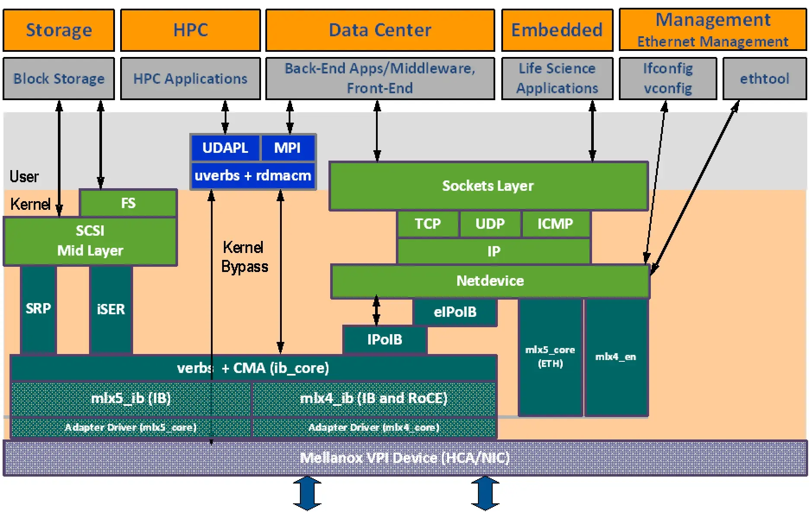
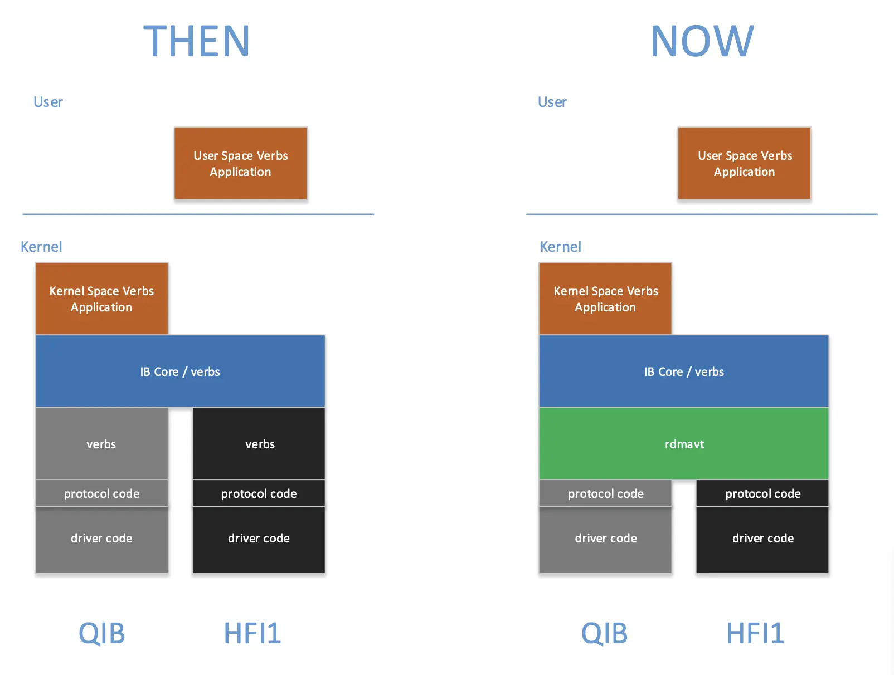
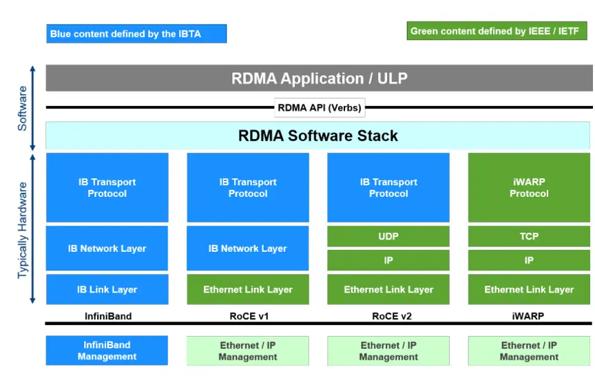
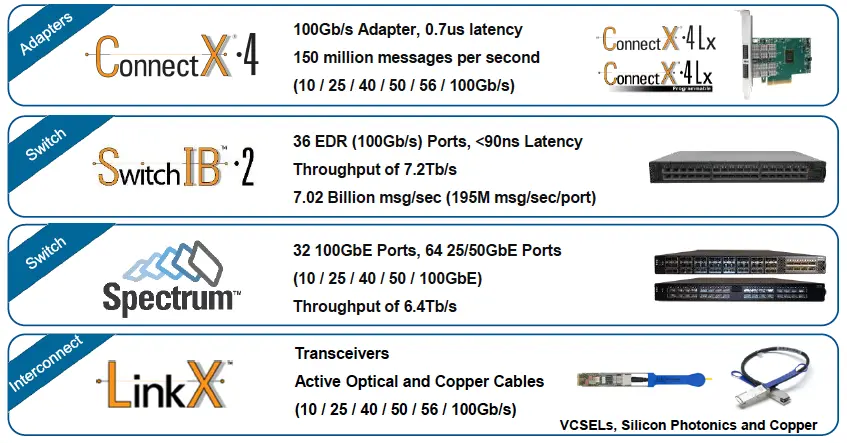
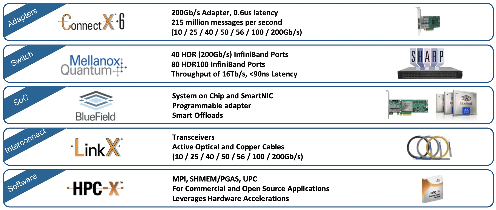
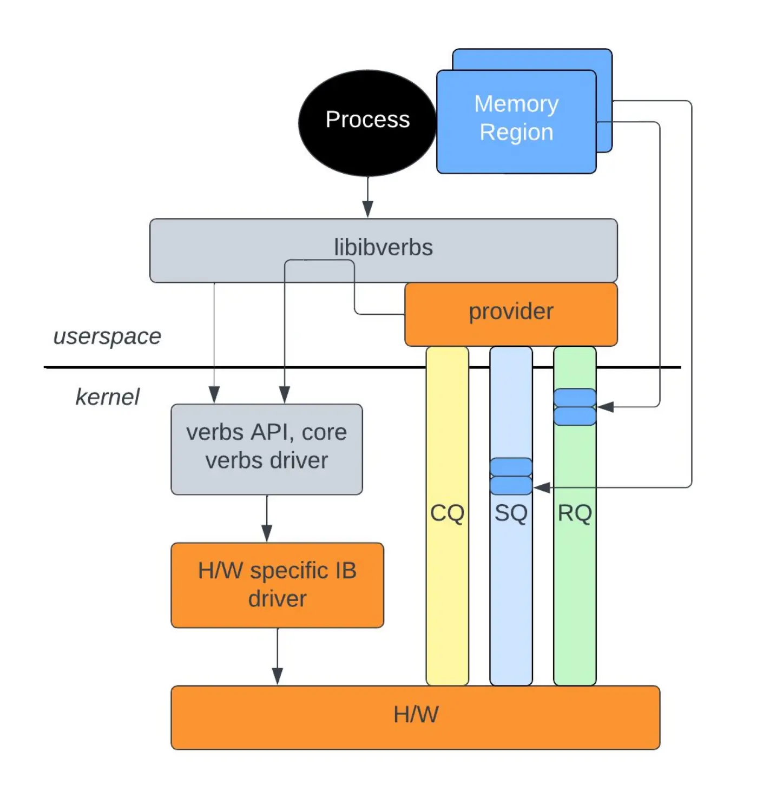

# 高性能网络

欢迎来到 HPN 的世界！

随着 AI 的发展和数据中心规模的不断扩大，高性能网络的需求日益增长。本篇笔记是对高性能网络方向的综述。我们将梳理 HPN 的软硬件层次结构，从整体上把握 HPN 的技术和知识体系。至于具体的内容，请查看其他子笔记。


## RDMA

学习 HPN 应当从 RDMA 基本概念开始。目前，RDMA 入门的最佳中文材料是 Savir 所作的 [RDMA 杂谈 - 知乎](https://www.zhihu.com/column/c_1231181516811390976)，请读者自行阅读，本篇笔记不会再讲解其中的知识。其中基本概念篇（第 1-12）必读，后面的内容可根据工作需要具体选择，因为 RDMA 具体实现之间有不少差异。

读者应当了解：

- 基本元素：
    - Send/Receive Queue
    - Work Queue Element
    - Queue Pair：存放 WQE 的一块空间
        - 特殊 QP：
            - 0：子网管理 Subnet Management Interface（仅 InfiniBand）
            - 1：通用服务接口 General Service Interface，包括 CM
        - 状态：RST、INIT、RTR、RTS、SQD、SQEr、ERR
    - Queue Pair Context：S/RQ 的地址、大小、编号等信息
        - QPN 24b 节点唯一，GID 128b 网络唯一
    - Completion Queue
        - 可关联多个 S/RQ
        - 同一 WQ 的 CQE 保序；SRQ 和 RD 下的 RQ 不保序
    - Completion Queue Element：
        - 包含 WQE 编号
        - 错误类型：Immediate（立即返回上报）/Completion（CQE 上报）/Asynchronous（中断上报）
        - 通知方式：Poll、Notification
- 操作类型：Send-Receive、Write、Read、Atomic
- 服务类型：Reliable/Unreliable、Connection/Datagram
    - UD：QP 间无连接，WQE 中填 Address；为了安全，此时有 QKey，请求中也带上
        - 最高位为 `1` 的 QKey 是特权 QKey，只有内核能用
    - RD：End-to-End Context
- 资源结构：
    - Memory Region：
        - 作用：VA/PA/IOVA 转换、R/LKey 访问权限控制、Pin 页面
        - 权限：Remote/Local Read/Write/Atomic
        - L/RKey 组成：24b index 索引转换表 + 8b key 校验
        - 要使 RKey 失效，只能注销重注册
        - Memory Window：动态绑定到 MR，灵活控制权限，无需内核态
    - Scatter Gather Element/List：
        - 内容：地址、长度、LKey
    - Protection Domain：安全性，阻止 AH、QP 和 MR 等资源的跨 PD 互访
    - Address Handle：地址指 GID、端口号和 MAC 地址等，UD 通过 AH 索引地址信息
    - Queue Pair、Completion Queue
- 网络结构：
    - Global Routing Header：
        - RoCE 网络必须
- 高级话题：
    - SRQ：
        - RC/UC/UD 接收方必须预先下发足够多的 WQE，造成大量 RQ 浪费，通过共享节省内存
        - 所属的 PD 可以与关联的 QP 不同
        - 状态：只有错误和非错误，错误了只能销毁
    - Connection Management Protocol：
        - MAnagement Datagram：基于 UD 实现，向上支持 GS 和 SM；使用 QP1 和 QKey `0x8001_0000`
- 建链：[Connecting Queue Pairs « RDMAmojo](https://www.rdmamojo.com/2014/01/18/connecting-queue-pairs/)

    | 传输类型 | 需要交换的信息 |
    | - | - |
    | RC Send | GID, QPN |
    | RC Write/Read | GID, QPN, VA, RKey |
    | UD Send | GID, QPN, QKey |

作者最后一次更新是在 2023 年，尚有一些内容鸽了没有介绍。接下来本章就一些高级话题进行补充。

专栏中只作了概念介绍。如果希望将习得的概念应用到编程中，可以阅读下面的两份材料入门 IB Verbs。

- 简单：[RDMA Tutorial - LSDS](https://www.doc.ic.ac.uk/~jgiceva/teaching/ssc18-rdma.pdf)
- 详细：[Verbs programming tutorial](https://www.csm.ornl.gov/workshops/openshmem2014/documents/presentations_and_tutorials/Tutorials/Verbs%20programming%20tutorial-final.pdf)

### eXtended Reliable Connection (XRC)

!!! quote

    - (2007) [Microsoft PowerPoint - XRC](https://downloads.openfabrics.org/Media/SC07/2007_SC_Nov_XRC.pdf)
    - (2008) [[ofa-general] [PATCH 1/11] libibverbs: XRC base implementation](https://lists.openfabrics.org/pipermail/general/2008-June/051889.html)

!!! warning "XRC 是 libfabric 独有的功能"

还记得 SRQ 吗？它通过共享 RQ 的方式大量节省了接收端的内存占用。假设有 $n$ 个节点，每个节点有 $c$ 个核，每个核上都跑一个通信进程：

SRQ 将 QP 数从 $n \times c^2$ 降低到 $n \times c$。

XRC 尝试在此之上继续降低内存占用，这次通过**减少连接数**的方式实现。

XRC 的想法类似于 RDMA RD

### 其他问题

- 为什么 SRQ 和 RD 下的 RQ 不保序？

## 软件栈

阅读 [For the RDMA novice: libfabric, libibverbs, InfiniBand, OFED, MOFED? — Rohit Zambre](https://www.rohitzambre.com/blog/2018/2/9/for-the-rdma-novice-libfabric-libibverbs-infiniband-ofed-mofed)，了解这些软件包的关系。

### 实用工具

#### infiniband-diags

提供了非常多的工具，见 [infiniband-diags(8)](https://github.com/linux-rdma/rdma-core/blob/master/infiniband-diags/man/infiniband-diags.8.in.rst)。在 Debian 上，它们位于 `/usr/sbin` 中。

这里记录常用的一些：

```bash
# 查询
ibstat
ibstatus
ibaddr
ibnodes
ibhosts
ibrouters
ibswitches
iblinkinfo
ibnetdiscover
# 查询当前 IB 子网管理的位置
sminfo
# 测试
ibping # 注意，需要在另一台机器上使用 ibping -S 作为 server，否则是 ping 不通的。
ibping -c <count> -L <lid>
ibroute
ibtracert
```

#### OpenSM

IB 管理交换机能够作为 Subnet Manager（SM）来管理 IB 网络。SM 负责发现和配置所有 InfiniBand 设备。

使用非网管 IB 交换机时，IB 网络中缺少 Subnet Manager（SM），此时所有 HCA 状态为 Initializing。可以在其中的一台主机上安装开源的 OpenSM：

```bash
sudo apt install opensm
sudo systemctl enable --now opensm
```

#### mstflint

!!! quote

    - [:simple-github: Mellanox/mstflint: Mstflint - an open source version of MFT (Mellanox Firmware Tools)](https://github.com/Mellanox/mstflint)

`mstflint` 是 Mellanox Firmware Flash Interface 的缩写，用于管理 Mellanox 网卡的固件。诸如切换 RoCE 与 InfiniBand 模式、更新固件等比较底层的操作都可以通过这个工具完成。

下面以将端口模式从 ETH(2) 切换到 IB(1) 为例演示命令用法：

```shell
$ mstconfig query
$ sudo mstconfig -d 4b:00.0 set LINK_TYPE_P1=1

Device #1:
----------

Device type:        ConnectX5
Name:               MCX555A-ECA_Ax_Bx
Description:        ConnectX-5 VPI adapter card; EDR IB (100Gb/s) and 100GbE; single-port QSFP28; PCIe3.0 x16; tall bracket; ROHS R6
Device:             4b:00.0

Configurations:                                     Next Boot       New
        LINK_TYPE_P1                                ETH(2)               IB(1)

 Apply new Configuration? (y/n) [n] : y
Applying... Done!
-I- Please reboot machine to load new configurations.
$ mstfwreset -d 4b:00.0 -l3 -y reset
```

其他命令见 mstflint 发布自带的手册。

??? info "老版本命令留档"

    MLNX_OFED 包含了 mstflint，但一般版本较老，与新版 mstflint 命令不兼容。这里仅作为留档记录一下。

    新版本相比老版本的变化：

    - 不需要执行 `mst start`，服务自动启动。
    - 命令名称发生变化，比如 `mlxconfig` 变为 `mstconfig`。

    ```shell
    # 查看所有设备
    mst status
    # 线缆
    mst cable add # 扫描线缆，线缆一般不会自动被添加
    mlxcables -d e3:00.0_cable_0 -q
    # 链路
    mlxlink
    # 配置
    mlxconfig -d <device> query # 查询详细信息
    Device #1:
    ----------
    Device type:    ConnectX5
    Name:           MCX555A-ECA_Ax_Bx
    Description:    ConnectX-5 VPI adapter card; EDR IB (100Gb/s) and 100GbE; single-port QSFP28; PCIe3.0 x16; tall bracket; ROHS R6
    Device:         31:00.0
    Configurations:                                      Next Boot
            MEMIC_BAR_SIZE                              0
            MEMIC_SIZE_LIMIT                            _256KB(1)
            HOST_CHAINING_MODE                          DISABLED(0)
            HOST_CHAINING_CACHE_DISABLE                 False(0)
            HOST_CHAINING_DESCRIPTORS                   Array[0..7]
            HOST_CHAINING_TOTAL_BUFFER_SIZE             Array[0..7]
            FLEX_PARSER_PROFILE_ENABLE                  0
            FLEX_IPV4_OVER_VXLAN_PORT                   0
            ROCE_NEXT_PROTOCOL                          254
            ESWITCH_HAIRPIN_DESCRIPTORS                 Array[0..7]
            ESWITCH_HAIRPIN_TOT_BUFFER_SIZE             Array[0..7]
            PF_BAR2_SIZE                                0
    ```

#### HCA 卡

使用 `ibstat` 命令可以查看 HCA 卡的状态。只要能在这里看到 HCA 卡，就说明驱动已经加载。

端口的状态有以下几种：

| State | Physical State | 说明 |
| --- | --- | --- |
| Down | Disabled | 未连接线缆 |
| Polling | Polling | 如果持续处于该状态说明 IB 子网没有 SM |
| Active | LinkUp | 连接正常 |

#### DHCP for IPoIB

我们使用 dnsmasq 作为 DHCP 服务器。在 dnsmasq 官方示例中有这样一段：

```text title="dnsmasq.conf"
# Always give the InfiniBand interface with hardware address
# 80:00:00:48:fe:80:00:00:00:00:00:00:f4:52:14:03:00:28:05:81 the
# ip address 192.168.0.61. The client id is derived from the prefix
# ff:00:00:00:00:00:02:00:00:02:c9:00 and the last 8 pairs of
# hex digits of the hardware address.
# dhcp-host=id:ff:00:00:00:00:00:02:00:00:02:c9:00:f4:52:14:03:00:28:05:81,192.168.0.61
```

可能是因为 InfiniBand 迭代，现在已经不适用了。我们在 NVIDIA 的某份文档（忘掉是哪份了）中看到了这样的写法：

```text
id:20 + 硬件地址后 8 对十六进制数字
```

这是可行的。

#### Benchmark

[`perftest`](https://github.com/linux-rdma/perftest) 软件包由 `linux-rdma` 维护，用于测试 InfiniBand 性能，可用于 RoCE。

```bash
# 客户端
ib_write_lat --ib-dev=mlx5_0 --ib-port=1 MAX01-ib -a -R
# 服务端
ib_write_lat --ib-dev=mlx5_0 --ib-port=1 -R -a

ib_send_lat     latency test with send transactions
ib_send_bw      bandwidth test with send transactions
ib_write_lat    latency test with RDMA write transactions
ib_write_bw     bandwidth test with RDMA write transactions
ib_read_lat     latency test with RDMA read transactions
ib_read_bw      bandwidth test with RDMA read transactions
ib_atomic_lat   latency test with atomic transactions
ib_atomic_bw    bandwidth test with atomic transactions
```

#### iproute2

强大的 iproute2 同样支持了 RDMA 网络接口的管理，提供了 `rdma` 命令，语法与 `ip` 命令类似：

```bash
ip link
rdma link
```

#### 其他

一个用于看 IB 卡实时流量的脚本：

```bash
#!/bin/bash

# Author: Chen Jinlong
# Usage: ib_monitor.sh [interval]

declare -A old_recv_bytes;
declare -A old_recv_packets;
declare -A old_xmit_bytes;
declare -A old_xmit_packets;

interval=$1
if [ -z $interval ]; then
    interval=1
fi

for ib_dev in $(ls /sys/class/infiniband/); do
    counter_dir="/sys/class/infiniband/$ib_dev/ports/1/counters"
    old_recv_bytes[$ib_dev]=$(cat $counter_dir/port_rcv_data)
    old_recv_packets[$ib_dev]=$(cat $counter_dir/port_rcv_packets)
    old_xmit_bytes[$ib_dev]=$(cat $counter_dir/port_xmit_data)
    old_xmit_packets[$ib_dev]=$(cat $counter_dir/port_xmit_packets)
done

while true; do
    printf "%-10s %12s %12s %12s %12s\n" Device recv_MBps recv_kpps xmit_MBps xmit_kpps
    for ib_dev in $(ls /sys/class/infiniband/); do
        counter_dir="/sys/class/infiniband/$ib_dev/ports/1/counters"
        new_recv_bytes=$(cat $counter_dir/port_rcv_data)
        new_recv_packets=$(cat $counter_dir/port_rcv_packets)
        new_xmit_bytes=$(cat $counter_dir/port_xmit_data)
        new_xmit_packets=$(cat $counter_dir/port_xmit_packets)

        recv_MBps=$(echo "scale=2; ( $new_recv_bytes - ${old_recv_bytes[$ib_dev]} ) / 256.0 / 1024.0 / $interval" | bc)
        recv_kpps=$(echo "scale=2; ( $new_recv_packets - ${old_recv_packets[$ib_dev]} ) / 1000.0 / $interval" | bc)
        xmit_MBps=$(echo "scale=2; ( $new_xmit_bytes - ${old_xmit_bytes[$ib_dev]} ) / 256.0 / 1024.0 / $interval" | bc)
        xmit_kpps=$(echo "scale=2; ( $new_xmit_packets - ${old_xmit_packets[$ib_dev]} ) / 1000.0 / $interval" | bc)

        printf "%-10s %12s %12s %12s %12s\n" $ib_dev $recv_MBps $recv_kpps $xmit_MBps $xmit_kpps

        old_recv_bytes[$ib_dev]=$new_recv_bytes
        old_recv_packets[$ib_dev]=$new_recv_packets
        old_xmit_bytes[$ib_dev]=$new_xmit_bytes
        old_xmit_packets[$ib_dev]=$new_xmit_packets
    done
    printf "\n"

    sleep $interval
done
```

### 用户空间库

阅读 [:simple-github: linux-rdma/rdma-core](https://github.com/linux-rdma/rdma-core) 的简介。

#### Linux InfiniBand 软件结构

!!! quote

    - [InfiniBand - The Linux Kernel](https://docs.kernel.org/infiniband/index.html)
    - [InfiniBand Software on Linux - Oracle](https://docs.oracle.com/cd/E19932-01/820-3523-10/ea_chpt3_software_overview.html)
    - [Developing a Linux Kernel module using RDMA for GPUDirect - NVIDIA](<https://docs.nvidia.com/cuda/archive/11.3.0/pdf/GPUDirect_RDMA.pdf>)

Linux 内核中的 InifiniBand 可以分为三个层次：

- HCA Driver
- Core InfiniBand Modules
- Upper Level Protocols

#### RDMA Verb

#### InfiniBand Verb

#### IPoIB

!!! quote

    - [Transmission of IP over InfiniBand (IPoIB) - RFC 4391](https://datatracker.ietf.org/doc/html/rfc4391)
    - [IP over InfiniBand (IPoIB) Architecture - RFC 4392](https://datatracker.ietf.org/doc/html/rfc4392)
    - [IP over InfiniBand - The Linux Kernel](https://docs.kernel.org/infiniband/ipoib.html)

Linux 内核提供 `ib_ipoib` 驱动。

#### NFS over RDMA


### 内核子系统

阅读 [:simple-github: linux/drivers/infiniband](https://github.com/torvalds/linux/blob/master/drivers/infiniband)。

#### 硬件驱动 `hw`

你可以在 `hw` 下看到这里不仅有 InfiniBand 驱动，还有 RoCE 和 iWARP 等驱动。代码注释、内核模块的 Description 中会说明这是哪个厂商的驱动。下面举一些常见的例子：

- InfiniBand
    - `mlx4`: Mellanox ConnectX HCA InfiniBand driver
    - `mlx5`: Mellanox 5th generation network adapters (ConnectX series) IB driver
    - `mthca`: Mellanox InfiniBand HCA low-level driver
- RoCE
    - `erdma`：来自阿里巴巴
    - `hns`：来自华为海思
    - `irdma`: [Linux* RDMA Driver for the E800 Series and X722 Intel(R) Ethernet Controllers](https://downloadmirror.intel.com/738730/README_irdma.txt)
- iWARP
    - `cxgb3`

此外你可能在远古文档中看见过 `amso`、`ipath` 等驱动。它们已经因为停止维护而被移出内核源码树。

`mthca` 用于远古的 InfiniHost 系列产品。[MLNX_OFED 文档](https://docs.nvidia.com/networking/display/ofedv502180/introduction) 详细解释了 `mlx4` 和 `mlx5` 这两个驱动。下图展示了这些驱动模块工作的位置。

<figure markdown="span">
    
    <figcaption>Mellanox ConnectX 驱动<br />
    <small>
    [Mellanox OFED User Manual](https://docs.nvidia.com/networking/display/ofedv502180/introduction/)
    </small></figcaption>
</figure>

- CX-3 和 CX-3 Pro 对应 `mlx4`，其后的产品对应 `mlx5`。
- CX-3 既可以工作在 InfiniBand 模式，也可以工作在 Ethernet 模式。因此 `mlx4` 分为几个模块：
    - `mlx4_core`
    - `mlx4_ib`
    - `mlx4_en`，位于 `drivers/net/ethernet/mellanox/mlx4`。
- 其后的产品也可以工作在 InfiniBand 和 Ethernet 模式，但以太网功能被合并到 `core` 中，因此不需要 `mlx5_en`（虽然这个驱动确实存在于 `drivers/net/ethernet/mellanox/mlx5` 中）：
    - `mlx5_core`
    - `mlx5_ib`

MLNX_OFED 文档中还有驱动的参数等，可以参考。

#### 软件驱动 `sw`

- `rxe`：软件实现的 RoCE。
- `siw`：Soft iWARP，软件实现的 iWARP。
- `rdmavt`：RDMA Verbs Transport Library。用于统一硬件驱动的一层，示意图如下：

    <figure markdown="span">
        
        <figcaption>
        RDMA Verbs Transport Library<br />
        <small>
        [Creating a Common Software Verbs Implementation - OpenFabrics Alliance](https://www.openfabrics.org/images/eventpresos/2016presentations/203SoftwareVerbs.pdf)
        </small></figcaption>
    </figure>

    举一个具体的作用：`rdmavt` 代表驱动调用 `ib_register_device()` 注册设备。

    详细解释见 [Creating a Common Software Verbs Implementation - OpenFabrics Alliance](https://www.openfabrics.org/images/eventpresos/2016presentations/203SoftwareVerbs.pdf)。

#### 上层协议 `ulp`

在前文 [InfiniBand 协议栈](#infiniband-协议栈) 中，我们已经介绍了 Upper Layer Protocols 用于将 InfiniBand 连接到常用的接口。在 `ulp` 中，我们可以看到这些协议的具体实现。其中值得探究的有：

- `ipoib`

NFS over RDMA 虽然也是一个 ULP，但它似乎实现在 IPoIB 上，因此不出现在这里。

#### 核心模块 `core`

!!! quote

    - [InfiniBand and Remote DMA (RDMA) Interfaces — The Linux Kernel documentation](https://docs.kernel.org/driver-api/infiniband.html)

TODO

## 硬件

前文语境中的 RDMA 指的是一种机制。考虑其具体实现，就涉及到多种技术。现有的 RDMA 技术包括 RoCE（RDMA over Converged Ethernet）、InfiniBand、iWARP 等。

<figure markdown="span">
    { width=80% align=center}
    <figcaption>
    RDMA 技术架构比较<br />
    <small>
    [浅析 RoCE 网络技术 - 腾讯云](https://cloud.tencent.com/developer/article/1771431)
    </small></figcaption>
</figure>

- **InfiniBand**：专为 RDMA 设计的网络技术，从硬件级别保证可靠传输。**需要专门的网络适配器、交换机。**
- **RoCE 和 iWARP**：都是基于以太网的 RDMA 技术，RoCE 使用 UDP 协议，iWARP 使用 TCP 协议。
    - **Soft RoCE**：可以以 Soft RoCE 的方式（使用 [`rxe` 驱动](https://github.com/SoftRoCE/librxe-dev)）运行在普通以太网上，但在带宽和延迟上都和普通以太网没什么差别（见 [Comparing Ethernet and soft Roce over 1 gigabit ethernet using osu benchmark - IJCSIT](https://www.ijcsit.com/docs/Volume%205/vol5issue01/ijcsit2014050168.pdf)）。
    - **聚合以太网（Converged Ethernet）**：真正的 RoCE 就和它全名描述的一样，需要交换机和网络适配器支持聚合以太网。这是由 IEEE DCB 工作组提出的一组增强标准（比如 802.Qbb 流控、802.Qaz 传输选择、802.Qau 拥塞控制等）组成的，有两大目的：
        1. 将存储、通信、计算等流量（如 iSCSI、FCoE、RDMA）**整合**到一套共享的以太网基础设施上，这就是“聚合”的意思。
        2. 支持**不丢包**传输，从而支持对传输可靠性要求极高的服务（比如 RDMA）。
- 其他专有技术：如 Intel 的 Omni-Path。

### InfiniBand

!!! quote

    - [RDMA - Debian Wiki](https://wiki.debian.org/RDMA)
    - [OFED for Linux – OpenFabrics Alliance](https://www.openfabrics.org/ofed-for-linux/)
    - [InfiniBand In-Network Computing Technology and Roadmap - Mellanox](https://mug.mvapich.cse.ohio-state.edu/static/media/mug/presentations/19/shainer-mug-19.pdf)

下面两张图是 InfiniBand 技术栈。可以看到 InfiniBand 是一套系统的解决方案，包含网络适配器、交换机、SoC、线缆和软件生态。

<figure markdown="span">
    { width=45% style="float: left"}
    { width=55%}
    <figcaption>
    InfiniBand 技术路线<br />
    左 2015 年，右 2019 年<br />
    <small>
    [Mellanox Touts Arrival of Intelligent Interconnect - HPC Wire](https://www.hpcwire.com/2015/11/16/mellanox-touts-arrival-of-intelligent-interconnect/)<br />
    [InfiniBand In-Network Computing Technology and Roadmap - MVAPICH](https://mug.mvapich.cse.ohio-state.edu/static/media/mug/presentations/19/shainer-mug-19.pdf)
    </small></figcaption>
</figure>

- **提供商**：NVIDIA Mellanox 仅此一家。
- **内核支持情况**：
    - **子系统**：Linux 内核将 InfiniBand 作为一个驱动子系统提供支持，见 [InfiniBand and Remote DMA (RDMA) Interfaces — The Linux Kernel documentation](https://docs.kernel.org/driver-api/infiniband.html)。
    - **用户空间**：只有内核接口是不够的，还需要用户空间的库和工具。内核团队维护了一套用户空间库和工具，见 [:simple-github: linux-rdma/rdma-core: RDMA core userspace libraries and daemons](https://github.com/linux-rdma/rdma-core)。

        它提供了两个重要的库（包含 C/C++ 和 Python 绑定），大多数 RDMA 应用都基于它们开发：

        - `librdmacm`：使用 IP 寻址建立连接，比 `libibverbs` 抽象程度更高，对于写过 socket 程序的人来说更容易上手。
        - `libibverbs`：提供其他控制和数据通路操作，实现 InfiniBand Trade Association（IBTA）定义的抽象接口。

        <figure markdown="span">
            { width=50% align=center}
            <figcaption>
            RDMA 栈
            <br /><small>
            [RDMA Tutorial - Netdev](https://netdevconf.info/0x16/slides/40/RDMA%20Tutorial.pdf)
        </small></figcaption></figure>

    !!! info

        这也就是说 Linux 不安装厂商的驱动也可以使用 InfiniBand。比如 NVIDIA 停止了 ConnectX-3 在 Debian 10 之后的 MLNX\_OFED 版本的支持，但用内核中的 rdma-core 等仍然可以使用。通过 rdma-core，我们在 Debian 12 中成功使用了 ConnectX-3 卡。

- **产商支持**：
    - **[OpenFabrics](https://www.openfabrics.org/ofa-overview/)**：OFA 联盟负责开发、测试、许可、支持和分发 RDMA/先进网络软件，目标是促进先进网络架构的发展与普及。成员包括 Mellanox、HUAWEI、Intel、IBM、Red Hat、Microsoft 等厂商和 SNIA 等标准组织。OpenFabrics 曾经是 OpenIB Alliance，但后来扩展支持了 iWARP、RoCE 等。
    - **[OpenFabrics Enterprise Distribution（OFED）](https://www.openfabrics.org/ofed-for-linux/)**：产商们从 linux-rdma 拉取源代码，针对自己的产品进行优化、修改、打补丁等。非常重要的是它提供了**内核旁路（kernel bypass）**功能，一些应用程序可以直接访问硬件资源，极大提高性能。此外，适配器和线缆等的**固件更新**也需要产商的工具。

    !!! warning

        MLNX_OFED 已经停止支持，将转移到 DOCA-OFED。

#### InfiniBand 硬件

InfiniBand 标准中定义的硬件组成部分有：

- **Host Channel Adapter（HCA）**：可以理解为网络适配器。
- **Target Channel Adapter（TCA）**：可以理解为嵌入式系统的网络适配器。
- **Switch**：实现了 InfiniBand 链路层流控的交换机，能够不丢包传输。
- **Router**：用于大型网络。IB 管理架构以子网为单位，通过路由器分隔子网能够减少管理流量在整个网络中的传输。
- **Cable and Connector**：

##### Host Channel Adapter

网络适配器

NVIDIA Mellanox 制造的网络适配器系列名称为 ConnectX。这些网络适配器一般支持 InfiniBand 或 RoCE 模式，可灵活配置。

| **Feature**        | **ConnectX-3**         | **ConnectX-4**                   | **ConnectX-5**                   | **ConnectX-6**                       | **ConnectX-7**                       |
| :----------------- | :--------------------- | :------------------------------- | :------------------------------- | :----------------------------------- | :----------------------------------- |
| Speed | 56Gb/s | 100Gb/s | 100Gb/s | 200Gb/s | 400Gb/s |
| Connector |  |  | QSFP28 | QSFP56 | OSFP, QSFP112 |
| PCIe               | x8 Gen3                | x8, x16 Gen3                     | Gen3/4 x16 | Gen3/4 x16          | Gen4/5 x16                |
| IB RDMA / RoCE     | IB RDMA, RoCE*         | IB RDMA, RoCE                    | IB RDMA, RoCE                    | IB RDMA, RoCE                        |IB RDMA, RoCE|
| SR-IOV             | Supported              | Supported                        | Supported                        | Supported                            |Supported|

<small>这张表来自 [Mellanox Adapters - Comparison Table](https://enterprise-support.nvidia.com/s/article/mellanox-adapters---comparison-table) 以及 [Networking-datasheet-InfiniBand-Adapter-Cards---web--1549706.pdf (widen.net)](https://nvdam.widen.net/s/cprk9mhfzq/networking-datasheet-infiniband-adapter-cards---web--1549706)。</small>

NVIDIA 是 InfiniBand 技术的唯一供应商，目前其他厂家最多只能制造 IB 线缆。而 RoCE 技术则有众多 ICT 厂商支持，如 Cisco、华为、Juniper 等。

##### 线缆

InfiniBand 线缆端子上有 EEPROM 芯片，可以存储线缆的信息，如长度、型号、序列号等。

##### 交换机

#### InfiniBand 协议栈

!!! quote

    - Presentation:
        - [(2013)InfiniBand Architecture Overview - SNIA](https://www.snia.org/sites/default/files/files2/files2/SDC2013/presentations/Hardware/DavidDeming_Infiniband_Architectural_Overview.pdf)
        - [(2008)InfiniBand Technology Overview - SNIA](https://www.snia.org/sites/default/education/tutorials/2008/spring/networking/Goldenberg-D_InfiniBand_Technology_Overview.pdf)
    - White Paper:
        - [(2003)Introduction to InfiniBand™ - NVIDIA](https://network.nvidia.com/pdf/whitepapers/IB_Intro_WP_190.pdf)
        - [(2010)Introduction to InfiniBand™ for End Users - NVIDIA](https://network.nvidia.com/pdf/whitepapers/Intro_to_IB_for_End_Users.pdf)
    - Specification: [(2007)InfiniBand Architecture Release 1.2.1 - ENEA](https://www.afs.enea.it/asantoro/V1r1_2_1.Release_12062007.pdf)

让我们忽略负责路由的网络层及更低层次，从 Transport Layer 开始。在传输层中，InfiniBand 双端建立消息队列（Queue Pair）进行通信。定义以下 Transport Functions：SEND、RDMA Write、RDMA Read、ATOMIC、Memory Binding。这些操作在不同服务等级（Transport Service Level）中的可用性不同。

SM：子网管理器。The InfiniBand Subnet Manager (SM) is a centralized entity running in the switch. The SM discovers and configures all the InfiniBand fabric devices to enable traffic flow between those devices. 每个 IB 网络中都需要一个 SM，否则 ibstat 一直会处于 Initializing 的状态。在 Switchless IB Network 中，其中的一台机器应当启动 OpenSM（在 LInux Kernel 中，一般发行版都会带）。用 sudo 启动 opensm，或者用 systemctl 启动 opensmd.service 即可。

```text
The installation of OpenSM includes:
sbin/
   opensm - the SM/SA executable
   osmtest - a test program for the SM/SA
lib/
   libosmcomp.{a,so} - component library with generic services and containers
   libopensm.{a,so} - opensm services for logs and mad buffer pool
   libosmvendor.{a,so} - interface to the user mad service of the driver
include/
   iba/ib_types.h - IBA types header file
   complib/ - component library includes
   vendor/  - vendor library includes
   opensm/  - public opensm library includes
```

### RoCE

??? quote

    - [端到端 RoCE 概念原理与部署调优](http://www.bj-joynet.com/static/upload/file/20221025/1666684563267006.pdf)：大部分是实际操作，没有清晰的理论讲解。

RoCE 协议存在 RoCEv1 和 RoCEv2 两个版本，取决于所使用的网络适配器。

- RoCE v1：基于以太网**链路层**实现的 RDMA 协议（交换机需要支持 PFC 等流控技术，在物理层保证可靠传输）。
- RoCE v2：封装为 **UDP（端口 4791） + IPv4/IPv6**，从而实现 L3 路由功能。可以跨 VLAN、进行 IP 组播了。RoCEv2 可以工作在 Lossless 和 Lossy 模式下。
    - Lossless：适用于数据中心网络，要求交换机支持 DCB（Data Center Bridging）技术。

RoCE 包格式：

<figure markdown="span">
    { width=80% align=center}
    { width=80% align=center}
    <figcaption>
    RoCE 包格式
    <br /><small>
    [RoCE 指南 - FS](https://community.fs.com/hk/article/roce-rdma-over-converged-ethernet.html)
</small></figcaption></figure>

#### Soft-RoCE

基于 Socket 实现的 RoCE。

```bash
modprobe rdma_rxe
rdma link add rxe_0 type rxe netdev <dev>
```

### iWARP

#### Soft-iWARP

内核模块名为 `siw`，同上。

---

待整理

!!! quote "参考资料"

    这里是一些参考资料，它们目前没有被本笔记使用，其中的内容有待挖掘。

    - [晓兵 - 知乎](https://www.zhihu.com/people/ssbandjl/posts)：有一些源码解析和前沿技术的讨论。

## 传统网络栈的不足

!!! quote

    - [ofi-guide/OFIGuide.md at master · ofiwg/ofi-guide](https://github.com/ofiwg/ofi-guide/blob/master/OFIGuide.md)

### Non-blocking Socket

!!! quote

    - [:simple-github: holmofy/echo-server](https://github.com/holmofy/echo-server)

在课堂上，我们学习过 Socket 编程的基本方法。在实践中，更多应用使用 non-blocking socket：

```c
/* Example server code flow to initiate listen */
struct addrinfo *ai, hints;
int listen_fd;

memset(&hints, 0, sizeof hints);
hints.ai_socktype = SOCK_STREAM;
hints.ai_flags = AI_PASSIVE;
getaddrinfo(NULL, "7471", &hints, &ai);

listen_fd = socket(ai->ai_family, SOCK_STREAM, 0);
bind(listen_fd, ai->ai_addr, ai->ai_addrlen);
freeaddrinfo(ai);

fcntl(listen_fd, F_SETFL, O_NONBLOCK);
listen(listen_fd, 128);

/* Example server code flow to accept a connection */
struct pollfd fds;
int server_fd;

fds.fd = listen_fd;
fds.events = POLLIN;

poll(&fds, -1);

server_fd = accept(listen_fd, NULL, 0);
fcntl(server_fd, F_SETFL, O_NONBLOCK);

/* Example of server receiving data from client */
struct pollfd fds;
size_t offset, size, ret;
char buf[4096];

fds.fd = server_fd;
fds.events = POLLIN;

size = sizeof(buf);
for (offset = 0; offset < size; ) {
    poll(&fds, -1);

    ret = recv(client_fd, buf + offset, size - offset, 0);
    offset += ret;
}
```

在高并发场景下，non-blocking socket 是必不可少的：

- **并发和响应性：** 等待网络操作时可以处理其他任务，单个线程能够处理多个连接。
- **资源利用率：** 通过 `select` 和 `poll` 等 I/O 多路复用技术，高效处理多个连接。与阻塞式模型为每个连接创建一个线程相比，non-blocking socket 减少了线程开销。

### Socket 的不足

在分析不足前，首先肯定 Socket 的两大优点：

- **通用性：** 适用于各种网络设备和协议。
- **易用性：** 编程简单，这是非常重要的一点。提供更高性能的 API 都比 Socket 更难编程。类比 C/C++ 与汇编，对于大多数程序员来说，编写 C/C++ 程序的性能更高。因此选择 Socket 之外的 API 时，需要有明确的需求。

但 Socket 无法满足高性能网络的三点需求：

- **避免内存拷贝：** 我们分别考虑发送和接收端的处理过程

    - **发送端：** `send()` 返回时，应用程序可以重用缓冲区。然而只有对方 ACK，才能确保数据成功送达。网络栈有两种选择：阻塞，等待 ACK 返回；立即返回，但需要将数据拷贝到内核缓冲区，等待 ACK 释放。
    - **接收端：** 网络适配器收到数据包后放入内核缓冲区，否则丢弃。要避免拷贝，唯一的方法就是在 `send()` 前调用 `recv()`，然而这会阻塞接收端，且在大部分情况下无法满足。

    可以看到，操作系统网络栈不得不维护缓冲区，造成数据在应用程序和网络栈之间的拷贝。

    如果能够支持将数据直接写入特定的内存区域，将显著提升某些应用的性能。例如：数据库可能希望将收到的记录合并到表中。

- **异步操作：** Socket API 以同步方式运行。要使用 Socket 进行异步操作，就会产生额外的拷贝。

- **直接访问硬件：**

---

待整理

## RDMA 基本概念

!!! quote

### 注册内存区域

RDMA 通信前，需要先注册内存区域 **MR（memory region）**，供 RDMA 设备访问：

- 内存页面必须被 Pin 住不可换出。
- 注册时获得 **L_Key（local key）** 和 **R_Key（remote key）**。前者用于本地访问，后者用于远程访问。

#### 交换信息

在进行 RDMA 通信前，通信双方需要交换 R_Key 和 QP 等信息。可以先通过以太网建立 TCP 连接，或者使用 `rdma_cm` 管理 RDMA 连接。

#### 异步通信

RDMA 基于三个队列进行**异步**通信：

- Send、Receive 队列用于**调度**工作（work）。这两个队列也合称为 **Queue Pair（QP）**。
- Completion 队列用于**通知**工作完成。

RDMA 通信流程如下：

- 应用程序将 **WR（work request，也称为 work queue element）**放入（post）到 Send 或 Receive 队列。
- WR 中含有 **SGE（Scatter/Gather Elements）**，指向 RDMA 设备可以访问的一块 MR 区域。在 Send 队列中指向发送数据，Receive 队列中指向接收数据。
- WR 完成后，RDMA 设备创建 **WC（work completion，也称为 completion queue element）**放入 Completion 队列。应用向适配器轮询（poll）Completion 队列，获取 WC。

对于一个应用，QP 和 CQ 可以是多对一的关系。QP、CQ 和 MR 都定义在一个 **Protection Domain（PD）** 中。

<figure markdown="span">
    { width=40% align=center}
    <figcaption>
    RDMA 通信队列
    <br /><small>
    [InfiniBand Technology Overview - SNIA](https://www.snia.org/sites/default/education/tutorials/2008/spring/networking/Goldenberg-D_InfiniBand_Technology_Overview.pdf)
</small></figcaption></figure>

#### 访存模式

RDMA 支持两种访存模式：

- 单边（one-sided）：**read、write、atomic** 操作。
    - 被动方注册一块内存区域，然后将控制权交给主动方；主动方使用 RDMA Read/Write 操作这块内存区域。
    - **被动方不会使用 CPU 资源**，不会知道 read、write 操作的发生。
    - WR 必须包含远端的**虚拟内存地址**和 **R_key**，主动方必须提前知道这些信息。
- 双边（two-sided）：**send、receive** 操作。
    - 源和目的应用都需要主动参与通信。双方都需要创建 QP 和 CQ。
    - 一方发送 receive，则对端需要发送 send，来消耗（consume）这个 receive。
    - 接收方需要先发送自己接收的数据结构，然后发送端按照这个数据结构发送数据。这意味着接收方的缓冲区和数据结构对发送方不可见。

在单个连接中，可以**混用并匹配（mix and match）**这两种模式。

#### 内核旁路

RDMA 提供内核旁路（kernel bypass）功能：

- 原先由 CPU 负责的分片、可靠性、重传等功能，现在由适配器负责。
- RDMA 硬件和驱动具有特殊的设计，可以安全地将硬件映射到用户空间，让应用程序直接访问硬件资源。
- 数据通路直接从用户空间到硬件，但控制通路仍然通过内核，包括资源管理、状态监控和清理等。保证系统安全稳定。

!!! question

    事实上，通信双方的 QP 被直接映射到了用户空间，因此相当于直接访问对方的内存。

    如果你对操作系统和硬件驱动有一些了解，不妨想一想下面的问题：

    - 如何才能让应用程序直接访问硬件资源，同时实现操作系统提供的应用隔离和保护呢？
    - 如果在两个独立的虚拟内存空间（可能在不同物理机、不同架构上）之间建立联系？

## 实用工具

```bash
show_gids
```

### perftest

需要熟练掌握使用 perftest 套件测试各类指标。以最常用的 `ib_send_bw` 为例：

```bash
ib_send_bw
```

## 通信框架

### NCCL

- [[2507.04786] Demystifying NCCL: An In-depth Analysis of GPU Communication Protocols and Algorithms](https://arxiv.org/abs/2507.04786)

### HCCL

### TCCL

## 文献阅读

### EuroSys’20 [StRoM: Smart Remote Memory](https://doi.org/10.1145/3342195.3387519)

基于 FPGA 的 SmartNIC。扩展 IB Verbs，将 RPC 操作 Offload 到远端 SmartNIC 上执行。好处是能够将多次 RTT 的操作合并为一次 RTT，到靠近数据的地方执行。

系统由三个部分构成：

- RoCE 网络栈
- StRoM 可编程 Kernel
- DMA 引擎

论文中的典型应用场景：

- KV 存储：在 NIC 上通过 DMA 读哈希表和获取数据。

一些知识点：

- RDMA 操作使用**虚拟内存地址**，但是 PCIe 访问主存使用**物理内存地址**。因此 SmartNIC 上需要一个 TLB。

Resources on BlueField 2 Smart NICs: <https://gist.github.com/aagontuk/cf01763c8ee26383afe10f51c9cd2984>

- 交换芯片 BlueField：用于 DPU 产品线，简单来说就是网卡上有独立的 CPU，可以处理网络流量。例如，下面是 BlueField-2 DPU 的架构图：

<figure markdown="span">
    { width=50% align=center}
    <figcaption>
    BlueField-2 DPU 架构
    <br /><small>
    [Nvidia Bluefield DPU Architecture - DELL](https://infohub.delltechnologies.com/en-us/l/dpus-in-the-new-vsphere-8-0-and-16th-generation-dell-poweredge-servers/nvidia-bluefield-dpu-architecture/)
</small></figcaption></figure>

## 问题记录

### 编译相关

- 编译 DPDK 时

    ```text
    Generating drivers/rte_common_ionic.pmd.c with a custom command
    FAILED: drivers/rte_common_ionic.pmd.c
    ...
    Exception: elftools module not found
    ```

    解决方法：`pip` 安装 `pyelftools` 模块

## 其他相关知识

- DMA 机制：包括 IOVA、VFIO 等。
- Linux 内存管理机制：包括 Hugepage、NUMA 等。
- Linux 资源分配机制：包括 cgroup 等。
- 基础线程库 pthread。

- Non-Uniform Memory Access (NUMA)：非一致性内存访问。
    - 与 UMA 相比的优劣：内存带宽增大，需要编程者考虑局部性
    - 每块内存有
        - home：物理上持有该地址空间的处理器
        - owner：持有该块内存值（写了该块内存）的处理器
    - Linux NUMA：<https://docs.kernel.org/mm/numa.html>
        - Cache Coherent NUMA
        - 硬件资源划分为 node
            - 隐藏了一些细节，不能预期同个 node 上的访存效率相同
            - 每个 node 有自己的内存管理系统
            - Linux 会尽可能为任务分配 node-local 内存
            - 在足够不平衡的条件下，scheduler 会将任务迁移到其他 node，造成访存效率下降
        - Memory Policy
    - Linux 实践
        - `numactl`
        - `lstopo`

- Hugepage
    - 受限于 TLB 大小，Hugepage 会减少 TLB miss
    - 场景：随机访存、大型数据结构
    - <https://www.evanjones.ca/hugepages-are-a-good-idea.html>
    - <https://rigtorp.se/hugepages/>
