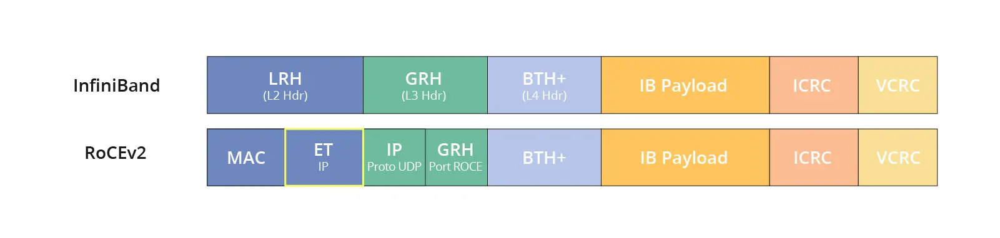

# 高性能网络

欢迎来到 HPN 的世界！

随着 AI 的发展和数据中心规模的不断扩大，高性能网络的需求日益增长。本篇笔记是对高性能网络方向的综述。我们将梳理 HPN 的软硬件层次结构，从整体上把握 HPN 的技术和知识体系。至于具体的内容，请查看其他子笔记。


## RDMA

学习 HPN 应当从 RDMA 基本概念开始。目前，RDMA 入门的最佳中文材料是 Savir 所作的 [RDMA 杂谈 - 知乎](https://www.zhihu.com/column/c_1231181516811390976)，请读者自行阅读，本篇笔记不会再讲解其中的知识。其中基本概念篇（第 1-12）必读，后面的内容可根据工作需要具体选择，因为 RDMA 具体实现之间有不少差异。

读者应当了解：

- 基本元素：Queue Pair、Work Queue Element、Send/Receive Queue
- 操作类型：Send-Receive、Write、Read、Atomic
- 服务类型：Reliable/Unreliable、Connection/Datagram
- 资源结构：Memory Region、Protection Domain、Address Handle、Queue Pair、Completion Queue
- 高级话题：
    - SRQ：
    - CM

作者最后一次更新是在 2023 年，尚有一些内容鸽了没有介绍。接下来本章就一些高级话题进行补充。

专栏中只作了概念介绍。如果希望将习得的概念应用到编程中，可以阅读下面的两份材料入门 IB Verbs。

- 简单：[RDMA Tutorial - LSDS](https://www.doc.ic.ac.uk/~jgiceva/teaching/ssc18-rdma.pdf)
- 详细：[Verbs programming tutorial](https://www.csm.ornl.gov/workshops/openshmem2014/documents/presentations_and_tutorials/Tutorials/Verbs%20programming%20tutorial-final.pdf)

### eXtended Reliable Connection (XRC)

!!! quote

    - (2007) [Microsoft PowerPoint - XRC](https://downloads.openfabrics.org/Media/SC07/2007_SC_Nov_XRC.pdf)
    - (2008) [[ofa-general] [PATCH 1/11] libibverbs: XRC base implementation](https://lists.openfabrics.org/pipermail/general/2008-June/051889.html)

!!! warning "XRC 是 libfabric 独有的功能"

还记得 SRQ 吗？它通过共享 RQ 的方式大量节省了接收端的内存占用。假设有 $n$ 个节点，每个节点有 $c$ 个核，每个核上都跑一个通信进程：

SRQ 将 QP 数从 $n \times c^2$ 降低到 $n \times c$。

XRC 尝试在此之上继续降低内存占用，这次通过**减少连接数**的方式实现。

XRC 的想法类似于 RDMA RD

## 软件

阅读 [For the RDMA novice: libfabric, libibverbs, InfiniBand, OFED, MOFED? — Rohit Zambre](https://www.rohitzambre.com/blog/2018/2/9/for-the-rdma-novice-libfabric-libibverbs-infiniband-ofed-mofed)，了解这些软件包的关系。

## 硬件

### InfiniBand


### RoCE

??? quote

    - [端到端 RoCE 概念原理与部署调优](http://www.bj-joynet.com/static/upload/file/20221025/1666684563267006.pdf)：大部分是实际操作，没有清晰的理论讲解。

RoCE 协议存在 RoCEv1 和 RoCEv2 两个版本，取决于所使用的网络适配器。

- RoCE v1：基于以太网**链路层**实现的 RDMA 协议 (交换机需要支持 PFC 等流控技术，在物理层保证可靠传输）。
- RoCE v2：封装为 **UDP（端口 4791） + IPv4/IPv6**，从而实现 L3 路由功能。可以跨 VLAN、进行 IP 组播了。RoCEv2 可以工作在 Lossless 和 Lossy 模式下。
    - Lossless：适用于数据中心网络，要求交换机支持 DCB（Data Center Bridging）技术。

RoCE 包格式：

<figure markdown="span">
    { width=80% align=center}
    { width=80% align=center}
    <figcaption>
    RoCE 包格式
    <br /><small>
    [RoCE 指南 - FS](https://community.fs.com/hk/article/roce-rdma-over-converged-ethernet.html)
</small></figcaption></figure>

---

待整理

!!! quote "参考资料"

    这里是一些参考资料，它们目前没有被本笔记使用，其中的内容有待挖掘。

    - [晓兵 - 知乎](https://www.zhihu.com/people/ssbandjl/posts)：有一些源码解析和前沿技术的讨论。

## 传统网络栈的不足

!!! quote

    - [ofi-guide/OFIGuide.md at master · ofiwg/ofi-guide](https://github.com/ofiwg/ofi-guide/blob/master/OFIGuide.md)

### Non-blocking Socket

!!! quote

    - [:simple-github: holmofy/echo-server](https://github.com/holmofy/echo-server)

在课堂上，我们学习过 Socket 编程的基本方法。在实践中，更多应用使用 non-blocking socket：

```c
/* Example server code flow to initiate listen */
struct addrinfo *ai, hints;
int listen_fd;

memset(&hints, 0, sizeof hints);
hints.ai_socktype = SOCK_STREAM;
hints.ai_flags = AI_PASSIVE;
getaddrinfo(NULL, "7471", &hints, &ai);

listen_fd = socket(ai->ai_family, SOCK_STREAM, 0);
bind(listen_fd, ai->ai_addr, ai->ai_addrlen);
freeaddrinfo(ai);

fcntl(listen_fd, F_SETFL, O_NONBLOCK);
listen(listen_fd, 128);

/* Example server code flow to accept a connection */
struct pollfd fds;
int server_fd;

fds.fd = listen_fd;
fds.events = POLLIN;

poll(&fds, -1);

server_fd = accept(listen_fd, NULL, 0);
fcntl(server_fd, F_SETFL, O_NONBLOCK);

/* Example of server receiving data from client */
struct pollfd fds;
size_t offset, size, ret;
char buf[4096];

fds.fd = server_fd;
fds.events = POLLIN;

size = sizeof(buf);
for (offset = 0; offset < size; ) {
    poll(&fds, -1);

    ret = recv(client_fd, buf + offset, size - offset, 0);
    offset += ret;
}
```

在高并发场景下，non-blocking socket 是必不可少的：

- **并发和响应性：** 等待网络操作时可以处理其他任务，单个线程能够处理多个连接。
- **资源利用率：** 通过 `select` 和 `poll` 等 I/O 多路复用技术，高效处理多个连接。与阻塞式模型为每个连接创建一个线程相比，non-blocking socket 减少了线程开销。

### Socket 的不足

在分析不足前，首先肯定 Socket 的两大优点：

- **通用性：** 适用于各种网络设备和协议。
- **易用性：** 编程简单，这是非常重要的一点。提供更高性能的 API 都比 Socket 更难编程。类比 C/C++ 与汇编，对于大多数程序员来说，编写 C/C++ 程序的性能更高。因此选择 Socket 之外的 API 时，需要有明确的需求。

但 Socket 无法满足高性能网络的三点需求：

- **避免内存拷贝：** 我们分别考虑发送和接收端的处理过程

    - **发送端：** `send()` 返回时，应用程序可以重用缓冲区。然而只有对方 ACK，才能确保数据成功送达。网络栈有两种选择：阻塞，等待 ACK 返回；立即返回，但需要将数据拷贝到内核缓冲区，等待 ACK 释放。
    - **接收端：** 网络适配器收到数据包后放入内核缓冲区，否则丢弃。要避免拷贝，唯一的方法就是在 `send()` 前调用 `recv()`，然而这会阻塞接收端，且在大部分情况下无法满足。

    可以看到，操作系统网络栈不得不维护缓冲区，造成数据在应用程序和网络栈之间的拷贝。

    如果能够支持将数据直接写入特定的内存区域，将显著提升某些应用的性能。例如：数据库可能希望将收到的记录合并到表中。

- **异步操作：** Socket API 以同步方式运行。要使用 Socket 进行异步操作，就会产生额外的拷贝。

- **直接访问硬件：**

---

待整理

## RDMA 基本概念

!!! quote


### 注册内存区域

RDMA 通信前，需要先注册内存区域 **MR（memory region）**，供 RDMA 设备访问：

- 内存页面必须被 Pin 住不可换出。
- 注册时获得 **L_Key（local key）** 和 **R_Key（remote key）**。前者用于本地访问，后者用于远程访问。

#### 交换信息

在进行 RDMA 通信前，通信双方需要交换 R_Key 和 QP 等信息。可以先通过以太网建立 TCP 连接，或者使用 `rdma_cm` 管理 RDMA 连接。

#### 异步通信

RDMA 基于三个队列进行**异步**通信：

- Send、Receive 队列用于**调度**工作（work）。这两个队列也合称为 **Queue Pair（QP）**。
- Completion 队列用于**通知**工作完成。

RDMA 通信流程如下：

- 应用程序将 **WR（work request，也称为 work queue element）**放入（post）到 Send 或 Receive 队列。
- WR 中含有 **SGE（Scatter/Gather Elements）**，指向 RDMA 设备可以访问的一块 MR 区域。在 Send 队列中指向发送数据，Receive 队列中指向接收数据。
- WR 完成后，RDMA 设备创建 **WC（work completion，也称为 completion queue element）**放入 Completion 队列。应用向适配器轮询（poll）Completion 队列，获取 WC。

对于一个应用，QP 和 CQ 可以是多对一的关系。QP、CQ 和 MR 都定义在一个 **Protection Domain（PD）** 中。

<figure markdown="span">
    { width=40% align=center}
    <figcaption>
    RDMA 通信队列
    <br /><small>
    [InfiniBand Technology Overview - SNIA](https://www.snia.org/sites/default/education/tutorials/2008/spring/networking/Goldenberg-D_InfiniBand_Technology_Overview.pdf)
</small></figcaption></figure>

#### 访存模式

RDMA 支持两种访存模式：

- 单边（one-sided）：**read、write、atomic** 操作。
    - 被动方注册一块内存区域，然后将控制权交给主动方；主动方使用 RDMA Read/Write 操作这块内存区域。
    - **被动方不会使用 CPU 资源**，不会知道 read、write 操作的发生。
    - WR 必须包含远端的**虚拟内存地址**和 **R_key**，主动方必须提前知道这些信息。
- 双边（two-sided）：**send、receive** 操作。
    - 源和目的应用都需要主动参与通信。双方都需要创建 QP 和 CQ。
    - 一方发送 receive，则对端需要发送 send，来消耗（consume）这个 receive。
    - 接收方需要先发送自己接收的数据结构，然后发送端按照这个数据结构发送数据。这意味着接收方的缓冲区和数据结构对发送方不可见。

在单个连接中，可以**混用并匹配（mix and match）**这两种模式。

#### 内核旁路

RDMA 提供内核旁路（kernel bypass）功能：

- 原先由 CPU 负责的分片、可靠性、重传等功能，现在由适配器负责。
- RDMA 硬件和驱动具有特殊的设计，可以安全地将硬件映射到用户空间，让应用程序直接访问硬件资源。
- 数据通路直接从用户空间到硬件，但控制通路仍然通过内核，包括资源管理、状态监控和清理等。保证系统安全稳定。

!!! question

    事实上，通信双方的 QP 被直接映射到了用户空间，因此相当于直接访问对方的内存。

    如果你对操作系统和硬件驱动有一些了解，不妨想一想下面的问题：

    - 如何才能让应用程序直接访问硬件资源，同时实现操作系统提供的应用隔离和保护呢？
    - 如果在两个独立的虚拟内存空间（可能在不同物理机、不同架构上）之间建立联系？

## 实用工具

```bash
show_gids
```

### perftest

需要熟练掌握使用 perftest 套件测试各类指标。以最常用的 `ib_send_bw` 为例：

```bash
ib_send_bw
```

## 通信框架

### NCCL

### HCCL

### TCCL

## 文献阅读

### EuroSys’20 [StRoM: Smart Remote Memory](https://doi.org/10.1145/3342195.3387519)

基于 FPGA 的 SmartNIC。扩展 IB Verbs，将 RPC 操作 Offload 到远端 SmartNIC 上执行。好处是能够将多次 RTT 的操作合并为一次 RTT，到靠近数据的地方执行。

系统由三个部分构成：

- RoCE 网络栈
- StRoM 可编程 Kernel
- DMA 引擎

论文中的典型应用场景：

- KV 存储：在 NIC 上通过 DMA 读哈希表和获取数据。

一些知识点：

- RDMA 操作使用**虚拟内存地址**，但是 PCIe 访问主存使用**物理内存地址**。因此 SmartNIC 上需要一个 TLB。

Resources on BlueField 2 Smart NICs: <https://gist.github.com/aagontuk/cf01763c8ee26383afe10f51c9cd2984>

- 交换芯片 BlueField：用于 DPU 产品线，简单来说就是网卡上有独立的 CPU，可以处理网络流量。例如，下面是 BlueField-2 DPU 的架构图：

<figure markdown="span">
    { width=50% align=center}
    <figcaption>
    BlueField-2 DPU 架构
    <br /><small>
    [Nvidia Bluefield DPU Architecture - DELL](https://infohub.delltechnologies.com/en-us/l/dpus-in-the-new-vsphere-8-0-and-16th-generation-dell-poweredge-servers/nvidia-bluefield-dpu-architecture/)
</small></figcaption></figure>

## 问题记录

### 编译相关

- 编译 DPDK 时

    ```text
    Generating drivers/rte_common_ionic.pmd.c with a custom command
    FAILED: drivers/rte_common_ionic.pmd.c
    ...
    Exception: elftools module not found
    ```

    解决方法：`pip` 安装 `pyelftools` 模块

## 其他相关知识

- DMA 机制：包括 IOVA、VFIO 等。
- Linux 内存管理机制：包括 Hugepage、NUMA 等。
- Linux 资源分配机制：包括 cgroup 等。
- 基础线程库 pthread。

- Non-Uniform Memory Access (NUMA)：非一致性内存访问。
    - 与 UMA 相比的优劣：内存带宽增大，需要编程者考虑局部性
    - 每块内存有
        - home：物理上持有该地址空间的处理器
        - owner：持有该块内存值（写了该块内存）的处理器
    - Linux NUMA：<https://docs.kernel.org/mm/numa.html>
        - Cache Coherent NUMA
        - 硬件资源划分为 node
            - 隐藏了一些细节，不能预期同个 node 上的访存效率相同
            - 每个 node 有自己的内存管理系统
            - Linux 会尽可能为任务分配 node-local 内存
            - 在足够不平衡的条件下，scheduler 会将任务迁移到其他 node，造成访存效率下降
        - Memory Policy
    - Linux 实践
        - `numactl`
        - `lstopo`

- Hugepage
    - 受限于 TLB 大小，Hugepage 会减少 TLB miss
    - 场景：随机访存、大型数据结构
    - <https://www.evanjones.ca/hugepages-are-a-good-idea.html>
    - <https://rigtorp.se/hugepages/>
