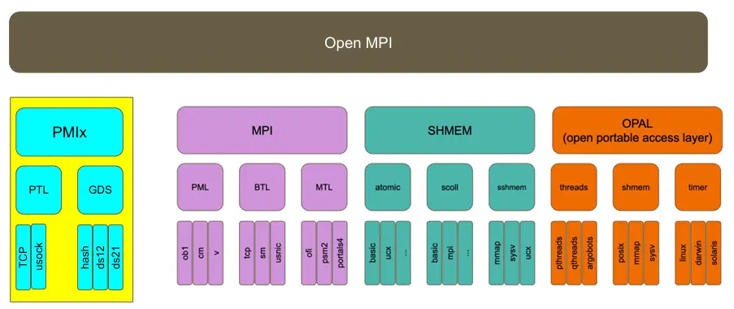
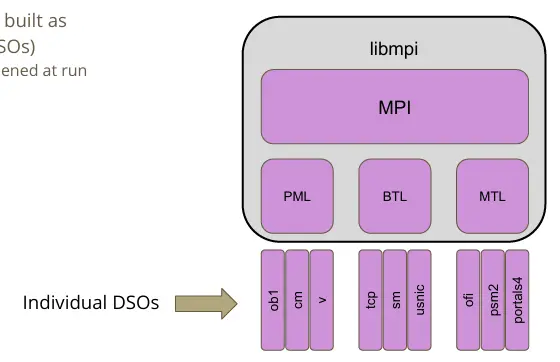
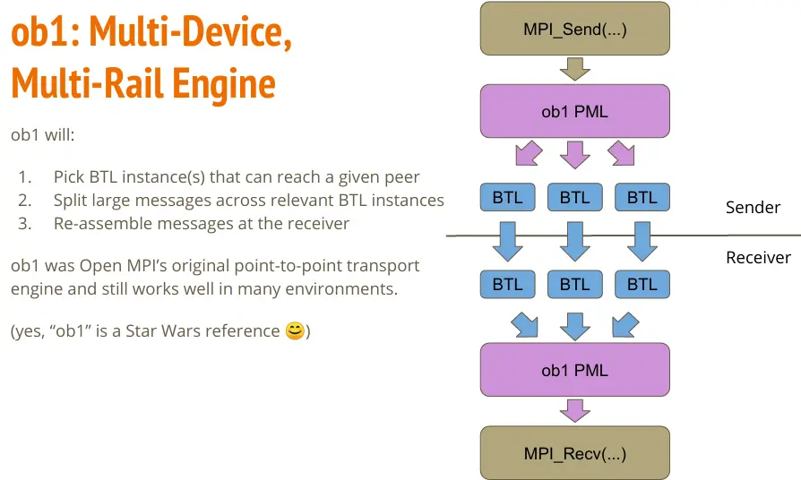
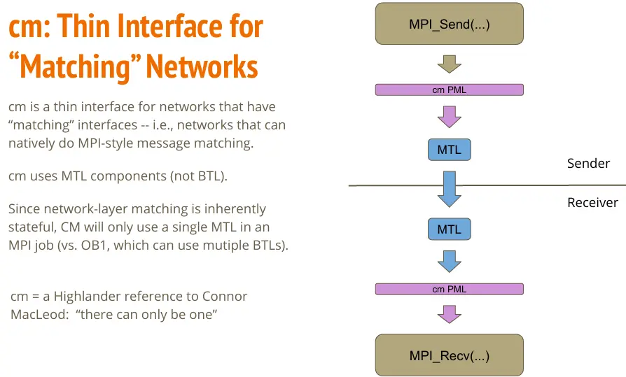

# MPI

!!! note

    - 使用容器运行 MPI 程序，见 [Apptainer]()。

OpenMPI 和 MPICH 是最主要的 MPI 实现，后者衍生版本众多。下表对比了常见的 MPI 实现。

|    对比项     |                                                                                     OpenMPI                                                                                      |                                                                                              MVAPICH                                                                                               |                                                             Intel MPI                                                             |                                         MPICH                                         |              HPC-X               | Platform MPI | Spectrum MPI |     |     |     |
| ------------- | -------------------------------------------------------------------------------------------------------------------------------------------------------------------------------- | -------------------------------------------------------------------------------------------------------------------------------------------------------------------------------------------------- | --------------------------------------------------------------------------------------------------------------------------------- | ------------------------------------------------------------------------------------- | -------------------------------- | ------------ | ------------ | --- | --- | --- |
| 历史          | [History of Open MPI](https://docs.open-mpi.org/en/main/history.html)<br>2003<br>由 OSU、LANL、UTK 的 MPI 实现合并而来                                                           | [overview of the mvapich project](https://mug.mvapich.cse.ohio-state.edu/static/media/mug/presentations/2015/mug15-overview_of_the_mvapich_project-dk_panda.pdf)<br>2002<br>OSU 开发，衍生自 MPICH | （来自 Wikipedia）衍生自 MPICH                                                                                                    | [MPICH Overview](https://www.mpich.org/about/overview/)<br>2001<br>由 ANL 和 MSU 开发 | []<br><br>打包自 OpenMPI         | IBM 闭源     | IBM 闭源     |     |     |     |
| 文档          | [Open MPI main documentation](https://docs.open-mpi.org/en/main/)                                                                                                                | [MVAPICH :: UserGuide](http://mvapich.cse.ohio-state.edu/userguide/)                                                                                                                               | [Intel® MPI Library Documentation](https://www.intel.com/content/www/us/en/developer/tools/oneapi/mpi-library-documentation.html) | [Guides \ MPICH](https://www.mpich.org/documentation/guides/)                         |                                  |              |              |     |     |     |
| mpirun 指向   | `prun`(v5.x)<br>`orterun`(v4.x)                                                                                                                                                  | `mpiexec.hydra`<br>`mpiexec.mpirun_rsh`（推荐）                                                                                                                                                    | `mpiexec.hydra`                                                                                                                   | hydra（默认）<br>gforker（编译选项）                                                  |                                  |              |              |     |     |     |
| Host 选项     | `-H/--host node1:1,node1:1<br>--hostfile hf`                                                                                                                                     | `-np 2 node1 node2<br>-hostfile hf`                                                                                                                                                                | `-hosts node1:1,node2:1<br>-f/-hostfile/-machine/-machinefile hf`                                                                 | `-f hf`                                                                               |                                  |              |              |     |     |     |
| Hostfile 格式 | `node1 slots=n`                                                                                                                                                                  | `node1:n:hca1`                                                                                                                                                                                     | `node1:n`                                                                                                                         | `node1:n`                                                                             |                                  |              |              |     |     |     |
| 例程/测试     | examples/                                                                                                                                                                        | OSU Benchmark                                                                                                                                                                                      | Intel MPI Benchmark                                                                                                               | exmaples/<br>`make testing`                                                           | OSU Benchmark<br>IMB<br>examples | mpitool      |              |     |     |     |
| 信息          | `ompi_info --all`                                                                                                                                                                | `mpiname -a`                                                                                                                                                                                       | `impi_info`                                                                                                                       | `mpiexec -info`                                                                       |                                  |              |              |     |     |     |
| 环境变量      | [`--mca mca_base_env_list VAR1,VAR2,...`<br>`OMPI_*` 自动导出<br>`-x` 已弃用](https://docs.open-mpi.org/en/v5.0.x/man-openmpi/man1/mpirun.1.html#exported-environment-variables) | [`-export` 不覆盖<br>`-export-all` 全覆盖](http://mvapich.cse.ohio-state.edu/static/media/mvapich/mvapich2-userguide.html#x1-550006.2)                                                             |                                                                                                                                   |                                                                                       |                                  |              |              |     |     |     |
| （模板）      | ``                                                                                                                                                                               | ``                                                                                                                                                                                                 | ``                                                                                                                                | ``                                                                                    | ``                               | ``           | ``           |     |     |     |

MPI 间的 ABI 兼容性信息见：

- [MPICH ABI Compatibility Initiative | MPICH](https://www.mpich.org/abi/)：MPICH、Intel MPI、MVAPICH2
- [Hammond MPI ABI for MUG 2023](http://mug.mvapich.cse.ohio-state.edu/static/media/mug/presentations/23/HammondMPIABIforMUG2023.pdf)

    似乎在 2023 后，MPICH 和 OpenMPI 家族开始着手统一 ABI 了。

## OpenMPI

!!! quote

    - [EasyBuild Tech Talks · easybuilders/easybuild Wiki](https://github.com/easybuilders/easybuild/wiki/EasyBuild-Tech-Talks-I:-Open-MPI)：2020 年的讲座，对 OpenMPI 进行了全面的讲解。
    - [Open MPI head of development — Open MPI main documentation](https://docs.open-mpi.org/en/main/index.html)
    - [open-mpi/ompi: Open MPI main development repository](https://github.com/open-mpi/ompi)

### 基础概念

我们从 2020 年的 The ABCs of Open MPI 系列讲座开始。

OpenMPI 是一个大型项目，采用模块化组织，称为 MCA（Modular Component Architecture），从上至下分为 Project、Framework、Component：



默认情况下，所有 component 被编译为动态链接库（Dynamic Shared Objects, DSO），可以按需加载：



到 OpenMPI v5.0，共有如下 FrameWork

- MPI：
    - `coll`：MPI Collecitves，实现 `MPI_BCAST`、`MPI_BARRIER`、`MPI_REDUCE` 等集合通信。

        在 v4.1.0 后，增加了可选的组件，并且可以对默认的通信算法选择进行调优。

    - `op`：MPI Reduction Operations
    - `osc`：MPI One-sided Communications
    - `pml`：MPI Point-to-Point Communications，实现 `MPI_SEND`、`MPI_RECV` 等点对点通信。可选：

        - `ob1`：多设备多链路引擎。它可以选择多个能够到达目标的 BTL 组件，并实现负载均衡。

            

        - `cm`：用于驱动支持硬件消息标签匹配的网络接口（matching network），比如 iWARP、OminiPath

            

        - `ucx`：使用 UCX 通信库，用于 InfiniBand 或 RoCE 设备

    - `topo`：MPI Topologies

- 底层传输：

    - `btl`：Byte Transport Layer

        可选组件：

        - `ofi`：Libfabric
        - `self`：loopback
        - `sm`：共享内存
        - `tcp`

        其余不常见的略过。

    - `bml`：BTL Multipliexing Layer
    - `mtl`：Matching Transport Layer，不常用，略

- 文件：

    - `io`：MPI IO，实现 `MPI_FILE_OPEN`、`MPI_FILE_READ`、`MPI_FILE_WRITE` 等文件操作。可选：

        - `ompio`：默认
        - `romio`：来自 MPICH

    - `fbtl`：MPI File Byte Transfer Layer
    - `fcoll`：MPI File Collectives
    - `fs`：MPI File Management
    - `sharedfp`：MPI shared file pointer operations

- 其他：

    - `hook`：Generic Hooks
    - `vprotocol`：Virtual Protocol API Interposition

#### 通信库

通信库主要通过 PML 选择。一般会采用如下组合：

```text
--mca pml ucx
--mca pml_ucx_verbose 100
--mca osc_ucx_verbose 100
-x UCX_NET_DEVICES=
-x UCX_LOG_LEVEL=trace
```

```text
--mca pml ob1 \
--mca btl ofi
```

IB 和 RoCE 设备支持：

- `openib` 在 OpenMPI 5.1.x 后弃用。与之相关的变量有：

    ```text
    OMPI_MCA_btl_openib_if_include
    ```

- `ucx`：IB 和 RoCE 设备的首选模块，相关变量有：

    ```text
    UCX_NET_DEVICES
    ```

#### PMIx

**PMIx（Process Management Interface）**：用于与 `slurm` 这样的资源管理器（Resource Manager，RM）沟通。因为 PMI 的存在，我们能够直接使用 `srun` 运行 OpenMPI 程序，取得与 `mpirun` 等效的效果。

MPI 与资源管理器可以通过三种方式交互：

- Slurm 启动 MPI 并行程序，并通过 PMI API（Process Management Interface）调用执行初始化。
- Slurm 分配资源，然后由 `mpirun` 基于 Slurm 的基础设施启动并行程序。`srun` 就是这种方式。
- Slurm 分配资源，然后由 `mpirun` 通过 SSH 等其他机制启动并行程序。这种方式下，Slurm 无法进行资源管控和追踪。

可以阅读 [Slurm: PMIx - Exascale Process Management Interface](https://slurm.schedmd.com/SLUG15/PMIx.pdf) 了解更多。

#### ORTE 与 PRRTE

ORTE 就是

`orterun`、`mpirun`、`mpiexec` 是同一个文件，见 [Ubuntu Manpage: orterun, mpirun, mpiexec - Execute serial and parallel jobs in Open MPI.](https://manpages.ubuntu.com/manpages/trusty/man1/orterun.1.html)

如果要阅读 ORTE 源码，可以在 v4.x 下找到 `orte` 文件夹，其中 `orte/tools/orterun/main.c` 就是 orterun 的入口。

在 OpenMPI v5.0 中，PRRTE 取代了 ORTE。现在，`prun` 的入口在 `prrte/src/tools/prun/main.c`。

### 构建和运行

构建：

```bash
./configure CC= CXX= FC= --with-FOO --without-FOO
```

OpenMPI 内置了某些依赖（如 hwloc 和 libevent），但是也可以用 `--with-hwloc` 等选项替换为外部版本。

要构建支持 CUDA 的 OpenMPI，需要：

- 构建支持 GDR 的 UCX
- 然后构建支持 CUDA 和 UCX 的 OpenMPI

查看当前构建的信息：

```bash
ompi_info --parsable
```

运行：

```bash
export OMPI_MCA_foo=bar
mpirun \
    --mca pml ob1/cm/ucx \
    --mca btl a,b,c \
```

- OpenMPI 使用 Slot 作为资源分配单位，有多少个 Slot 就可以运行多少个进程。
    - 默认：处理器核数。
    - 使用超线程核心数：用 `--use-hwthread-cpus` 开启，常见为 2 倍处理器核数。可以在 `lscpu` 中的 `Thread(s) per core` 查看。
    - 资源管理器调度：从资源管理器获取 Slot 数。
    - 需要注意：Slot 数和硬件没有关系，可能比硬件核数多，也可能比硬件核数少。

!!! example

    在 OpenMPI v4.x 中：

    ```bash
    $ ompi_info --all | grep btl_openib_if_include
    MCA btl openib: parameter "btl_openib_if_include" (current value: "", data source: default, level: 9 dev/all, type: string)
        Comma-delimited list of devices/ports to be used (e.g. "mthca0,mthca1:2"; empty value means to use all ports found).  Mutually exclusive with btl_openib_if_exclude.
    ```

    可以通过下面的方式：

    ```bash
    export OMPI_MCA_btl_openib_if_include=mlx5_0:1
    mpirun \
        --mca btl_openib_if_include mlx5_0:1
    ```

调试选项：

```text
--mca mpi_show_mca_params all \
--mca pml_base_verbose 100
```

### 源码阅读

#### 构建系统

从 Makefile 开始，构建时我们使用 `all` 这个目标，它进入到所有子文件夹并执行构建，见 [Where is the target all-recursive in makefile? - Stack Overflow](https://stackoverflow.com/questions/17172659/where-is-the-target-all-recursive-in-makefile)。

#### 运行时

#### MCA

#### BTL

##### openib

## MPICH

MPICH 是 MVAPICH、Intel MPI 等众多 MPI 实现的基础。MPICH 维护四个组件：

- mpich
- hydra：启动器，衍生版本大多也支持 hydra 启动
- libpmi
- mpich-testsuite

简单梳理：

- Process Manager（PM）：默认 hydra。编译时可选 gforker，仅在单节点上通过 fork 和 exec 创建进程。
- Communication Device：MPICH 中的通信分为 device 和 module 层。
    - `ch3` 意思是 3rd version of Channel interface。通过编译时 `--with-device=ch3:channel:module` 可选组件。`nemesis` 是默认 channel，单节点用 shared-memory，跨节点用 socket。
    - 默认：`ch4`，支持的 module 有 ofi、UCX、POSIX 共享内存。

### 构建和运行

```bash
./configure \
    --enable-g=all \
    --enable-debuginfo \
```

### Hydra

```bash
-verbose \
-print-all-exitcodes \
-prepend-rank \
-profile \
```

## MVAPICH

!!! quote

    - [The MVAPICH2 Project Latest Status and Future Plans](https://www.mpich.org/static/docs/slides/2021-sc-bof/MVAPICH2.pdf)：在 SC 21 进行的一次报告，介绍了 MVAPICH2 的最新进展和未来计划。

这可能是目前最先进的 MPI 实现，受 NVIDIA 喜爱，并且也是神威 - 太湖之光所使用的 MPI 实现。

MVAPICH 提供非常多种细分的版本，可根据需求选择。一般选用 MVAPICH2（源码分发）或 MVAPICH2-X（打包分发），提供最全面的 MPI 和 IB/RoCE 支持。

用户手册见 MVAPICH 首页 Support->UserGuide。

以 MVAPICH2 为例梳理：

- 通信：基于 MPICH 的 CH3 改造，通过 OpenFabric 支持了多种 RDMA 通信，例如 OFA-IB-CH3、OFA-RoCE-CH3 等。

### 构建和运行

日志输出需要在构建时开启：

```bash
./configure --enable-g=all --enable-error-messages=all \
    --enable-debuginfo
```

```bash
mpirun_rsh \
    MV2_HOMOGENEOUS_CLUSTER=1 \
    MV2_SHOW_ENV_INFO=2 \
    MV2_DEBUG_FORK_VERBOSE=2 \
    MV2_DEBUG_CORESIZE=unlimited \
    MV2_DEBUG_FT_VERBOSE=1 \
    MV2_DEBUG_SHOW_BACKTRACE=1 \
    MV2_DEBUG_MEM_USAGE_VERBOSE=2 \
    MV2_USE_RoCE=1 MV2_DEFAULT_GID_INDEX=3 MV2_USE_RDMA_CM=0 \
    build/default/libexec/osu-micro-benchmarks/mpi/pt2pt/osu_bw
```

网络接口选择：

```bash
# RoCE
MV2USERoCE=1 MV2USERDMACM=1
# IB
MV2_IBA=HCA=mlx4_0:mlx4_1
```

### OSU Benchmark

!!! quote

    - [Benchmarks - MVAPICH](https://mvapich.cse.ohio-state.edu/benchmarks/)

## Intel MPI

!!! quote

    - [Intel MPI Library](https://www.intel.com/content/www/us/en/developer/tools/oneapi/mpi-library.html#gs.pinwor)
    - [Get Started](https://www.intel.com/content/www/us/en/develop/documentation/get-started-with-mpi-for-linux/top.html)
    - [Developer Guides](https://www.intel.com/content/www/us/en/develop/documentation/mpi-developer-guide-linux/top.html)
    - [Developer References](https://www.intel.com/content/www/us/en/develop/documentation/mpi-developer-reference-linux/top.html)
    - [How to set up IntelMPI over RoCEv2 - HPC-Works - Confluence](https://hpcadvisorycouncil.atlassian.net/wiki/spaces/HPCWORKS/pages/156237831/How+to+set+up+IntelMPI+over+RoCEv2)
    - [Intel® MPI Library 2019 Over Libfabric*](https://www.intel.com/content/www/us/en/developer/articles/technical/mpi-library-2019-over-libfabric.html)
    - [Improve Performance and Stability with Intel® MPI Library on InfiniBand*](https://www.intel.com/content/www/us/en/developer/articles/technical/improve-performance-and-stability-with-intel-mpi-library-on-infiniband.html)

```bash
./intel-mpi*.sh -a --silent --cli --eula accept
```

### 运行与调试

加载环境：

- oneAPI：

    ```bash
    source /opt/intel/oneapi/setvars.sh
    ```

- IntelMPI（老版本）：具体路径可能有变化，仅作参考

    ```bash
    source intel2018/compilers_and_libraries_2018.3.222/linux/mpi/bin64/mpivars.sh
    ```

对 Intel MPI 来说，`mpirun` 是 `mpiexec.hydra` 的包装。其选项有全局选项和局部选项之分，一般以 `g` 开头的参数是全局选项，下文不对全局和局部选项分别介绍。可以编写文件保存选项，使用 `-configfile` 指定配置文件，`#` 注释。`./mpiexec.conf` 会自动加载。

- 环境变量
    - `-genv <ENVVAR> <val>` 指定运行时环境变量，常用的有：`OMP_`
    - `-genvall, -genvnone` 控制是否传递环境变量
- profiling:
    - `-trace` `-aps` `-mps`
- 设备：
    - `-iface`
- 运行参数：
    - `-n, -np` 进程数
    - `-env` 环境变量
    - `-path` 可执行文件

重要环境变量：

```text
-genv I_MPI_DEBUG 5 \
```

!!! tips `I_MPI_OFI_PROVIDER` 优先于 `FI_PROVIDER`。

!!! tips "更多选项参阅 [Intel® MPI Library Developer Reference for Linux* OS](https://www.intel.com/content/www/us/en/docs/mpi-library/developer-reference-linux/2021-16/overview.html) 中的 Command Reference 和 Environment Variable Reference 章节。"

日志输出：

```bash
mpirun \
    -genv I_MPI_DEBUG 5 \
    -genv I_MPI_HYDRA_DEBUG \
    -v \
```

调试：

!!! tips "调试器似乎不能和日志一起用，否则调试器命令输入会有问题。"

- oneAPI：

    ```bash
    mpirun -n 4 -gtool "gdb-oneapi:0-3=attach" ./wrf_hydro.exe
    # Using 'z' command you can switch active processes.
    # e.g.
    # 0-3: (gdb) z 1-3
    # 1-3: (gdb) b 53
    # 1-3: Breakpoint 2 at 0x4009f3: file test.c, line 53.
    # 1-3: (gdb) z
    # 0-3: (gdb) r
    # 0-3: Continuing.
    ```

- Intel MPI:

    ```bash
    mpirun \
        -gdb \
    ```

### IMB Benchmark

!!! quote

    - [Intel MPI Benchmarks User Guide](https://www.intel.com/content/www/us/en/develop/documentation/imb-user-guide/top.html)
    - [:simple-github: intel/mpi-benchmarks](https://github.com/intel/mpi-benchmarks)

Intel® MPI Benchmarks 包含以下**组件**：

- [IMB-MPI1](https://www.intel.com/content/www/us/en/develop/documentation/imb-user-guide/top/mpi-1-benchmarks.html) – 用于 MPI-1 功能的基准测试。
- 用于 [MPI-2](https://www.intel.com/content/www/us/en/develop/documentation/imb-user-guide/top/mpi-2-benchmarks.html) 功能的组件：
    - IMB-EXT – 单边通信基准测试。
    - IMB-IO – 输入/输出基准测试。
- 用于 [MPI-3](https://www.intel.com/content/www/us/en/develop/documentation/imb-user-guide/top/mpi-3-benchmarks.html) 功能的组件：
    - IMB-NBC – **非阻塞集合（non-blocking collective，NBC）** 操作的基准测试。
    - IMB-RMA – 单边通信基准测试。这些基准测试测量 MPI-3 标准中引入的**远程内存访问（Remote Memory Access，RMA）** 功能。
    - IMB-MT – 在每个 rank 内运行的**多线程** 的 MPI-1 功能基准测试。

使用方法见：

- [Intel(R) MPI Benchmarks User Guide](https://www.intel.com/content/www/us/en/docs/mpi-library/user-guide-benchmarks/2021-8/overview.html)
- [Command-line Control](https://www.intel.com/content/www/us/en/docs/mpi-library/user-guide-benchmarks/2021-8/command-line-control.html)

一个简单的例子

```bash
mpirun -ppn 1 -f hostfile IMB-MPI1 > MPI1.log
```

要获取更多调试信息，请在运行前设置 `I_MPI_DEBUG`（可以设置为 `0` 到 `5`）。

```bash
I_MPI_DEBUG=1 mpirun -ppn 1 -f hostfile IMB-MPI1 > MPI1.log
```

下面的命令行在基准测试列表 `IMB-MPI1` 中只执行 `PingPong` 基准测试。

```bash
mpirun -ppn 1 -f hostfile IMB-MPI1 PingPong
```

## 其他 MPI 实现

### Platform MPI

这是由 IBM 维护的一个古老的 MPI 实现。

它使用一个同样古老的通信库 [DATL（Direct Access Transport Libraries）](https://www.openfabrics.org/downloads/dapl/README.html)，已于 2016 年停止支持。

运行命令例：

```bash
export MPI_IB_STRINGS=cnic_0:1
export MPI_IC_ORDER="UDAPL"

bin/mpirun \
    -np 2 \
    -hostfile hostfile \
    -d -v \
    -UDAPL \
    -netaddr 11.83.209.4 \
    -- \
    bin/mpitool -ppr 10000
```
