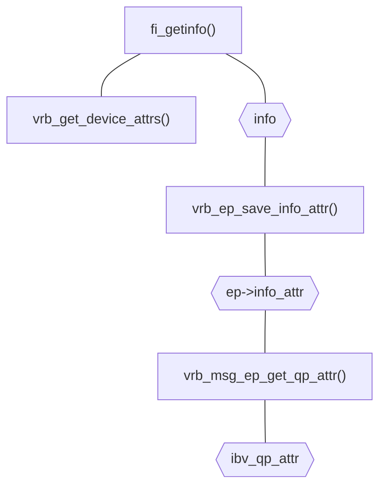

# libfabric

libfabric 简称 OFI，由不希望网络 API 受 InfiniBand 的抽象限制的厂商发起，如 Intel 和 Cicso。它构建在较高的抽象层次，支持 IB Verbs、Sockets、共享内存等。

## 基础知识

### 整体结构

libfabric 整体分为两层：

- `src` 中是 Core Service 层，负责提供和操作系统、底层网卡无关的 API 接口，供上层应用使用
- `prov` 是 Provider 层，实现具体的底层通信


libfabric 有完善的说明文档，下面总结一些 [fi_arch(7)](https://ofiwg.github.io/libfabric/main/man/fi_arch.7.html) 中的基本知识：

- **通信方式**：进程间通过的**端点（Endpoints）**进行通信，概念上类似于套接字
- **数据传输服务**：提供五类通信 API，下面列出部分供读者熟悉 API 命名

    ```text
    fi_msg: fi_recv, fi_recvv, fi_recvmsg, fi_inject
    fi_rma: fi_read, fi_readv, fi_readmsg, fi_inject_write
    fi_atomic: fi_atomic, fi_atomicv, fi_atomicmsg, fi_fetch_atomic, fi_compare_atomic
    fi_tagged: fi_trecv, fi_trecvv, fi_trecvmsg, fi_tinject
    fi_collective: fi_join_collective, fi_barrier, fi_broadcast, fi_alltoall
    ```

- **面向对象设计**：用户需要操作这些关键对象
    - Fabric (`fi_fabric`)：表示一个或多个网络接口的集合。
    - Domain (`fi_domain`)：表示一个特定于 Provider 的网络接口（或一组接口）的功能。
    - Passive Endpoint (`fi_pep`)：用于监听传入连接请求。
    - Active Endpoint (`fi_endpoint`)：用于实际的数据传输。
    - Event Queues (`fi_eq`)：用于接收异步事件，如连接请求、错误等。
    - Completion Queue (`fi_cq`)：用于报告异步操作的完成状态。
    - Memory Region (`fi_mr`)：表示已注册的内存区域。
    - Address Vectors (`fi_av`)：用于存储远程端点的地址信息。
- **通信模式（Communication Model）**：可类比 RDMA 服务类型

    | Endpoint 类型 | 类比 |
    | - | - |
    | `FI_EP_MSG` Reliable-connected | RDMA RC |
    | `FI_EP_DGRAM` Unreliable datagram | RDMA UD |
    | `FI_EP_RDM` Reliable-unconnected | RDMA RD |

以 Verbs Provider 为例，我们应用一下上面的基本概念，官方文档见 [fi_verbs(7)](https://ofiwg.github.io/libfabric/v1.2.0/man/fi_verbs.7.html)：

- 支持情况：

    ```text
    FI_EP_MSG, FI_EP_RDM
    FI_MSG, FI_RMA, FI_ATOMIC
    ```

libfabric 仓库的 README 文件详细说明了现有的各类 Providers。

!!! tip "libfabric 在文档方面比 OpenMPI 和 UCX 做的都好"

## 编程

libfabric 有完善的使用教程。我们先总结 [fi_setup(7)](https://ofiwg.github.io/libfabric/v1.20.2/man/fi_setup.7.html) 中的要点，然后以 `fi_pingpong` 的源码为例具体分析。

- `fi_getinfo()` 获得 `struct fi_info*` 链表，包含可用的 fabric service。其中的关键字段：
    - `caps` 表明提供的能力，如传输服务类型等
- `fi_fabric()` 创建一个 Provider
- `fi_domain()` 使用一个网络接口
- **主动端点（Active Endpoints）**
    - **功能**：用于执行数据传输，可以是面向连接或无连接的。所有数据传输接口（如消息、标记消息、RMA、原子操作、集合操作）都与主动端点关联。
    - **队列**：通常有一个发送队列和一个接收队列。发送队列用于发起数据传输（如发送消息、RMA、原子操作），接收队列用于接收传入数据。
    - **状态**：创建时处于**禁用状态**。必须先进行配置并绑定到必要的结构（例如完成队列 CQ、事件队列 EQ 和地址向量 AV），然后调用 `fi_enable()` 才能启用，或通过 `fi_connect()` 和 `fi_accept()` 自动启用。只有启用后才能进行数据传输操作。
- **被动端点（Passive Endpoints）**
    - **功能**：主要用于**监听传入的连接请求**，不能执行数据传输。
    - **类型**：仅支持 `FI_EP_MSG` 类型。
    - **绑定**：必须绑定到**事件队列（Event Queue）**以报告连接请求。与主动端点不同，被动端点不与域（domain）关联，允许在不同域但同一提供者下监听连接。
    - **连接流程**：应用程序通过被动端点监听连接请求，接收到 `FI_CONNREQ` 事件后，会为该连接分配一个新的主动端点，并调用 `fi_accept()` 接受连接。

根据 `pingpong.c` 的代码内容，以下是主要流程的函数名及其使用的 `fi_` 调用：

1. **初始化阶段**
    - **函数名**: `pp_init_fabric`
        - 使用的 `fi_` 调用：
            - `fi_fabric`: 初始化 Fabric 资源
            - `fi_eq_open`: 创建事件队列 (EQ)
            - `fi_domain`: 创建 Domain
            - `fi_av_open`: 创建地址向量 (AV)
            - `fi_cq_open`: 创建完成队列 (CQ)
            - `fi_endpoint`: 创建端点 (EP)
            - `fi_enable`: 启用端点

2. **控制消息同步**
    - **函数名**: `pp_ctrl_init`, `pp_ctrl_sync`
        - 使用的 `fi_` 调用：
            - `fi_getname`: 获取本地地址
            - `fi_av_insert`: 将地址插入地址向量
            - `fi_eq_sread`: 从事件队列读取同步事件

3. **数据传输阶段**
    - **函数名**: `pp_tx`, `pp_rx`, `pp_inject`
        - 使用的 `fi_` 调用：
            - `fi_send` / `fi_tsend`: 发送数据（普通或带标签）
            - `fi_recv` / `fi_trecv`: 接收数据（普通或带标签）
            - `fi_inject` / `fi_tinject`: 直接注入数据（无需完成通知）
            - `fi_cq_read`: 从完成队列读取完成事件

4. **性能测试与统计**
    - **函数名**: `pingpong`, `show_perf`
        - 使用的 `fi_` 调用：
            - `fi_gettime_us`: 获取时间戳（用于性能统计）
            - `fi_cq_readerr`: 读取完成队列错误事件

5. **资源释放与清理**
    - **函数名**: `pp_free_res`, `pp_finalize`
        - 使用的 `fi_` 调用：
            - `fi_close`: 关闭 Fabric 资源（Fabric、Domain、EQ、CQ、EP 等）
            - `fi_shutdown`: 关闭端点连接

6. **其他关键函数**
    - **地址解析与同步**:
        - `pp_getaddrinfo`: 解析地址（使用 `getaddrinfo`，非 `fi_` 调用）
        - `pp_exchange_names_connected`: 交换地址信息（通过控制消息）
    - **错误处理**:
        - `pp_process_eq_err`: 处理事件队列错误（调用 `fi_eq_readerr`）

## 运行

```bash
export FI_LOG_LEVEL=debug
export FI_PROVIDER=verbs
./fi_pingpong
```

## 源码阅读

libfabric 版本编号的宏定义写在 `include/rdma/fabric.h` 中。

### 类型系统

[fi_arch(7)](https://ofiwg.github.io/libfabric/main/man/fi_arch.7.html) 中提到，libfabric 使用 OOP 设计模式。我们来看看它是怎么对各种实体进行建模的。

`fid` 作为所有类的基类。

### `fi_ini()` 初始化 Provider

```c title="src/fabric.c"
struct ofi_prov {
    struct ofi_prov        *next;
    char            *prov_name;
    struct fi_provider    *provider;
    void            *dlhandle;
    bool            hidden;
    bool            preferred;
};
// 用于保存所有 provider 的链表
static struct ofi_prov *prov_head, *prov_tail;
```

`fi_ini()` 负责加载各 Provider，它在 `fi_getinfo()` 和 `fi_fabric()` 中被调用。

`fi_ini()` 的实现如下：

```c title="src/fabric.c"
ofi_ordered_provs_init()
    // 遍历预定义的 ordered_prov_names 字符串列表
    for (i = 0; i < num_provs; i++)
        prov = ofi_alloc_prov(ordered_prov_names[i]);
        // 插入预定义的 struct ofi_prov *prov_head 链表
        ofi_insert_prov(prov);
ofi_load_dl_prov()
    // 搜索预定义的 provider
    ofi_find_prov_libs()
        // 遍历上面填充的列表
        for (prov = prov_head; prov; prov = prov->next) 
            ofi_reg_dl_prov(lib, false)
                dlopen(lib, RTLD_NOW)
                inif = dlsym(dlhandle, "fi_prov_ini")
                ofi_register_provider((inif)(), dlhandle)
ofi_register_provider(PSM3_INIT, NULL)
//...
```

其中，`fi_prov_ini()` 是 External Provider 的入口函数（见 [fi_provider(3)](https://ofiwg.github.io/libfabric/v1.14.0/man/fi_provider.3.html)）。

在预定义的 Provider 中没有该符号定义，将通过分支判断 NULL 直接返回，回到 `fi_ini()` 中由 `ofi_register_provider()` 完成。预定义的 Provider 的入口函数由宏定义为 `<provider>_INIT`。

```c title="include/ofi_prov.h"
#define INI_SIG(name) struct fi_provider* name(void)
#define VERBS_INIT fi_verbs_ini()
```

```c title="prov/verbs/src/verbs_init.c"
#define VERBS_INI INI_SIG(fi_verbs_ini)
VERBS_INI
{
    return &vrb_prov;
}
struct fi_provider vrb_prov = {
    .name = VERBS_PROV_NAME,
    .version = OFI_VERSION_DEF_PROV,
    .fi_version = OFI_VERSION_LATEST,
    .getinfo = vrb_getinfo,
    .fabric = vrb_fabric,
    .cleanup = vrb_fini
};
```

### `fi_getinfo()` 获取设备信息

```c title="include/rdma/fabric.h" hl_lines="15"
struct fi_info {
    struct fi_info        *next;
    uint64_t        caps;
    uint64_t        mode;
    uint32_t        addr_format;
    size_t            src_addrlen;
    size_t            dest_addrlen;
    void            *src_addr;
    void            *dest_addr;
    fid_t            handle;
    struct fi_tx_attr    *tx_attr;
    struct fi_rx_attr    *rx_attr;
    struct fi_ep_attr    *ep_attr;
    struct fi_domain_attr    *domain_attr;
    struct fi_fabric_attr    *fabric_attr;
    struct fid_nic        *nic;
};
```

- `fabric_attr` 将用于调用 `fi_fabric()`

本质上是调用各个 Provider 的 `getinfo()`：

```c title="src/fabric.c"
fi_getinfo(FI_VERSION(FI_MAJOR_VERSION, FI_MINOR_VERSION), NULL, NULL, flags, hints, info)
    for (prov = prov_head; prov; prov = prov->next)
        prov->provider->getinfo(version, node, service, flags, hints, &cur);
```

以 Verbs Provider 为例，`vrb_getinfo()` 实现如下：

- 两个全局链表：`vrb_devs` 和 `vrb_util_prov.info`，分别从 `getifaddrs()`（来自 libc）和 `rdma_get_devices()`（来自 librdmacm）获取 Verbs 设备

    ```c title="prov/verbs/src/verbs_init.c"
    DEFINE_LIST(vrb_devs);
    struct util_prov vrb_util_prov = {
        .prov = &vrb_prov,
        .info = NULL, // struct fi_info *
        .info_lock = &vrb_info_mutex,
        .flags = 0,
    };
    ```

    这里的 `DEFINE_LIST` 和内核的双向链表定义和用法相同。

```c title="vrb_getinfo() 调用链" hl_lines="9-11 20-27"
vrb_init_info(&vrb_devs, &vrb_util_prov.info)
    // 由 libc 提供
    vrb_getifaddrs(verbs_devs)
        ofi_getifaddrs(&ifaddr)
            getifaddrs(ifaddr)
        for (ifa = ifaddr; ifa; ifa = ifa->ifa_next)
            // 在该 ifaddrs 上测试 rdma verbs
            vrb_ifa_rdma_info(ifa, &dev_name, &rai)
                rdma_create_id(NULL, &id, NULL, RDMA_PS_TCP)
                rdma_getaddrinfo((char *) name, NULL, &rai_hints, &rai_)
                rdma_bind_addr(id, rai_->ai_src_addr)
            // 插入 vrb_devs
            verbs_devs_add(verbs_devs, dev_name, rai)
    // 由 librdmacm 提供
    ctx_list = rdma_get_devices(&num_devices)
        for (i = 0; i < num_devices; i++)
            // 插入 vrb_util_prov.info
            vrb_alloc_info(ctx_list[i], &fi, ep_type[j])
                // 通过 Verbs API 获取设备信息，并保存到 `info->domain_attr`、`info->tx_attr` 等处
                vrb_get_device_attrs(ctx, fi, ep_dom->protocol);
                    ret = ibv_query_device(ctx, &device_attr);
                    ret = vrb_get_qp_cap(ctx, info, protocol);
                        pd = ibv_alloc_pd(ctx);
                        cq = ibv_create_cq(ctx, 1, NULL, NULL, 0);
                        qp_type = (info->ep_attr->type != FI_EP_DGRAM) ? IBV_QPT_RC : IBV_QPT_UD;
                        qp = ibv_create_qp(pd, &init_attr);
                    ret = ibv_query_port(ctx, port_num, &port_attr);
vrb_get_match_infos(&vrb_devs, version, node, service,
                    flags, hints, vrb_util_prov.info, info);
    // 先尝试 vrb_util_prov.info 来自 librdmacm
    vrb_get_matching_info(version, hints, info, raw_info, ofi_is_wildcard_listen_addr(node, service, flags, hints));
        struct fi_info *check_info = verbs_info
        for (i = 1; check_info; check_info = check_info->next, i++)
            // 首先检查 hints
            if (hints) vrb_check_hints(version, hints, check_info)
            // 然后根据接口类型调用
            if ((check_info->ep_attr->type == FI_EP_MSG) && passive)
                vrb_get_passive_info()
            else
                vrb_set_default_info()
    // 再尝试 vrb_devs 来自 libc
    vrb_handle_sock_addr(verbs_devs, node, service, flags, hints, info)
    vrb_handle_ib_ud_addr(node, service, flags, info)
```

### `fi_fabric()` 创建 Fabric

```c title="src/fabric.c"
__attribute__((visibility ("default"),EXTERNALLY_VISIBLE))
int DEFAULT_SYMVER_PRE(fi_fabric)(struct fi_fabric_attr *attr,
        struct fid_fabric **fabric, void *context) {
    struct ofi_prov *prov;
    fi_ini();
    top_name = attr->prov_name
    prov = ofi_getprov(top_name, strlen(top_name));
    ret = prov->provider->fabric(attr, fabric, context);
}
```

- `ofi_getprov()` 字符串匹配获得对应的 `fi_provider` 实例
- 剩余的任务转交给该 Provider 的 `.fabric` 成员

以 Verbs Provider 为例，`vrb_fabric()` 首先调用 `ofi_fabric_init()` 进行通用初始化，然后做一些 Verbs 特有的设置，其中最重要的是设置 fabric 的函数表：

```c title="prov/verbs/src/verbs_domain.c"
int vrb_fabric(struct fi_fabric_attr *attr, struct fid_fabric **fabric,
          void *context) {
    (*fabric)->fid.ops = &vrb_fi_ops;
    (*fabric)->ops = &vrb_ops_fabric;
}
static struct fi_ops_fabric vrb_ops_fabric = {
    .size = sizeof(struct fi_ops_fabric),
    .domain = vrb_domain,
    .passive_ep = vrb_passive_ep,
    .eq_open = vrb_eq_open,
    .wait_open = fi_no_wait_open,
    .trywait = vrb_trywait
};
```

### `fi_domain()` 启用设备并设置函数表

`fi_domain()` 直接将操作转交给 `fabric->ops->domain()`，在上面我们看到这就是 `vrb_domain()`。它调用 `ofi_domain_init()` 进行通用初始化，然后做一些 Vrb 特有的设置。

不同的 EP 类型从 Domain 开始区分：

- 如果 EP 类型为 MSG（RDMA RC）且设备支持 XRC，则进一步转交给 `verbs_domain_xrc.c` 中的函数进行处理。
- Domain 层的 ops 主要负责 EP 操作，需要根据 EP 类型进行设置。

```c title="prov/verbs/src/verbs_domain.c"
vrb_domain()
    ofi_domain_init(fabric, info, &_domain->util_domain, context, OFI_LOCK_MUTEX);
    vrb_open_device_by_name(_domain, info->domain_attr->name);
        dev_list = rdma_get_devices(NULL);
        const char *rdma_name = ibv_get_device_name(dev_list[i]->device);
    switch (_domain->ep_type) {
    case FI_EP_DGRAM:
        _domain->util_domain.domain_fid.ops = &vrb_dgram_domain_ops;
    case FI_EP_MSG:
        if (_domain->ext_flags & VRB_USE_XRC) {
            ret = vrb_domain_xrc_init(_domain);
        }
        _domain->util_domain.domain_fid.ops = &vrb_msg_domain_ops;
    }
    ret = vrb_init_progress(&_domain->progress, _domain->info);
    *domain = &_domain->util_domain.domain_fid;
```

```c
static struct fi_ops_domain vrb_msg_domain_ops = {
    .size = sizeof(struct fi_ops_domain),
    .av_open = fi_no_av_open,
    .cq_open = vrb_cq_open,
    .endpoint = vrb_open_ep,
    .scalable_ep = fi_no_scalable_ep,
    .cntr_open = fi_no_cntr_open,
    .poll_open = fi_no_poll_open,
    .stx_ctx = fi_no_stx_context,
    .srx_ctx = vrb_srq_context,
    .query_atomic = vrb_query_atomic,
    .query_collective = fi_no_query_collective,
};
```

### `fi_endpoint()` 建立连接

先看数据结构，`struct vrb_ep`、`struct util_ep`、`struct fid_ep` 三级结构层层向上：

```c title="include/rdma/fi_endpoint.h"
struct fid_ep {
    struct fid        fid;
    struct fi_ops_ep    *ops;
    struct fi_ops_cm    *cm;
    struct fi_ops_msg    *msg;
    struct fi_ops_rma    *rma;
    struct fi_ops_tagged    *tagged;
    struct fi_ops_atomic    *atomic;
    struct fi_ops_collective *collective;
};
```

```c title="include/ofi_util.h"
struct util_ep {
    struct fid_ep        ep_fid;
    struct util_domain    *domain;

    struct util_av        *av;
    struct dlist_entry    av_entry;
    struct util_eq        *eq;
    /* CQ entries */
    struct util_cq        *rx_cq;
    uint64_t        rx_op_flags;
    struct util_cq        *tx_cq;
    uint64_t        tx_op_flags;
    uint64_t        inject_op_flags;
};
```

```c title="prov/verbs/src/verbs_ofi.h"
struct vrb_ep {
    struct util_ep            util_ep;
    struct ibv_qp            *ibv_qp;

    struct slist            sq_list;
    struct slist            rq_list;
    struct slist            prepost_wr_list;
    union {
        struct rdma_cm_id    *id;
        struct {
            struct ofi_ib_ud_ep_name    ep_name;
            int                service;
        };
    };

    struct vrb_eq            *eq;
    struct vrb_srx            *srx;

    struct {
        struct ibv_send_wr    rma_wr;
        struct ibv_send_wr    msg_wr;
        struct ibv_sge        sge;
    } *wrs;
    struct rdma_conn_param        conn_param;
    struct vrb_cm_data_hdr        *cm_hdr;
    void                *cm_priv_data;
};
struct vrb_srx {
    struct ibv_srq        *srq;
};
struct vrb_eq {
    struct rdma_event_channel *channel;
};
```

Endpoint 有多种类型，对应到不同的 QP 种类：

```c title="prov/verbs/src/verbs_info.c"
static inline int vrb_get_qp_cap(struct ibv_context *ctx,
                    struct fi_info *info, uint32_t protocol) {
    if (protocol == FI_PROTO_RDMA_CM_IB_XRC)
        qp_type = IBV_QPT_XRC_SEND;
    else
        qp_type = (info->ep_attr->type != FI_EP_DGRAM) ?
                    IBV_QPT_RC : IBV_QPT_UD;
    init_attr.qp_type = qp_type;

    qp = ibv_create_qp(pd, &init_attr);
    ibv_destroy_qp(qp);
}
```

`fi_endpoint()` 直接转交到 `domain->ops->endpoint()`，在上面我们看到这是 `vrb_msg_domain_ops->endpoint`，即 `vrb_open_ep()`。该函数根据 EP 类型，创建具体的资源：

- 消息端点 (FI_EP_MSG)：
    - 根据是否启用 XRC 设置不同的操作集（如 vrb_msg_xrc_ep_msg_ops 或 vrb_msg_ep_msg_ops）。
    - 处理连接请求或被动端点（PEP）的特殊逻辑：
        - 如果没有 info->handle，创建 RDMA CM ID。
        - 如果是连接请求 (FI_CLASS_CONNREQ)，处理 XRC 或普通连接。
        - 如果是被动端点 (FI_CLASS_PEP)，使用 `rdma_resolve_addr()` 解析地址并绑定。
- 数据报端点 (FI_EP_DGRAM)：
    - 设置服务名称（从源地址或生成唯一值）。
    - 根据线程安全模式设置操作集（如 vrb_dgram_msg_ops 或 vrb_dgram_msg_ops_ts）。

```c title="prov/verbs/src/verbs_ep.c"
int vrb_open_ep(struct fid_domain *domain, struct fi_info *info,
           struct fid_ep **ep_fid, void *context) {
    struct vrb_ep *ep;
    ep = vrb_alloc_init_ep(info, dom, context);
    *ep_fid = &ep->util_ep.ep_fid;
    ep->util_ep.ep_fid.fid.ops = &vrb_ep_ops;
    ep->util_ep.ep_fid.ops = &vrb_ep_base_ops;
}
static struct fi_ops vrb_ep_ops = {
    .size = sizeof(struct fi_ops),
    .close = vrb_ep_close,
    .bind = vrb_ep_bind,
    .control = vrb_ep_control,
    .ops_open = vrb_ep_ops_open,
};
```

梳理一下哪些函数对 `vrb_ep` 做了修改：

- `vrb_alloc_init_ep()`：
    - 处理 XRC，特化为 `struct vrb_xrc_ep`
    - 分配 WR 空间
    - 调用 `ofi_endpoint_init()` 通用初始化
- `vrb_ep_save_info_attr()`：处理 `ep->info_attr`
- `vrb_create_ep()`：创建 RDMA CM ID

`fi_enable()` 转交为 `ep->fid.ops->control(&ep->fid, FI_ENABLE, NULL)`，即 `vrb_ep_ops->control`，也即 `vrb_ep_control()`。根据 command 参数，又被转交到 `vrb_ep_enable(ep)`。

- 对于 MSG 类型，将使用 `rdma_create_qp()` 建立 RC 连接
- 对于 DGRAM 类型，将使用 `ibv_create_qp()` 建立 UD 连接

```c title="prov/verbs/src/verbs_ep.c"
static int vrb_ep_enable(struct fid_ep *ep_fid) {
    struct ibv_qp_init_attr attr = { 0 };
    vrb_msg_ep_get_qp_attr(ep, &attr);
    switch (ep->util_ep.type) {
    case FI_EP_MSG:
        if (ep->srx) {
        } else if (domain->ext_flags & VRB_USE_XRC) {
        }
        if (ep->id->verbs && ep->ibv_qp == NULL) {
            ret = rdma_create_qp(ep->id, domain->pd, &attr);
        }
    case FI_EP_DGRAM:
        ret = vrb_create_dgram_ep(domain, ep, &attr);
    }
}
// 负责检查 ep 及其父类持有的各项资源，据此设置 QP 参数
void vrb_msg_ep_get_qp_attr(struct vrb_ep *ep,
                struct ibv_qp_init_attr *attr) {
    attr->qp_type = IBV_QPT_RC;
    attr->sq_sig_all = 1;

    if (ep->srx) {
        attr->srq = ep->srx->srq;
        attr->cap.max_recv_wr = 0;
    }
}
static int vrb_create_dgram_ep(struct vrb_domain *domain, struct vrb_ep *ep,
                  struct ibv_qp_init_attr *init_attr) {
    init_attr->qp_type = IBV_QPT_UD;
    ep->ibv_qp = ibv_create_qp(domain->pd, init_attr);
}
```

如果支持 XRC（eXtended Reliable Connections），则使用 `rdma_create_qp_ex()` 建立 XRC 连接，其上层调用路径于上面有所不同，暂未研究。

```c title="prov/verbs/src/verbs_domain_xrc.c"
static int vrb_create_ini_qp(struct vrb_xrc_ep *ep) {
#if VERBS_HAVE_XRC
    struct ibv_qp_init_attr_ex attr_ex;

    attr_ex.qp_type = IBV_QPT_XRC_SEND;
    attr_ex.comp_mask = IBV_QP_INIT_ATTR_PD;
    attr_ex.pd = domain->pd;
    attr_ex.qp_context = domain;
    attr_ex.srq = NULL;

    ret = rdma_create_qp_ex(ep->base_ep.id, &attr_ex);
    return FI_SUCCESS;
#else /* VERBS_HAVE_XRC */
    return -FI_ENOSYS;
#endif /* !VERBS_HAVE_XRC */
}
```

#### Active 和 Passive EP

先看 Passive EP 的创建过程。`fi_passive_ep()` -> `fabric->ops->passive_ep` -> `vrb_passive_ep()`：

```c title="prov/verbs/src/verbs_ep.c"
int vrb_passive_ep(struct fid_fabric *fabric, struct fi_info *info,
              struct fid_pep **pep, void *context) {
    ret = rdma_create_id(NULL, &_pep->id, &_pep->pep_fid.fid,
                 vrb_get_port_space(_pep->info->addr_format));
    if (info->src_addr) {
        ret = rdma_bind_addr(_pep->id, (struct sockaddr *) info->src_addr);
    }
}
```

#### 如何启用 SRQ？

除了 `vrb_open_ep()` 创建 EP，还有一些函数会修改 EP。其中 `vrb_ep_bind()` 是唯一给 `ep->srx` 赋值的地方。调用路径：`fi_*ep_bind()` -> `vrb_ep_ops.bind`：

```c title="prov/verbs/src/verbs_ep.c"
static int vrb_ep_bind(struct fid *fid, struct fid *bfid, uint64_t flags) {
    switch (bfid->fclass) {
    case FI_CLASS_CQ:
    case FI_CLASS_EQ:
    case FI_CLASS_SRX_CTX:
        if (ep->util_ep.type != FI_EP_MSG)
            return -FI_EINVAL;
        ep->srx = container_of(bfid, struct vrb_srx, ep_fid.fid);
    case FI_CLASS_AV:
    }
}
```

这里的 `struct vrb_srx` 是怎么来的呢？是通过 `fi_srx_context()` 创建的，它转交给 `domain->ops->srx_ctx`，即 `vrb_srq_context()`，该函数负责调用 `ibv_create_srq()`。

在源码中，暂时没有看见自动创建 Shareable Receive Context 的地方，推测这里包装为 `fi_srx_context()` 接口应该是把选择权留给用户了，默认并不启用 SRQ（XRC 除外，未仔细查看是否会自动分配）。

#### CQ 的创建

CQ 在 `vrb_msg_ep_get_qp_attr()` 中设置：

```c
    if (ep->util_ep.tx_cq) {
        struct vrb_cq *cq = container_of(ep->util_ep.tx_cq,
                            struct vrb_cq, util_cq);

        attr->cap.max_send_wr = ep->info_attr.tx_size;
        attr->cap.max_send_sge = ep->info_attr.tx_iov_limit;
        attr->send_cq = cq->cq;
    } else {
        struct vrb_cq *cq =
            container_of(ep->util_ep.rx_cq, struct vrb_cq, util_cq);

        attr->send_cq = cq->cq;
    }

    if (ep->util_ep.rx_cq) {
        struct vrb_cq *cq =
            container_of(ep->util_ep.rx_cq, struct vrb_cq, util_cq);

        attr->cap.max_recv_wr = ep->info_attr.rx_size;
        attr->cap.max_recv_sge = ep->info_attr.rx_iov_limit;
        attr->recv_cq = cq->cq;
    } else {
        struct vrb_cq *cq =
            container_of(ep->util_ep.tx_cq, struct vrb_cq, util_cq);

        attr->recv_cq = cq->cq;
    }
```

优先每个方向使用自己的 CQ，如果不存在则使用对方的 CQ。

层级结构：

```c
struct util_cq {
    struct fid_cq        cq_fid;
    struct util_domain    *domain;
}
struct vrb_cq {
    struct util_cq        util_cq;
    struct ibv_comp_channel    *channel;
    struct ibv_cq        *cq;
}
```

CQ 需由用户创建。以 pingpong 为例：

```c
ct->cq_attr.size = fi->tx_attr->size;
ret = fi_cq_open(ct->domain, &(ct->cq_attr), &(ct->txcq), &(ct->txcq));
if (ret) {
    PP_PRINTERR("fi_cq_open", ret);
    return ret;
}

ct->cq_attr.size = fi->rx_attr->size;
ret = fi_cq_open(ct->domain, &(ct->cq_attr), &(ct->rxcq), &(ct->rxcq));
if (ret) {
    PP_PRINTERR("fi_cq_open", ret);
    return ret;
}
```

CQ 创建过程：

```c
fi_cq_open


    vrb_cq_open()
        ofi_cq_init(&vrb_prov, domain_fid, &tmp_attr, &cq->util_cq, vrb_cq_progress, context) 注意 vrb_cq_progress
```

#### 如何使用 event channel

从 IB Verbs 逆向找调用：

```c
ibv_req_notify_cq()
    vrb_cq_trywait()
        vrb_cq_sread()
        vrb_trywait()
```

```c
ibv_poll_cq()
    vrb_poll_cq()
        vrb_flush_cq()
            vrb_cq_trywait()：位于 ibv_req_notify_cq 之后
            vrb_cq_progress()：
            vrb_post_send()：
```

以 `pingpong.c` 中 `pp_get_cq_comp()` 调用 `fi_cq_read()` 为例：

```c
fi_cq_read() = struct fi_ops_cq.read = vrb_cq_ops.read = ofi_cq_read()
    fi_cq_readfrom() = struct fi_ops_cq.readfrom = vrb_cq_ops.readfrom = vrb_cq_readfrom()
        ofi_cq_readfrom(cq_fid, buf, count, src_addr)
            cq->progress(cq) = vrb_cq_progress()    
                vrb_flush_cq()
                    vrb_poll_cq()
                        ibv_poll_cq()
            ofi_cq_read_entries(cq, buf, count, src_addr)
                cq->read_entry(&buf, entry)
                    util_cq_read_msg()
                    // 将 entry 中的数据拷贝到 buf
```

而如果是 Event Channel，则应该调用 `fi_cq_sread()`：

```c
fi_cq_sread() = struct fi_ops_cq.sread = vrb_cq_ops.sread = vrb_cq_sread()
    vrb_cq_trywait()
        ibv_get_cq_event()
        ibv_req_notify_cq()
        vrb_flush_cq()
            vrb_poll_cq()
                ibv_poll_cq()
    vrb_poll_events()
        poll(_cq->channel->fd)
        ibv_get_cq_event()
```

#### 发送和接收

小消息使用 SEND_INLINE：

```c
pp_inject(ct, ct->ep, ct->opts.transfer_size);
    pp_post_inject(ct, ep, size + ct->tx_prefix_size)
fi_inject(ep, ct->tx_buf, size, ct->remote_fi_addr) = struct fi_ops_msg.inject = vrb_msg_ep_msg_ops.inject = vrb_msg_ep_inject()
    .opcode = IBV_WR_SEND,
    .send_flags = IBV_SEND_INLINE,
    vrb_send_buf(ep, &wr, buf, len, NULL)
        vrb_post_send(ep, wr, 0)
            vrb_flush_cq(cq) //当 ep->sq_credits 为 0 时
            ibv_post_send(ep->ibv_qp, wr, &bad_wr)
fi_tinject(ep, ct->tx_buf, size, ct->remote_fi_addr, TAG) 
    = struct fi_ops_tagged.inject // Verbs 不提供
```

```c
pp_tx(ct, ct->ep, ct->opts.transfer_size)
    pp_post_tx(ct, ep, size + ct->tx_prefix_size, ct->tx_ctx_ptr)
fi_send(ep, ct->tx_buf, size, fi_mr_desc(ct->mr), ct->remote_fi_addr, ctx) = struct fi_ops_msg.send = vrb_msg_ep_send()
    .opcode = IBV_WR_SEND
    .send_flags = (len) <= (ep)->info_attr.inject_size ? IBV_SEND_INLINE : 0
    vrb_send_buf(ep, &wr, buf, len, desc)
        // 见上文
fi_tsend(ep, ct->tx_buf, size, fi_mr_desc(ct->mr), ct->remote_fi_addr, TAG, ctx) 
    = struct fi_ops_tagged.tsend // Verbs 不提供
```

### Provider

#### Verbs

##### IFACE 与 DEVICE

Verbs 使用 RDMACM 建链，需要使用 `rdma_bind_addr()` 绑定到相关的网络接口。因此有 `vrb_getifaddrs()` 来查询接口信息。

```text
vrb_getifaddrs()
ofi_getifaddrs() src/common.c
getifaddrs() /usr/include/ifaddrs.h
```

使用 `getifaddrs(3)` 帮助页的示例代码，容易得知返回的内容。

!!! todo

    接下来看该函数如何处理这些接口。

##### 参数配置

`vrb_msg_ep_get_qp_attr()` 从 `ep->info_attr` 获取了 EP 的 QP 参数，后者由 `vrb_ep_save_info_attr()` 在 `vrb_open_ep()` 中将先前 `fi_getinfo()`（即 `vrb_get_device_attrs()`）拿到的 `info` 结构体信息存入。



`vrb_get_device_attrs()`：

- `ibv_query_device()` 存入 `info`
- `vrb_get_qp_cap()` 比较 `info` 和全局默认值。后者来自 `vrb_read_params()`。该函数从环境变量中获取参数的具体值，然后覆盖全局变量 `struct vrb_gl_data vrb_gl_data` 中的默认值：

```c title="prov/verbs/src/verbs_init.c"
static int vrb_read_params(void) {
    /* Common parameters */
    if (vrb_get_param_int("tx_size", "Default maximum tx context size",
                  &vrb_gl_data.def_tx_size) ||
        (vrb_gl_data.def_tx_size < 0)) {
        VRB_WARN(FI_LOG_CORE, "Invalid value of tx_size\n");
        return -FI_EINVAL;
    }
    //...
}
```

`fi_param_*` API 支持 Provider 定义、获取参数。Provider 一般会对它包装，例如：

```text
vrb_param_define -> fi_param_define
vrb_get_param_int -> fi_param_get_int
```

参数格式为 `FI_<provider_name>_<param_name>`。以 Verbs Provider 为例，支持下列参数：

```text
FI_VERBS_TX_SIZE
FI_VERBS_RX_SIZE
FI_VERBS_TX_IOV_LIMIT
FI_VERBS_RX_IOV_LIMIT
FI_VERBS_INLINE_SIZE
FI_VERBS_MIN_RNR_TIMER
FI_VERBS_USE_ODP
FI_VERBS_PREFER_XRC
FI_VERBS_XRCD_FILENAME
FI_VERBS_CQREAD_BUNCH_SIZE
FI_VERBS_GID_IDX
FI_VERBS_DEVICE_NAME
FI_VERBS_IFACE
FI_VERBS_DGRAM_USE_NAME_SERVER
FI_VERBS_DGRAM_NAME_SERVER_PORT
vrb_read_params():742<info> dmabuf support is disabled
```

以 `FI_VERBS_TX_SIZE` 的流向为例：

```text
vrb_read_params(): FI_VERBS_TX_SIZE -> vrb_gl_data.def_tx_size
vrb_set_default_info(): MIN(vrb_gl_data.def_tx_size, info->tx_attr->size) -> info->tx_attr->size

INFO 传递到 vrb_open_ep()，调用 vrb_ep_save_info_attr()

vrb_ep_save_info_attr(): info.tx_attr.size -> ep->info_attr.tx_size
vrb_msg_ep_get_qp_attr(): ep->info_attr.tx_size -> attr->cap.max_send_wr
```

#### RxM

RxM Provider 能够使用 MSG 端点模拟 RDM 端点，让 OpenMPI 这种只用 RDM 的能够跑在 RC 连接上。让我们看看它是怎么做的。

##### Provider 种类

RxM Provider 将带领我们认识 libfabric 中的 Provider 分类。除了上面的 Verbs Provider 这种实现具体功能的 Provider（称为 Core Provider），还有其他几种 Provider：

```c title="include/ofi.h"
enum ofi_prov_type {
    OFI_PROV_CORE,
    OFI_PROV_UTIL,
    OFI_PROV_HOOK,
    OFI_PROV_OFFLOAD,
};
```

这些 Provider 在 `fi_getinfo()` 中遍历 Provider 时通过下面的特殊分支激活：

```c title="src/fabric.c"
if (hints && hints->fabric_attr && hints->fabric_attr->prov_name) {
    prov_vec = ofi_split_and_alloc(hints->fabric_attr->prov_name,
    ";", &count);
}
ofi_layering_ok(prov->provider, prov_vec, count, flags)
```

##### RxM 的三种协议

| 协议名称 | 默认上限 | 实现方式 |
|  ----  | ----  | ----  |
| Eager | 16K | 直接发送 |
| Segmentation And Reassembly | 128Kb | 分段发送 |
| rendezvous | 无 | 分段发送 |

##### CQ 创建

调用链：

```c
fi_rxm_ini()
    // 从环境变量 FI_OFI_RXM_MSG_RX_SIZE 中读取值
    fi_param_get_size_t(&rxm_prov, "msg_rx_size", &rxm_msg_rx_size);
rxm_endpoint()
    rxm_open_core_res(rxm_ep)
        // 获取 core provider（即 Verbs Provider）的 info
        ofi_get_core_info(domain->util_domain.fabric->fabric_fid.api_version, NULL, NULL, 0, &rxm_util_prov, ep->rxm_info, NULL, rxm_info_to_core, &ep->msg_info)
            ofi_info_to_core(version, util_prov->prov, util_hints, base_attr, info_to_core, &core_hints);
                rxm_info_to_core(version, util_hints, base_attr, *core_hints)
                    core_info->rx_attr->size = rxm_msg_rx_size ? rxm_msg_rx_size : RXM_MSG_RXTX_SIZE;
            fi_getinfo(version, node, service, flags | OFI_CORE_PROV_ONLY, core_hints, core_info)
        // 打开 core provider 的 ep
        rxm_listener_open(ep)            
            fi_eq_open(rxm_fabric->msg_fabric, &eq_attr, &rxm_ep->msg_eq, rxm_ep);
            fi_passive_ep(rxm_fabric->msg_fabric, rxm_ep->msg_info, &rxm_ep->msg_pep, rxm_ep);
            fi_pep_bind(rxm_ep->msg_pep, &rxm_ep->msg_eq->fid, 0)
    rxm_ep_settings_init(rxm_ep)
        assert(rxm_ep->msg_info)
```

```c
fi_enable() = ep->fid.ops->control(&ep->fid, FI_ENABLE, NULL)
    rxm_ep_ctrl(struct fid *fid, int command, void *arg)
        rxm_ep_msg_cq_open(ep)
            cq_attr.size = rxm_ep->msg_info->rx_attr->size;
            if (rxm_ep->msg_info->ep_attr->rx_ctx_cnt != FI_SHARED_CONTEXT)
                cq_attr.size *= ofi_universe_size;
            cq_attr.size += rxm_ep->msg_info->tx_attr->size * ofi_universe_size; 
            fi_cq_open(domain->msg_domain, &cq_attr, &rxm_ep->msg_cq, rxm_ep);
                vrb_cq_open(struct fid_domain *domain_fid, struct fi_cq_attr *attr, struct fid_cq **cq_fid, void *context)
                    size = attr->size ? attr->size : VERBS_DEF_CQ_SIZE;
                    ibv_create_cq(domain->verbs, size, cq, cq->channel, comp_vector);
```

计算例：若指定 `FI_OFI_RXM_MSG_RX_SIZE=128`，则 `rxm_msg_rx_size` 为 128，`cq_attr.size = rxm_ep->msg_info->rx_attr->size` 为 128。

CQ Size 需要乘比例系数：

- 支持 Shared Context（SRQ）时，比例为 `1 + ofi_universe_size`
- 不支持 Shared Context（SRQ）时，比例为 `2 * ofi_universe_size`
- `ofi_universe_size` 默认为 256

##### 通信

RxM 提供以下通信接口：

```c title="prov/rxm/src/rxm_msg.c"
struct fi_ops_msg rxm_msg_ops = {
    .size = sizeof(struct fi_ops_msg),
    .recv = rxm_recv,
    .recvv = rxm_recvv,
    .recvmsg = rxm_recvmsg,
    .send = rxm_send,
    .sendv = rxm_sendv,
    .sendmsg = rxm_sendmsg,
    .inject = rxm_inject,
    .senddata = rxm_senddata,
    .injectdata = rxm_injectdata,
};
```

Send 的所有操作最终都会转交给 `rxm_send_common`，由其根据消息大小等因素决定具体的通信方式：

```c
rxm_send_common()
    if (data_len <= rxm_ep->eager_limit)
        rxm_send_eager()
            if (rxm_use_direct_send(rxm_ep, count, flags))
                rxm_direct_send()
                    fi_sendv(rxm_conn->msg_ep, send_iov, send_desc, count + 1, 0, tx_buf);
            else
                fi_send(rxm_conn->msg_ep, &eager_buf->pkt, total_len, eager_buf->hdr.desc, 0, eager_buf)
            rxm_ep_do_progress()
                fi_cq_read(rxm_ep->msg_cq, &comp, 32)
                    // 见 verbs CQ 部分
                rxm_ep->handle_comp(rxm_ep, &comp[i]) = rxm_handle_comp()

    else if (data_len <= rxm_ep->sar_limit)
        rxm_send_sar()
    else
        rxm_send_rndv()
            if(pkt_size <= rxm_ep->inject_limit)
                fi_inject(rxm_conn->msg_ep, &tx_buf->pkt, pkt_size, 0);
            else
                fi_send(rxm_conn->msg_ep, &tx_buf->pkt, pkt_size, tx_buf->hdr.desc, 0, tx_buf);

```

##### Poll CQ

```c
// 如果支持 FI_COLLECTIVE，则会多一层包装处理
rxm_ep_progress_coll()
    rxm_ep_progress()
        rxm_ep_do_progress()
            // 见上文
    coll_ep->progress()
```

### API 层

libfabric 自身的代码位于 `src` 下。这部分 API 采用宏导出符号，因此 IDE 可能难以解析到函数定义的位置：

```c title="src/var.c"
__attribute__((visibility ("default"),EXTERNALLY_VISIBLE))
int DEFAULT_SYMVER_PRE(fi_param_get)(struct fi_provider *provider,
        const char *param_name, void *value)
{ /* ... */ }
```
