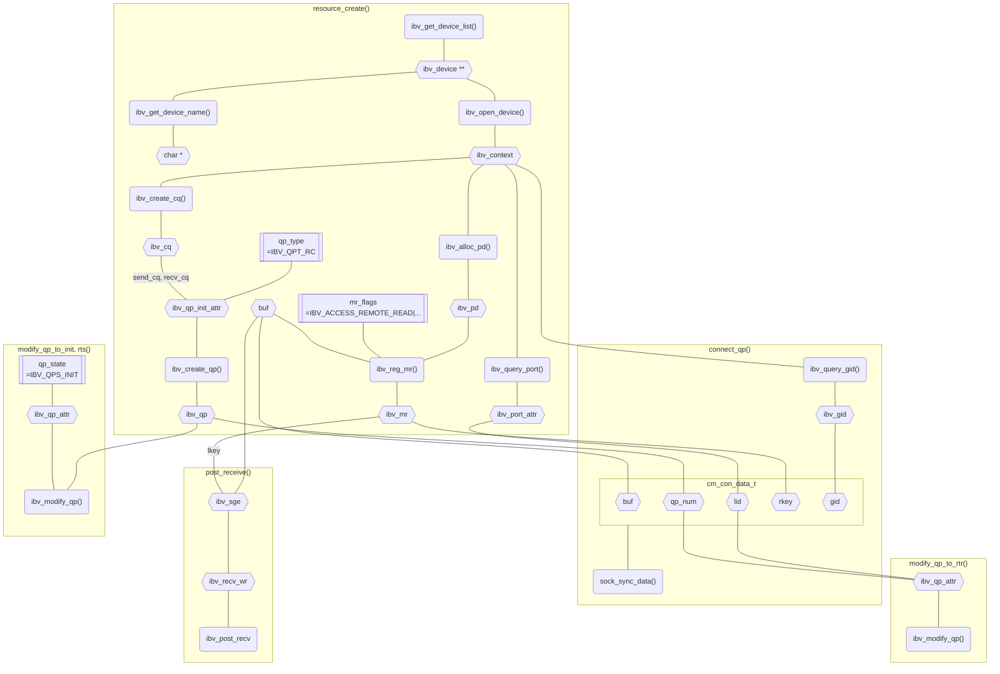
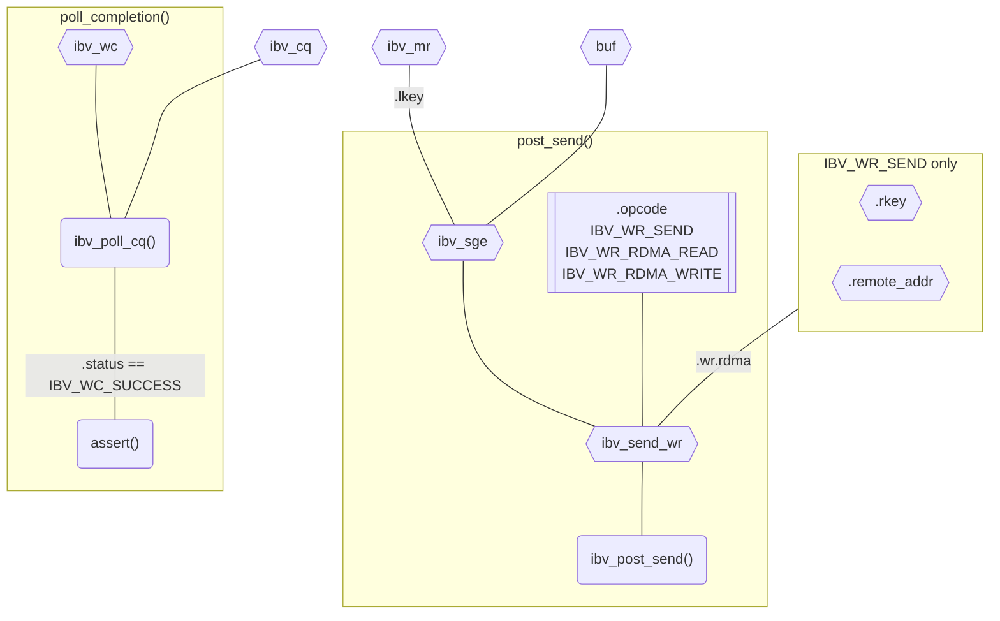

# IB Verbs

!!! quote

    - 阅读 [InfiniBand: An Introduction + Simple IB verbs program with RDMA Write - Service Engineering (ICCLab & SPLab)](https://blog.zhaw.ch/icclab/infiniband-an-introduction-simple-ib-verbs-program-with-rdma-write/)，了解 PD、MR、QP、CQ、WR、SGE、WC 等基本概念。
    - 阅读 [RDMA Tutorial - Netdev](https://netdevconf.info/0x16/slides/40/RDMA%20Tutorial.pdf)，其中介绍了 `ipv_pd` 等重要的 API。
    - 阅读 [Introduction to Programming Infiniband RDMA · Better Tomorrow with Computer Science](https://insujang.github.io/2020-02-09/introduction-to-programming-infiniband/)，这篇文章逐步讲解了如何编写一个简单的 RDMA 程序，并给出了详细的代码。
    - 阅读 [InfiniBandTM Architecture Specification Volume 1](https://www.afs.enea.it/asantoro/V1r1_2_1.Release_12062007.pdf)，规范中的第十章定义了软件接口，即 IB Verbs。
    - [Mellanox Adapters Programmer’s Reference Manual](https://network.nvidia.com/files/doc-2020/ethernet-adapters-programming-manual.pdf)：该手册适用于 CX4，详细地描述了 IB Verbs 编程的所有细节，细致到每个字段的定义。
    - [RDMA Aware Networks Programming User Manual - NVIDIA Docs](https://docs.nvidia.com/networking/display/rdmaawareprogrammingv17)：包含 RDMA 架构概述和 IB Verbs、RDMACM 的 API 文档。**该文档第八章包含了各层次 API 编程的例子，具有比较详细的注释，适合初学者学习。**本文中的部分编程示例来自该手册。

- 头文件：`infiniband/verbs.h`
- API 前缀：`ibv_`
- 软件包：`libibverbs-dev`

## 例程

代码见 [`RDMA_RC_example.c`](./index.assets/code/RDMA_RC_example.c)。

准备阶段：

- `resource_create()`：创建资源，包括 PD、MR、QP、CQ 等。
- `connect_qp()`：通信双方交换信息，包括 LID、QP_NUM、RKEY 等，将 QP 状态更改为 INIT、RTR、RTS。
    - `sock_sync_data()`：通过 TCP 通信交换信息。
    - `modify_qp_to_init()`
    - `post_receive()`：预置接收队列，也可以放在通信阶段。
    - `modify_qp_to_rtr()`
    - `modify_qp_to_rts()`
    - 同步点



通信阶段：

- `post_send()`：创建并发送 WR，WR 的类型取决于 `opcode`。
- `poll_completion()`：轮询得到 WC。



该程序演示了下面的操作：

- `resource_create()`：服务端把 `SEND operation` 字符串放在缓冲区 `res->buf` 中。
- `connect_qp()`：交换资源信息，远端信息放入 `res->remote_props`。交换内容包括 `res->buf` 的地址。Client 向 Server 发送一个 Receive。
- `post_send()`：Server 发送一个 Send。该 WR 的构成：
    - `.sg_list->addr` 为 `res->buf`，即 Server 的缓冲区地址。
    - `.wr.rdma.remote_addr` 为 `res->remote_props.addr`，即 Client 的缓冲区地址。
- `poll_completion()`：Client 收到并显示信息 `SEND operation`。
- Server 再将缓冲区内容修改为 `RDMA read operation`。
- `post_send()`：Client 发送一个 read 操作，读取到 `RDMA read operation`。因为这是单边操作，Server 不会知道。
- Client 将缓冲区内容修改为 `RDMA write operation`。
- `post_send()`：Client 发送一个 write 操作，写入到 Server 的缓冲区。
- Server 打印缓冲区内容，为 `RDMA write operation`。

## 能力归纳

梳理 IB Verbs 的全链路，各调用可能需要网卡提供不同的能力：

- `ibv_reg_mr()` 访问控制：

    ```c
    enum ibv_access_flags {
        IBV_ACCESS_LOCAL_WRITE		= 1,
        IBV_ACCESS_REMOTE_WRITE		= (1<<1),
        IBV_ACCESS_REMOTE_READ		= (1<<2),
        IBV_ACCESS_REMOTE_ATOMIC	= (1<<3),
        IBV_ACCESS_MW_BIND		= (1<<4),
        IBV_ACCESS_ZERO_BASED		= (1<<5),
        IBV_ACCESS_ON_DEMAND		= (1<<6),
        IBV_ACCESS_HUGETLB		= (1<<7),
        IBV_ACCESS_FLUSH_GLOBAL		= (1 << 8),
        IBV_ACCESS_FLUSH_PERSISTENT	= (1 << 9),
        IBV_ACCESS_RELAXED_ORDERING	= IBV_ACCESS_OPTIONAL_FIRST,
    };
    ```

- `struct ibv_qp_init_attr`：

    ```c
    enum ibv_qp_type {
        IBV_QPT_RC = 2,
        IBV_QPT_UC,
        IBV_QPT_UD,
        IBV_QPT_RAW_PACKET = 8,
        IBV_QPT_XRC_SEND = 9,
        IBV_QPT_XRC_RECV,
        IBV_QPT_DRIVER = 0xff,
    };
    ```

- `struct ibv_send_wr->opcode`

    ```c
    const char *ibv_wr_opcode_str(enum ibv_wr_opcode opcode);
    enum ibv_wr_opcode {
        IBV_WR_RDMA_WRITE,
        IBV_WR_RDMA_WRITE_WITH_IMM,
        IBV_WR_SEND,
        IBV_WR_SEND_WITH_IMM,
        IBV_WR_RDMA_READ,
        IBV_WR_ATOMIC_CMP_AND_SWP,
        IBV_WR_ATOMIC_FETCH_AND_ADD,
        IBV_WR_LOCAL_INV,
        IBV_WR_BIND_MW,
        IBV_WR_SEND_WITH_INV,
        IBV_WR_TSO,
        IBV_WR_DRIVER1,
        IBV_WR_FLUSH = 14,
        IBV_WR_ATOMIC_WRITE = 15,
    };
    ```

- 

## SRQ

SRQ 作为 `struct ibv_qp_init_attr` 中的一个**可选**字段。

## `ibv_wr_*`


## `*_ex`
