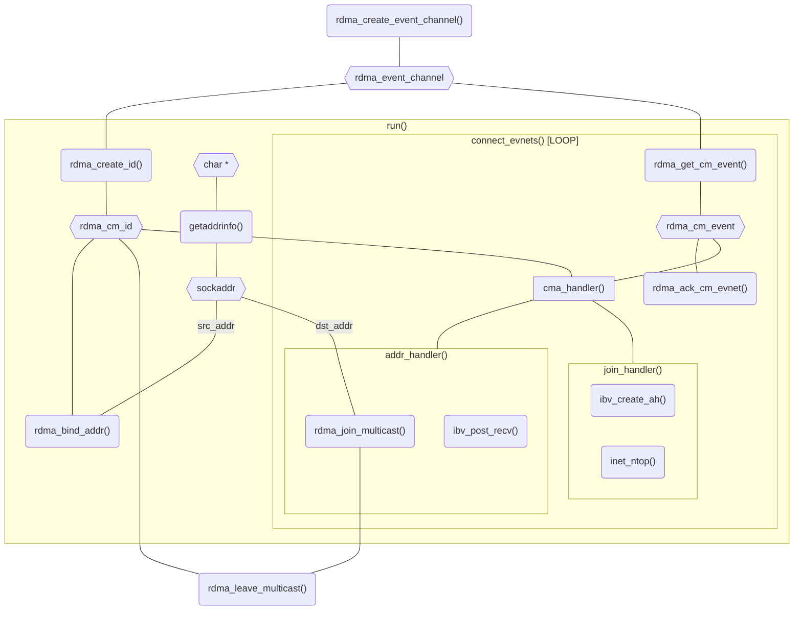

# RDMA CM

!!! quote

    - [RDMA Aware Networks Programming User Manual - NVIDIA Docs](https://docs.nvidia.com/networking/display/rdmaawareprogrammingv17)：包含 RDMA 架构概述和 IB Verbs、RDMACM 的 API 文档。**该文档第八章包含了各层次 API 编程的例子，具有比较详细的注释，适合初学者学习。**本文中的部分编程示例来自该手册。

- 头文件：`rdma/rdma_cma.h`、`rdma_verbs.h`
- API 前缀：`rdma_`
- 软件包名：`librdmacm-dev`

librdmacm 提供比 IB Verbs 抽象层次更高的另一套 API：

- Connection Manager，负责管理 RDMA 连接。它包装了交换 QP、Key 等信息的过程，减少了代码量，让 RDMA 编程更加简单。它的接口与 Socket 比较类似：

    ```c
    rdma_listen()
    rdma_connect()
    rdma_accept()
    ```

- RDMA Verbs，本质上是建立在 libibverbs 上的一层包装。

以 SRQ 的创建为例，我们看看具体的包装过程：

```c title="librdmacm/cma.c"
int rdma_create_srq(struct rdma_cm_id *id, struct ibv_pd *pd,
    struct ibv_srq_init_attr *attr) {
    ret = rdma_create_srq_ex(id, &attr_ex);
}
int rdma_create_srq_ex(struct rdma_cm_id *id, struct ibv_srq_init_attr_ex *attr) {
    struct ibv_srq *srq;
    srq = ibv_create_srq_ex(id->verbs, attr);
}
```

## 例程

代码见 [`mckey.c`](./index.assets/code/mckey.c)。

RDMA_CM 用于管理 RDMA 连接，包装了使用 socket 编程交换 QP、R_Key 等信息的过程，减少代码量。它的接口与 Socket 类似：

与 Socket 编程的比较：

- 操作异步进行，通过 `rdma_event_channel` 进行事件通知。
- `rdma_cm_id`（identifier）与 `fd` 类似，用于标识连接。
- 使用 `rdma_bind_addr()` 将 `rdma_cm_id` 与 `sockaddr` 绑定，类似 `bind()`。

本例为多播通信，需要使用 `rdma_join_multicast()` 和 `rdma_leave_multicast()` 进出多播组。


